# Nibe DIM – Environmental Monitoring System
## Complete High-Level Design Document (Updated)

### Version 2.0 | May 11, 2026

---

## Document Control

| Version | Date | Author | Changes |
|---------|------|--------|---------|
| 1.0 | March 29, 2026 | Architecture Team | Initial HLD |
| 2.0 | May 11, 2026 | Architecture Team | Complete restructure with Mermaid diagrams, detailed explanations |

---

## 1. Executive Summary

### 1.1 Product Overview

Nibe DIM (Digital Infrastructure Monitor) is an enterprise-grade real-time environmental monitoring system designed to track, visualize, and generate actionable alerts for critical environmental parameters. The system addresses the growing need for smart building management, industrial process monitoring, and regulatory compliance across multiple sectors.

**Primary Use Cases:**
- **Industrial Facilities:** Monitor temperature/humidity in manufacturing areas, storage warehouses
- **Commercial Buildings:** Smart HVAC control, energy efficiency optimization
- **Healthcare:** Temperature-sensitive storage (vaccines, medicines), clean room monitoring
- **Data Centers:** Thermal monitoring, humidity control, leakage detection
- **Agriculture:** Greenhouse climate control, cold storage monitoring

### 1.2 Business Value

| Capability | Business Impact |
|------------|-----------------|
| Real-time monitoring | 80% reduction in incident response time |
| Predictive alerts | 95% reduction in equipment damage from environmental excursions |
| Automated workflows | 60% reduction in manual intervention |
| Compliance reporting | Automated audit trails for regulatory compliance (ISO, FDA, GMP) |
| Energy optimization | 15-30% reduction in HVAC energy costs |

### 1.3 Key Features

1. **Real-time Telemetry Dashboard** - Live sensor data visualization with sub-second latency
2. **Multi-tenant Architecture** - Support for multiple organizations with complete isolation
3. **Configurable Alert Engine** - Threshold-based alerts with escalation policies
4. **Automation Workflows** - Trigger device commands, notifications, or webhooks based on conditions
5. **Time-series Analytics** - Historical trending, aggregation, and export capabilities
6. **Device Management** - OTA firmware updates, configuration management, health monitoring
7. **Role-based Access Control** - Granular permissions per organization, site, or device

### 1.4 Target KPIs

| Metric | Target |
|--------|--------|
| Data ingestion latency | < 100ms (p99) |
| Dashboard load time | < 2 seconds |
| Alert notification latency | < 5 seconds |
| System uptime | 99.95% |
| Concurrent devices supported | 100,000+ |
| Data retention | 90 days raw, 2 years aggregated |

---

## 2. System Architecture Overview

### 2.1 Architecture Pattern: Microservices with GraphQL Gateway

```mermaid
flowchart TB
    subgraph CLIENT["CLIENT LAYER"]
        direction LR
        Web["🖥️ Web Dashboard<br/>(React.js)"]
        Mobile["📱 Mobile App<br/>(React Native)"]
        Admin["⚙️ Admin Portal<br/>(React.js)"]
        External["🔌 External APIs<br/>(REST/GraphQL)"]
    end

    subgraph EDGE["EDGE & GATEWAY LAYER"]
        direction TB
        CDN["CloudFront CDN<br/>Global edge caching"]
        WAF["AWS WAF<br/>Security & DDoS protection"]
        Nginx["Nginx API Gateway<br/>SSL | Rate Limit | Load Balance"]
    end

    subgraph GRAPHQL["GRAPHQL FEDERATION LAYER"]
        Apollo["Apollo Federation Gateway<br/>Schema Composition | Query Planning | Entity Resolution"]
        
        subgraph SUBGRAPHS["Federated Subgraphs"]
            DeviceSub["Device Subgraph"]
            DataSub["Data Subgraph"]
            AlertSub["Alert Subgraph"]
            WorkflowSub["Workflow Subgraph"]
            UserSub["User Subgraph"]
        end
    end

    subgraph SERVICES["BACKEND MICROSERVICES"]
        direction TB
        
        subgraph CORE["Core Services"]
            DeviceSvc["🔧 Device Service<br/>• Registry & Provisioning<br/>• Configuration Management<br/>• Firmware OTA<br/>• Health Monitoring"]
            DataSvc["📊 Data Service<br/>• Telemetry Ingestion<br/>• Time-series Queries<br/>• Aggregation Engine<br/>• Export Service"]
            AlertSvc["🚨 Alert Service<br/>• Rule Evaluation<br/>• Escalation Engine<br/>• Notification Delivery<br/>• Silencing/Ack"]
            WorkflowSvc["⚡ Workflow Service<br/>• Schedule Management<br/>• Condition Evaluation<br/>• Action Execution<br/>• Audit Logging"]
        end
        
        subgraph SUPPORT["Supporting Services"]
            AuthSvc["🔐 Auth Service<br/>• JWT Management<br/>• OAuth2 Providers<br/>• Session Handling"]
            FileSvc["📁 File Service<br/>• Firmware Storage<br/>• Export Management<br/>• Log Archival"]
            NotifySvc["📧 Notification Service<br/>• Email/SMS/Push<br/>• Template Management<br/>• Delivery Tracking"]
        end
    end

    subgraph DATA["DATA LAYER"]
        direction LR
        MongoDB[(📀 MongoDB<br/>Config | Users | Alerts | Workflows)]
        InfluxDB[(⏱️ InfluxDB<br/>Time-series Sensor Data)]
        Redis[(⚡ Redis<br/>Cache | Sessions | Rate Limiting)]
        S3[(🗄️ AWS S3<br/>Firmware | Exports | Logs)]
        RabbitMQ[(🐇 RabbitMQ<br/>Async Tasks | Event Bus)]
    end

    subgraph INFRA["INFRASTRUCTURE LAYER"]
        direction LR
        Docker["🐳 Docker<br/>Development"]
        ECS["☁️ AWS ECS<br/>Orchestration"]
        K8s["⎈ Kubernetes<br/>(Planned)"]
        TF["🏗️ Terraform<br/>IaC"]
    end

    %% Connections
    Web --> CDN
    Mobile --> CDN
    Admin --> CDN
    External --> CDN
    CDN --> WAF
    WAF --> Nginx
    Nginx --> Apollo

    Apollo --> DeviceSub
    Apollo --> DataSub
    Apollo --> AlertSub
    Apollo --> WorkflowSub
    Apollo --> UserSub

    DeviceSub --> DeviceSvc
    DataSub --> DataSvc
    AlertSub --> AlertSvc
    WorkflowSub --> WorkflowSvc
    UserSub --> AuthSvc

    DeviceSvc --> MongoDB
    DeviceSvc --> Redis
    DataSvc --> InfluxDB
    DataSvc --> Redis
    AlertSvc --> MongoDB
    AlertSvc --> RabbitMQ
    WorkflowSvc --> MongoDB
    WorkflowSvc --> RabbitMQ
    AuthSvc --> Redis
    FileSvc --> S3
    NotifySvc --> RabbitMQ

    DeviceSvc --> Docker
    DataSvc --> Docker
    AlertSvc --> Docker
    WorkflowSvc --> Docker
```

### 2.2 Architecture Decisions & Rationale

| Decision | Selected Approach | Alternatives Considered | Rationale |
|----------|------------------|------------------------|-----------|
| API Style | GraphQL + Federation | REST, gRPC | Flexible queries, reduced over-fetching, type safety, independent service evolution |
| Data Storage | MongoDB + InfluxDB | PostgreSQL, Cassandra, TimescaleDB | MongoDB for flexible schemas, InfluxDB optimized for time-series workloads (high write throughput) |
| Real-time | WebSocket + MQTT | SSE, Long Polling | MQTT for device-constrained environments, WebSocket for rich client interactions |
| Message Queue | RabbitMQ | Kafka, SQS, Redis Pub/Sub | Reliable delivery, complex routing, dead-letter queues, familiar to team |
| Container Orchestration | AWS ECS Fargate | Kubernetes, Lambda | Simplicity, serverless operational model, AWS integration, cost-effective for predictable workloads |
| Cache | Redis | Memcached, ElastiCache | Rich data structures (Sorted Sets, Hashes), persistence options, built-in replication |

### 2.3 Data Flow Overview

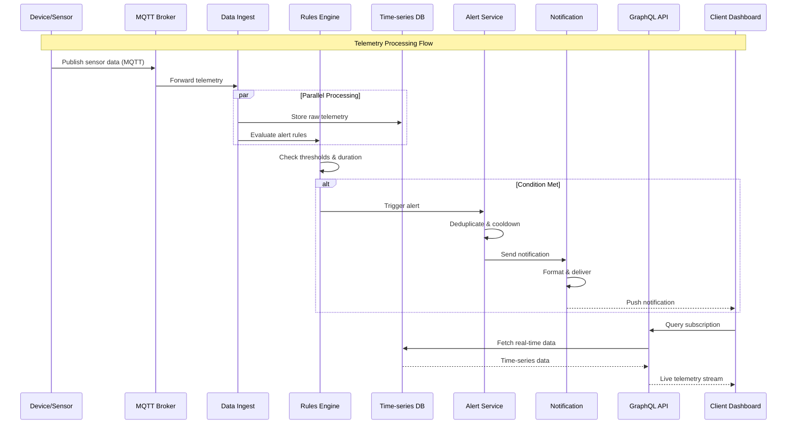

---

## 3. Technology Stack

### 3.1 Complete Technology Inventory

| Layer | Technology | Version | Purpose | Justification |
|-------|------------|---------|---------|---------------|
| **Frontend** | React.js | 18.2 | UI Framework | Component reusability, ecosystem maturity |
| | TypeScript | 5.0 | Type Safety | Reduce runtime errors, improve maintainability |
| | Material UI | 5.14 | Component Library | Accessibility, customization, design consistency |
| | Recharts | 2.9 | Charts | Lightweight, React-native, SVG-based |
| | D3.js | 7.8 | Advanced Visualizations | Complex data binding, custom visualizations |
| | React Query | 4.36 | Server State | Caching, background updates, optimistic updates |
| **State** | Redux Toolkit | 1.9 | Global State | DevTools, middleware ecosystem, predictable updates |
| | Apollo Client | 3.8 | GraphQL Client | Cache normalization, subscription support |
| **API** | GraphQL | Apollo 4 | Query Language | Schema federation, real-time subscriptions |
| **Backend** | Node.js | 20 LTS | Runtime | Non-blocking I/O, large ecosystem |
| | Express.js | 4.18 | Web Framework | Minimal, flexible, middleware support |
| | BullMQ | 4.12 | Job Queue | Redis-backed, reliable job processing |
| | Socket.io | 4.6 | WebSocket | Automatic reconnection, fallback support |
| **Database** | MongoDB | 6.0 | Document DB | Schema flexibility, horizontal scaling |
| | InfluxDB | 2.7 | Time-series | High write throughput, efficient compression |
| | Redis | 7.2 | In-memory Cache | Low latency, atomic operations |
| **Message** | RabbitMQ | 3.12 | Message Broker | Reliable delivery, complex routing |
| | MQTT (EMQX) | 5.0 | IoT Protocol | Lightweight, QoS levels, massive scale |
| **Storage** | AWS S3 | - | Object Storage | Durable, cost-effective, lifecycle policies |
| | CloudFront | - | CDN | Global edge caching, security features |
| **Auth** | JWT | - | Tokens | Stateless, self-contained |
| | OAuth2 (Auth0) | - | SSO | Enterprise integration, social providers |
| **DevOps** | Docker | 24.0 | Containerization | Consistency, isolation |
| | AWS ECS | - | Orchestration | Managed, serverless options |
| | Terraform | 1.6 | IaC | Multi-cloud, immutable infrastructure |
| | GitHub Actions | - | CI/CD | Integrated, matrix builds, self-hosted runners |
| **Monitoring** | Prometheus | 2.48 | Metrics | Pull-based, dimensional data |
| | Grafana | 10.2 | Visualization | Multi-source dashboards, alerting |
| | OpenTelemetry | 1.20 | Tracing | Vendor-neutral instrumentation |
| **Security** | Helmet.js | 7.0 | HTTP Headers | Security headers (CSP, HSTS, XSS) |
| | CORS | 2.8 | Cross-origin | Fine-grained origin control |
| | Rate Limiter | express-rate-limit | Rate Limiting | Denial-of-service protection |

### 3.2 Development Environment Setup

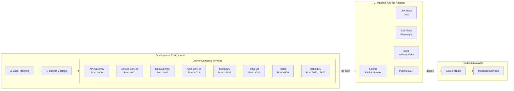

---

## 4. Core Module Breakdown

### 4.1 Device Management Module

#### 4.1.1 Overview & Responsibilities

The Device Management Service serves as the source of truth for all device metadata, configuration, and lifecycle management. It handles device registration, provisioning, firmware updates, and health monitoring.

**Core Responsibilities:**
- **Device Registry:** Maintains catalog of all devices with unique identifiers
- **Provisioning:** Secure onboarding of new devices with certificate/API key generation
- **Configuration Management:** Store and version device configurations (sampling rates, thresholds)
- **Firmware Management:** OTA (Over-The-Air) update orchestration with rollback capabilities
- **Health Monitoring:** Track device status (online/offline), battery levels, signal strength
- **Hierarchy Management:** Support nested organizational structures (Org → Site → Zone → Device)

#### 4.1.2 Device Hierarchy

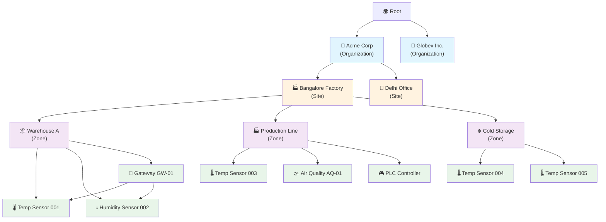

#### 4.1.3 Device Lifecycle States

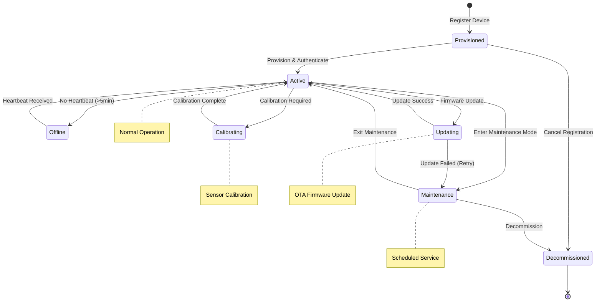

**State Transitions & Business Rules:**

| From | To | Trigger | Business Rule |
|------|-----|---------|---------------|
| Provisioned | Active | Device sends valid credentials | Must have valid organization assignment |
| Active | Offline | No heartbeat for 5+ minutes | Send alert after 5 minutes of downtime |
| Offline | Active | Heartbeat received | Log reconnection event |
| Active | Maintenance | Admin triggers maintenance mode | Suppress alerts during maintenance |
| Active | Calibrating | Scheduled calibration or admin trigger | Requires calibration data submission |
| Active | Updating | New firmware available | Must validate firmware integrity (SHA256) |

#### 4.1.4 Device Configuration Schema

```javascript
{
  "device_id": "DEV-TEMP-00123",
  "name": "Production Line Temperature Sensor #3",
  "type": "TEMPERATURE_SENSOR",
  "model": "Sensirion SHT35",
  "manufacturer": "Sensirion",
  "serial_number": "SHT35-2024-00123",
  
  "firmware": {
    "version": "2.1.0",
    "last_updated": "2026-05-01T10:00:00Z",
    "update_status": "SUCCESS"
  },
  
  "location": {
    "organization_id": "org_acme_123",
    "site_id": "site_blr_factory",
    "zone_id": "zone_production_line_a",
    "coordinates": {
      "type": "Point",
      "coordinates": [77.5946, 12.9716]
    },
    "address": "Whitefield Industrial Area, Bangalore",
    "floor": 1,
    "room": "Assembly Line A"
  },
  
  "configuration": {
    "sampling_rate_seconds": 30,
    "reporting_interval_seconds": 60,
    "calibration": {
      "offset": 0.5,
      "multiplier": 1.02,
      "last_calibrated": "2026-05-01T00:00:00Z",
      "next_calibration_due": "2026-08-01T00:00:00Z"
    },
    "thresholds": {
      "temperature": {
        "min": 18.0,
        "max": 25.0,
        "warning_min": 19.0,
        "warning_max": 24.0
      },
      "humidity": {
        "min": 40.0,
        "max": 60.0
      }
    },
    "reporting": {
      "mqtt_qos": 1,
      "retain_messages": false,
      "payload_format": "PROTOBUF"
    }
  },
  
  "credentials": {
    "certificate_id": "cert_sensirion_00123",
    "api_key_hash": "$2b$10$...",
    "mqtt_username": "device_00123"
  },
  
  "status": {
    "state": "ACTIVE",
    "last_heartbeat": "2026-05-11T10:00:00Z",
    "battery_voltage": 3.3,
    "battery_percentage": 85,
    "signal_strength_dbm": -55,
    "wifi_ssid": "Factory_Network_5G"
  },
  
  "metadata": {
    "installation_date": "2026-04-15",
    "maintenance_contract": "PREMIUM",
    "tags": ["production", "critical", "temperature-sensitive"],
    "custom_fields": {
      "supplier": "Sensirion Distributor",
      "warranty_expiry": "2028-04-15"
    }
  }
}
```

---

### 4.2 Sensor Data Ingestion Service

#### 4.2.1 Overview

The Data Ingestion Service is responsible for receiving, validating, and processing incoming sensor telemetry. It handles multiple protocols (MQTT, WebSocket, REST), performs data validation and enrichment, and routes data to appropriate storage and processing pipelines.

#### 4.2.2 Complete Ingestion Pipeline

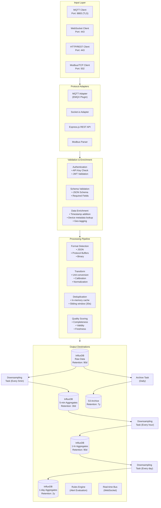

#### 4.2.3 Telemetry Data Format

**MQTT Payload (JSON Format):**
```json
{
  "device_id": "DEV-TEMP-00123",
  "timestamp": "2026-05-11T10:05:30.123Z",
  "metrics": [
    {
      "name": "temperature",
      "value": 23.45,
      "unit": "celsius",
      "min": 23.40,
      "max": 23.50,
      "count": 6
    },
    {
      "name": "humidity",
      "value": 52.3,
      "unit": "percent",
      "min": 52.1,
      "max": 52.5,
      "count": 6
    }
  ],
  "device_status": {
    "battery": 85.0,
    "signal": -55,
    "uptime_seconds": 864000
  },
  "quality": {
    "score": 0.99,
    "flags": ["VALID", "CALIBRATED"]
  },
  "checksum": "sha256:abc123..."
}
```

**Protocol Buffers Schema (optimized for constrained devices):**
```protobuf
syntax = "proto3";

message Telemetry {
  string device_id = 1;
  int64 timestamp_ms = 2;
  repeated Metric metrics = 3;
  DeviceStatus status = 4;
}

message Metric {
  enum MetricType {
    TEMPERATURE = 0;
    HUMIDITY = 1;
    CO2 = 2;
    VOC = 3;
    PM25 = 4;
    PRESSURE = 5;
  }
  MetricType type = 1;
  float value = 2;
  float min = 3;
  float max = 4;
}

message DeviceStatus {
  float battery_voltage = 1;
  int32 signal_rssi = 2;
  uint32 uptime_seconds = 3;
}
```

#### 4.2.4 Ingestion Performance Targets

| Metric | Target | Measurement Method |
|--------|--------|-------------------|
| Write throughput | 100,000 events/second | Load testing |
| Per-event latency | < 50ms (p99) | Distributed tracing |
| Batch processing | 10,000 events/batch | Kafka consumer |
| Protocol overhead | < 20% | Network monitoring |
| Data compression ratio | 10:1 | InfluxDB storage metrics |
| Validation pass rate | > 99.9% | Application logs |

---

### 4.3 Alert & Notification Module

#### 4.3.1 Overview

The Alert Management System provides flexible, configurable alert rules with multi-channel notifications, escalation policies, and automated remediation workflows. It supports both threshold-based and anomaly detection alerts.

#### 4.3.2 Alert Rule Configuration

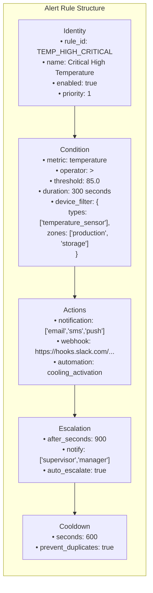

**Complete Alert Rule JSON Schema:**
```json
{
  "rule_id": "TEMP_HIGH_CRITICAL_v2",
  "name": "Critical High Temperature - Manufacturing",
  "description": "Alert when temperature exceeds 85°C for 5 continuous minutes",
  "enabled": true,
  "severity": "CRITICAL",
  
  "trigger": {
    "type": "THRESHOLD",
    "metric": "temperature",
    "operator": ">",
    "threshold": 85.0,
    "threshold_unit": "celsius",
    "duration_seconds": 300,
    "evaluation_window_seconds": 300,
    "percentage_of_samples": 90
  },
  
  "device_filter": {
    "device_types": ["temperature_sensor", "hvac_sensor"],
    "device_ids": ["DEV-001", "DEV-002"],
    "zones": ["production_line_a", "production_line_b"],
    "sites": ["blr_factory"],
    "organizations": ["acme_corp"],
    "tags": ["critical", "high-value"]
  },
  
  "actions": [
    {
      "id": "action_1",
      "type": "notification",
      "order": 1,
      "channels": ["email", "sms", "push"],
      "recipients": ["ops-team@acme.com", "+91-9876543210"],
      "template": "high_temp_alert",
      "quiet_hours": {
        "enabled": false
      }
    },
    {
      "id": "action_2",
      "type": "webhook",
      "order": 2,
      "url": "https://hooks.slack.com/services/T000/B000/XXX",
      "method": "POST",
      "headers": {
        "Content-Type": "application/json"
      },
      "body_template": "{\"text\": \"⚠️ Critical alert: {device_name} reached {value}°C\"}"
    },
    {
      "id": "action_3",
      "type": "automation",
      "order": 3,
      "workflow_id": "cooling_activation",
      "parameters": {
        "cooling_setpoint": 72,
        "fan_speed": "HIGH"
      }
    }
  ],
  
  "escalation": {
    "enabled": true,
    "after_seconds": 900,
    "repeat_interval_seconds": 1800,
    "max_attempts": 5,
    "notify_roles": ["site_manager", "engineering_lead"],
    "notify_users": ["raj@acme.com", "priya@acme.com"],
    "auto_resolve_after_seconds": 7200
  },
  
  "cooldown": {
    "seconds": 600,
    "same_device": true,
    "same_rule": true
  },
  
  "suppression": {
    "allow_during_maintenance": false,
    "allowed_time_windows": [
      { "start": "09:00", "end": "17:00", "days": ["MONDAY", "TUESDAY"] }
    ]
  },
  
  "metadata": {
    "created_by": "admin@nibe.com",
    "created_at": "2026-05-01T00:00:00Z",
    "updated_by": "engineer@nibe.com",
    "updated_at": "2026-05-10T00:00:00Z",
    "version": 3
  }
}
```

#### 4.3.3 Alert Processing Flow

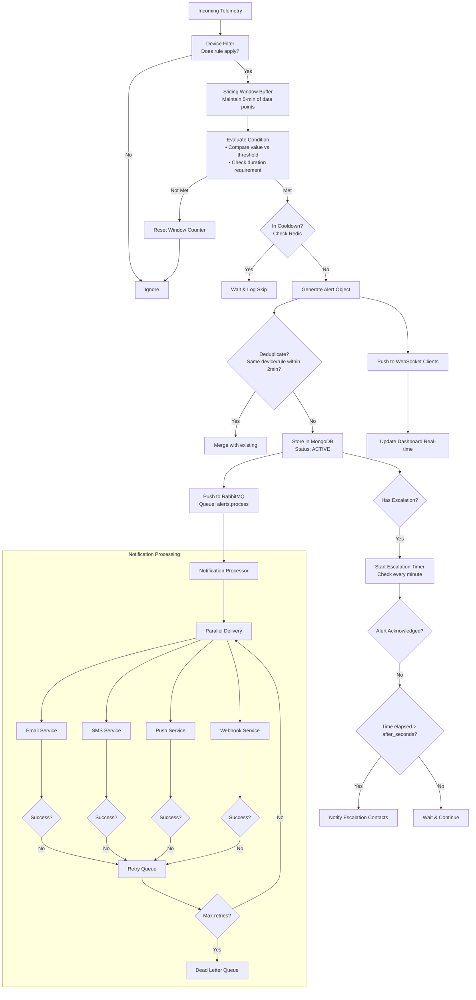

#### 4.3.4 Severity Levels & SLAs

| Severity | Color | Response Time | Notification Channels | Auto-resolution |
|----------|-------|---------------|----------------------|-----------------|
| **EMERGENCY** | 🔴 Red | < 2 minutes | SMS + Phone + Email + Push | Not auto-resolved |
| **CRITICAL** | 🟠 Orange | < 5 minutes | SMS + Email + Push | 1 hour |
| **WARNING** | 🟡 Yellow | < 30 minutes | Email + Push | 4 hours |
| **INFO** | 🔵 Blue | < 2 hours | Email only | 24 hours |

---

### 4.4 Automation & Scheduling Module

#### 4.4.1 Overview

The Workflow Automation Engine enables users to create complex automation sequences triggered by schedules, events, or sensor thresholds. It supports conditional logic, parallel execution, and integration with external systems.

#### 4.4.2 Workflow Definition Schema

```javascript
{
  "workflow_id": "hvac_optimization_v2",
  "name": "Intelligent HVAC Optimization",
  "description": "Optimize HVAC based on occupancy and temperature",
  "enabled": true,
  
  "trigger": {
    "type": "schedule",
    "cron": "*/5 * * * *",
    "timezone": "Asia/Kolkata",
    "start_date": "2026-05-01T00:00:00Z",
    "end_date": null
  },
  
  "conditions": [
    {
      "type": "all",  // all, any, none
      "conditions": [
        {
          "type": "sensor_threshold",
          "device_group": "zone_a_sensors",
          "metric": "temperature",
          "operator": ">",
          "value": 75.0,
          "duration": 300
        },
        {
          "type": "time_window",
          "start": "09:00",
          "end": "18:00",
          "days": ["MONDAY", "TUESDAY", "WEDNESDAY", "THURSDAY", "FRIDAY"]
        },
        {
          "type": "device_status",
          "device_ids": ["occupancy_sensor_01"],
          "status": "online"
        }
      ]
    }
  ],
  
  "actions": [
    {
      "id": "action_1",
      "type": "parallel",
      "actions": [
        {
          "type": "device_command",
          "device_id": "hvac_controller_01",
          "command": "set_cooling",
          "parameters": {
            "target_temperature": 72,
            "fan_speed": "medium",
            "mode": "auto"
          },
          "timeout_seconds": 30,
          "retry": {
            "max_attempts": 3,
            "delay_seconds": 5,
            "backoff_multiplier": 2
          }
        },
        {
          "type": "notification",
          "channel": "slack",
          "recipients": ["#facility-management"],
          "message": "HVAC cooling activated due to high temperature in Zone A"
        }
      ]
    },
    {
      "id": "action_2",
      "type": "sequential",
      "depends_on": ["action_1"],
      "actions": [
        {
          "type": "webhook",
          "url": "https://api.energy-monitor.com/events",
          "method": "POST",
          "body": {
            "event": "hvac_adjustment",
            "zone": "Zone A",
            "temperature_before": "{{trigger.temperature}}",
            "adjustment_made": "cooling_activated"
          }
        },
        {
          "type": "log",
          "level": "info",
          "message": "HVAC optimization workflow completed successfully"
        }
      ]
    }
  ],
  
  "error_handling": {
    "on_failure": "continue",  // continue, stop, retry
    "retry_policy": {
      "max_retries": 3,
      "retry_delay_seconds": 60
    },
    "fallback_actions": [
      {
        "type": "notification",
        "message": "Workflow execution failed: {{error}}"
      }
    ]
  },
  
  "concurrency": {
    "max_instances": 5,
    "policy": "queue"  // queue, drop, parallel
  },
  
  "metrics": {
    "record_execution_time": true,
    "record_input_output": true,
    "retention_days": 90
  }
}
```

#### 4.4.3 Workflow Execution Engine

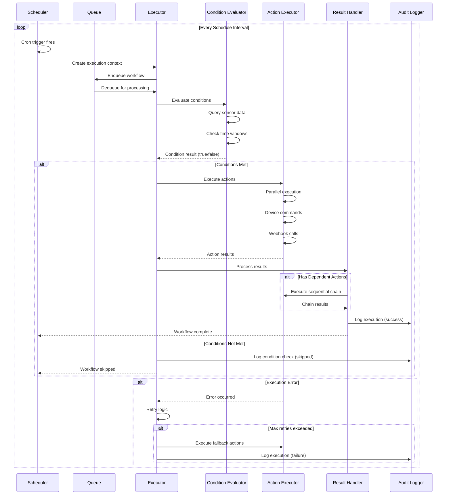

#### 4.4.4 Available Action Types

| Action Type | Description | Example Use Case |
|-------------|-------------|------------------|
| `device_command` | Send command to device | Activate cooling, turn on fan |
| `notification` | Send alert via multiple channels | Email team when condition met |
| `webhook` | Call external API | Integration with ERP system |
| `http_request` | Generic HTTP request | Trigger external automation |
| `log` | Write to audit log | Record event for compliance |
| `delay` | Wait before next action | Staggered equipment startup |
| `condition` | Nested condition check | Complex decision trees |
| `parallel` | Execute multiple actions simultaneously | Speed up multi-device commands |
| `sequential` | Execute actions in order | Ensure dependency ordering |
| `loop` | Repeat actions N times | Retry until success |
| `transform` | Modify data before next action | Unit conversion, formatting |
| `email` | Send templated email | Daily report generation |
| `sms` | Send text message | Critical alert delivery |
| `slack` | Post to Slack channel | Team notification |
| `teams` | Post to Microsoft Teams | Enterprise notification |

---

## 5. GraphQL Schema Design

### 5.1 Complete GraphQL Schema

```graphql
"""
Core GraphQL Schema for Nibe DIM Environmental Monitoring System
Version: 2.0 | Last Updated: 2026-05-11
"""

# ============================================
# QUERY ROOT
# ============================================

type Query {
  """Get device by ID or serial number"""
  device(
    id: ID, 
    serial_number: String
  ): Device
  
  """List devices with filtering and pagination"""
  devices(
    filter: DeviceFilterInput, 
    pagination: PaginationInput, 
    sort: DeviceSortInput
  ): DeviceConnection!
  
  """Get real-time telemetry for a device"""
  deviceTelemetry(
    deviceId: ID!, 
    timeRange: TimeRangeInput, 
    aggregation: AggregationInput,
    metrics: [MetricType!]
  ): TelemetryResult!
  
  """Query time-series data across multiple devices"""
  timeseries(
    query: TimeseriesQueryInput!
  ): TimeseriesResult!
  
  """Get active alerts"""
  activeAlerts(
    deviceId: ID, 
    severity: Severity, 
    limit: Int
  ): [Alert!]!
  
  """Get alert history with filters"""
  alerts(
    filter: AlertFilterInput, 
    pagination: PaginationInput
  ): AlertConnection!
  
  """Get alert rules"""
  alertRules(
    organizationId: ID,
    enabled: Boolean,
    severity: Severity
  ): [AlertRule!]!
  
  """Get dashboard metrics"""
  dashboardMetrics(
    dashboardId: ID!, 
    timeRange: TimeRangeInput
  ): DashboardData!
  
  """List automation workflows"""
  workflows(
    status: WorkflowStatus,
    organizationId: ID
  ): [Workflow!]!
  
  """Get workflow execution history"""
  workflowExecutions(
    workflowId: ID!, 
    limit: Int, 
    status: WorkflowExecutionStatus
  ): [WorkflowExecution!]!
  
  """Get organization hierarchy"""
  organizationHierarchy(
    organizationId: ID
  ): OrganizationTree!
  
  """Get audit logs"""
  auditLogs(
    filter: AuditLogFilterInput,
    pagination: PaginationInput
  ): AuditLogConnection!
  
  """Get system health status"""
  systemHealth: SystemHealth!
  
  """Get user profile"""
  me: User!
}

# ============================================
# MUTATION ROOT
# ============================================

type Mutation {
  # ===== Device Management =====
  
  """Register a new device"""
  registerDevice(
    input: DeviceRegistrationInput!
  ): DeviceRegistrationResult!
  
  """Update device configuration"""
  updateDevice(
    id: ID!, 
    input: DeviceUpdateInput!
  ): Device!
  
  """Delete (decommission) a device"""
  deleteDevice(id: ID!): DeleteDeviceResult!
  
  """Update device firmware via OTA"""
  updateDeviceFirmware(
    id: ID!, 
    firmwareVersion: String!
  ): FirmwareUpdateJob!
  
  """Calibrate device sensors"""
  calibrateDevice(
    id: ID!, 
    calibrationData: CalibrationInput!
  ): Boolean!
  
  """Bulk import devices"""
  bulkImportDevices(
    file: Upload!
  ): BulkImportResult!
  
  # ===== Alert Management =====
  
  """Create a new alert rule"""
  createAlertRule(
    input: AlertRuleInput!
  ): AlertRule!
  
  """Update an existing alert rule"""
  updateAlertRule(
    id: ID!, 
    input: AlertRuleUpdateInput!
  ): AlertRule!
  
  """Delete an alert rule"""
  deleteAlertRule(id: ID!): Boolean!
  
  """Acknowledge an alert"""
  acknowledgeAlert(
    id: ID!, 
    note: String
  ): Alert!
  
  """Resolve an alert"""
  resolveAlert(
    id: ID!, 
    resolution: String
  ): Alert!
  
  """Silence alerts for a device or rule"""
  silenceAlerts(
    input: SilenceInput!
  ): Silence!
  
  # ===== Workflow Management =====
  
  """Create a new workflow"""
  createWorkflow(
    input: WorkflowInput!
  ): Workflow!
  
  """Update an existing workflow"""
  updateWorkflow(
    id: ID!, 
    input: WorkflowUpdateInput!
  ): Workflow!
  
  """Delete a workflow"""
  deleteWorkflow(id: ID!): Boolean!
  
  """Manually execute a workflow"""
  executeWorkflow(
    id: ID!, 
    parameters: JSON
  ): WorkflowExecution!
  
  """Pause a workflow"""
  pauseWorkflow(id: ID!): Workflow!
  
  """Resume a paused workflow"""
  resumeWorkflow(id: ID!): Workflow!
  
  # ===== Data Management =====
  
  """Export sensor data"""
  exportData(
    query: ExportQueryInput!
  ): ExportJob!
  
  """Cancel an export job"""
  cancelExportJob(jobId: ID!): Boolean!
  
  # ===== User Management =====
  
  """Invite a new user"""
  inviteUser(
    input: InviteUserInput!
  ): UserInvitation!
  
  """Update user role"""
  updateUserRole(
    userId: ID!, 
    roleId: ID!
  ): User!
  
  """Remove user from organization"""
  removeUser(userId: ID!): Boolean!
  
  """Create API key"""
  createAPIKey(
    name: String!, 
    permissions: [String!]!
  ): APIKey!
  
  """Revoke API key"""
  revokeAPIKey(id: ID!): Boolean!
}

# ============================================
# SUBSCRIPTION ROOT
# ============================================

type Subscription {
  """Real-time telemetry stream"""
  telemetryStream(
    deviceIds: [ID!]!, 
    metrics: [MetricType!]
  ): TelemetryUpdate!
  
  """Real-time alert stream"""
  alertStream(
    severity: Severity, 
    deviceGroupId: ID,
    organizationId: ID
  ): Alert!
  
  """Device status change stream"""
  deviceStatusStream(
    deviceIds: [ID!]!
  ): DeviceStatusUpdate!
  
  """Workflow execution events"""
  workflowEventStream(
    workflowId: ID
  ): WorkflowEvent!
  
  """System health updates"""
  systemHealthStream: SystemHealth!
}

# ============================================
# CORE TYPES
# ============================================

"""Represents a physical or virtual device in the system"""
type Device {
  id: ID!
  name: String!
  deviceType: DeviceType!
  serialNumber: String!
  model: String!
  manufacturer: String!
  
  status: DeviceStatus!
  configuration: DeviceConfiguration!
  sensors: [Sensor!]!
  firmware: FirmwareInfo!
  
  location: Location!
  metadata: JSON!
  
  lastSeen: DateTime!
  createdAt: DateTime!
  updatedAt: DateTime!
  
  # Relationships
  organization: Organization!
  site: Site
  zone: Zone
}

"""Device types supported by the system"""
enum DeviceType {
  TEMPERATURE_SENSOR
  HUMIDITY_SENSOR
  AIR_QUALITY_SENSOR
  CO2_SENSOR
  PRESSURE_SENSOR
  HVAC_CONTROLLER
  GATEWAY
  ACTUATOR
  LEAK_DETECTOR
  ENERGY_METER
}

"""Current operational status of a device"""
type DeviceStatus {
  state: DeviceState!
  lastHeartbeat: DateTime!
  batteryLevel: Float
  signalStrength: Float
  uptimeSeconds: Int
  errorCode: String
}

enum DeviceState {
  PROVISIONED
  ACTIVE
  OFFLINE
  MAINTENANCE
  CALIBRATING
  UPDATING
  DECOMMISSIONED
}

"""Sensor attached to or part of a device"""
type Sensor {
  id: ID!
  name: String!
  type: MetricType!
  unit: String!
  currentValue: Float
  lastUpdate: DateTime
  calibrationOffset: Float
  calibrationMultiplier: Float
}

"""Time-series telemetry data point"""
type TelemetryPoint {
  timestamp: DateTime!
  deviceId: ID!
  metrics: [MetricValue!]!
  quality: Float!
}

"""Single metric measurement"""
type MetricValue {
  name: MetricType!
  value: Float!
  unit: String!
  min: Float
  max: Float
  avg: Float
  count: Int
}

enum MetricType {
  TEMPERATURE
  HUMIDITY
  VOC
  CO2
  PM10
  PM25
  PRESSURE
  AIRFLOW
  ENERGY_CONSUMPTION
  BATTERY
  SIGNAL_STRENGTH
}

"""Alert generated by the system"""
type Alert {
  id: ID!
  ruleId: ID!
  ruleName: String!
  severity: Severity!
  status: AlertStatus!
  
  title: String!
  description: String!
  recommendations: String
  
  deviceId: ID!
  deviceName: String!
  metric: MetricType!
  threshold: Float!
  actualValue: Float!
  
  triggeredAt: DateTime!
  acknowledgedAt: DateTime
  acknowledgedBy: User
  acknowledgementNote: String
  
  resolvedAt: DateTime
  resolvedBy: User
  resolutionNote: String
  
  actions: [AlertAction!]!
  notificationsSent: [NotificationDelivery!]!
}

enum Severity {
  INFO
  WARNING
  CRITICAL
  EMERGENCY
}

enum AlertStatus {
  ACTIVE
  ACKNOWLEDGED
  RESOLVED
  SUPPRESSED
}

"""Alert rule configuration"""
type AlertRule {
  id: ID!
  name: String!
  description: String
  enabled: Boolean!
  severity: Severity!
  
  trigger: AlertTrigger!
  deviceFilter: DeviceFilter!
  actions: [AlertActionConfig!]!
  escalation: EscalationConfig
  cooldown: CooldownConfig
  
  createdBy: User!
  createdAt: DateTime!
  updatedAt: DateTime!
  version: Int!
}

"""Automation workflow"""
type Workflow {
  id: ID!
  name: String!
  description: String
  enabled: Boolean!
  
  trigger: WorkflowTrigger!
  conditions: [WorkflowCondition!]!
  actions: [WorkflowAction!]!
  
  status: WorkflowStatus!
  lastExecution: DateTime
  executionCount: Int!
  averageDurationMs: Int
  successRate: Float
  
  createdBy: User!
  createdAt: DateTime!
  updatedAt: DateTime!
  version: Int!
}

enum WorkflowStatus {
  ACTIVE
  PAUSED
  ARCHIVED
  DRAFT
}

"""Workflow execution record"""
type WorkflowExecution {
  id: ID!
  workflowId: ID!
  workflowName: String!
  
  status: WorkflowExecutionStatus!
  startedAt: DateTime!
  completedAt: DateTime
  durationMs: Int
  
  trigger: WorkflowTriggerInfo!
  conditionsResult: Boolean!
  actionsExecuted: [ActionExecution!]!
  
  error: String
  retryCount: Int
  
  inputParameters: JSON
  outputData: JSON
}

enum WorkflowExecutionStatus {
  PENDING
  RUNNING
  SUCCESS
  FAILED
  SKIPPED
  TIMEOUT
}

"""
Organization hierarchy structure
Supports multi-tenant isolation
"""
type Organization {
  id: ID!
  name: String!
  plan: SubscriptionPlan!
  settings: OrganizationSettings!
  
  sites: [Site!]!
  users: [User!]!
  devices: [Device!]!
  
  createdAt: DateTime!
  updatedAt: DateTime!
}

type Site {
  id: ID!
  name: String!
  location: Location!
  address: Address!
  
  zones: [Zone!]!
  devices: [Device!]!
  
  settings: SiteSettings!
}

type Zone {
  id: ID!
  name: String!
  description: String
  zoneType: ZoneType!
  
  floor: Int
  room: String
  
  devices: [Device!]!
  parentZone: Zone
  childZones: [Zone!]!
}

enum ZoneType {
  PRODUCTION
  WAREHOUSE
  OFFICE
  LABORATORY
  COLD_STORAGE
  CLEAN_ROOM
  DATA_CENTER
  OTHER
}

# ============================================
# INPUT TYPES
# ============================================

input DeviceRegistrationInput {
  name: String!
  deviceType: DeviceType!
  serialNumber: String!
  model: String!
  manufacturer: String!
  locationId: String!
  configuration: DeviceConfigurationInput
  metadata: JSON
}

input DeviceFilterInput {
  deviceTypes: [DeviceType!]
  status: DeviceState
  organizationId: ID
  siteId: ID
  zoneId: ID
  tags: [String!]
  search: String
}

input TimeRangeInput {
  start: DateTime!
  end: DateTime!
  timezone: String
}

input AggregationInput {
  interval: AggregationInterval!
  functions: [AggregationFunction!]!
}

enum AggregationInterval {
  MINUTE_1
  MINUTE_5
  MINUTE_15
  HOUR_1
  HOUR_6
  DAY_1
  WEEK_1
  MONTH_1
}

enum AggregationFunction {
  AVG
  MIN
  MAX
  SUM
  COUNT
  P95
  P99
}

input AlertRuleInput {
  name: String!
  description: String
  severity: Severity!
  condition: AlertConditionInput!
  deviceFilter: DeviceFilterInput!
  actions: [AlertActionConfigInput!]!
  escalation: EscalationConfigInput
  cooldown: CooldownConfigInput
}

input AlertConditionInput {
  metric: MetricType!
  operator: ConditionOperator!
  threshold: Float!
  durationSeconds: Int
}

enum ConditionOperator {
  GT
  LT
  GTE
  LTE
  EQ
  NEQ
  BETWEEN
  OUTSIDE
}

input WorkflowInput {
  name: String!
  description: String
  trigger: WorkflowTriggerInput!
  conditions: [WorkflowConditionInput!]!
  actions: [WorkflowActionInput!]!
  concurrency: ConcurrencyConfigInput
}

input WorkflowTriggerInput {
  type: TriggerType!
  config: JSON!
}

enum TriggerType {
  SCHEDULE
  EVENT
  WEBHOOK
  DEVICE_COMMAND
  ALERT
}

input TimeseriesQueryInput {
  deviceIds: [ID!]!
  metrics: [MetricType!]!
  timeRange: TimeRangeInput!
  aggregation: AggregationInput
  limit: Int
}

# ============================================
# UTILITY TYPES
# ============================================

"""Connection pattern for paginated results"""
type DeviceConnection {
  edges: [DeviceEdge!]!
  pageInfo: PageInfo!
  totalCount: Int!
}

type DeviceEdge {
  node: Device!
  cursor: String!
}

type PageInfo {
  hasNextPage: Boolean!
  hasPreviousPage: Boolean!
  startCursor: String
  endCursor: String
}

"""JSON scalar for flexible metadata"""
scalar JSON
scalar DateTime
scalar Upload

"""System health status"""
type SystemHealth {
  status: SystemStatus!
  timestamp: DateTime!
  components: [ComponentHealth!]!
  metrics: SystemMetrics!
}

enum SystemStatus {
  HEALTHY
  DEGRADED
  DOWN
}

type ComponentHealth {
  name: String!
  status: SystemStatus!
  latencyMs: Int
  error: String
  lastChecked: DateTime!
}

type SystemMetrics {
  uptimeSeconds: Int!
  activeDevices: Int!
  alertsPerMinute: Int!
  queriesPerSecond: Int!
  messageThroughput: Int!
}

# ============================================
# SUBSCRIPTION PAYLOAD TYPES
# ============================================

type TelemetryUpdate {
  deviceId: ID!
  timestamp: DateTime!
  metrics: [MetricValue!]!
}

type DeviceStatusUpdate {
  deviceId: ID!
  previousState: DeviceState!
  currentState: DeviceState!
  changedAt: DateTime!
  reason: String
}

type WorkflowEvent {
  workflowId: ID!
  executionId: ID!
  eventType: WorkflowEventType!
  timestamp: DateTime!
  data: JSON!
}

enum WorkflowEventType {
  STARTED
  CONDITION_CHECK
  ACTION_STARTED
  ACTION_COMPLETED
  COMPLETED
  FAILED
  RETRYING
}
```

### 5.2 GraphQL Federation Architecture Details

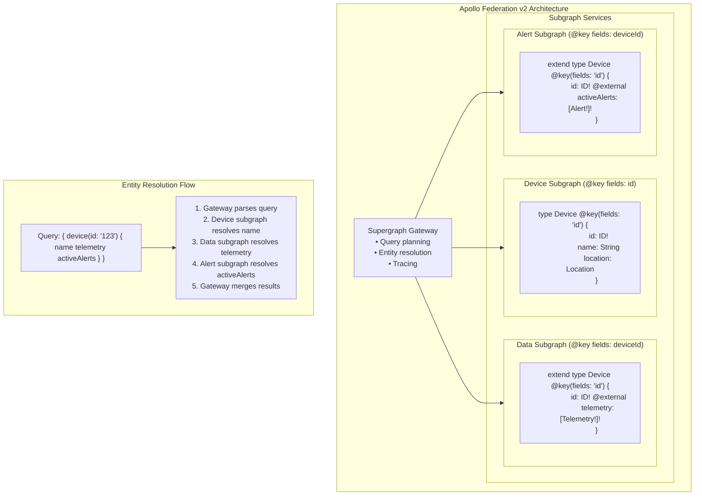

### 5.3 GraphQL Query Examples

**Complex Dashboard Query:**
```graphql
query DashboardQuery($timeRange: TimeRangeInput!) {
  # Get all devices in production zone
  devices(
    filter: { zoneId: "zone_prod_a", deviceTypes: [TEMPERATURE_SENSOR] }
  ) {
    edges {
      node {
        id
        name
        status { state batteryLevel }
        currentTelemetry: telemetry(timeRange: $timeRange, limit: 1) {
          metrics { name value unit }
        }
      }
    }
  }
  
  # Get aggregated statistics
  timeseries(
    query: {
      deviceIds: ["zone_prod_a_sensors"]
      metrics: [TEMPERATURE, HUMIDITY]
      timeRange: $timeRange
      aggregation: { interval: HOUR_1, functions: [AVG, MIN, MAX] }
    }
  ) {
    data {
      timestamp
      values {
        metric
        avg
        min
        max
      }
    }
  }
  
  # Get active alerts
  activeAlerts(severity: [CRITICAL, EMERGENCY]) {
    id
    title
    severity
    deviceName
    actualValue
    threshold
  }
  
  # Get dashboard summary metrics
  dashboardMetrics(dashboardId: "default", timeRange: $timeRange) {
    summary {
      avgTemperature
      maxTemperature
      avgHumidity
      activeAlertCount
      deviceOnlineCount
      totalDeviceCount
    }
  }
}
```

**Subscription for Real-time Updates:**
```graphql
subscription LiveDashboard($deviceIds: [ID!]!) {
  # Real-time telemetry
  telemetryStream(deviceIds: $deviceIds) {
    deviceId
    timestamp
    metrics {
      name
      value
      unit
    }
  }
  
  # Real-time alerts
  alertStream(severity: [WARNING, CRITICAL]) {
    id
    title
    severity
    deviceName
    actualValue
  }
  
  # Device status changes
  deviceStatusStream(deviceIds: $deviceIds) {
    deviceId
    currentState
    previousState
  }
}
```

---

## 6. Database Schema Design

### 6.1 MongoDB Entity Relationship Diagram

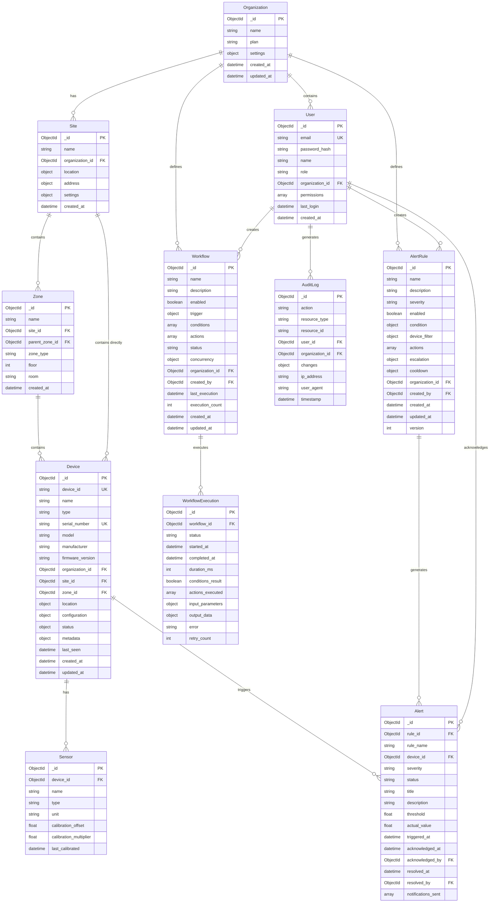

### 6.2 MongoDB Indexing Strategy

```javascript
// Devices Collection Indexes
db.devices.createIndex({ "device_id": 1 }, { unique: true })
db.devices.createIndex({ "serial_number": 1 }, { unique: true })
db.devices.createIndex({ "organization_id": 1, "site_id": 1, "zone_id": 1 })
db.devices.createIndex({ "organization_id": 1, "status.state": 1 })
db.devices.createIndex({ "location.coordinates": "2dsphere" })
db.devices.createIndex({ "status.last_heartbeat": 1 })
db.devices.createIndex({ "metadata.tags": 1 })
db.devices.createIndex({ "name": "text", "device_id": "text" })

// Alerts Collection Indexes
db.alerts.createIndex({ "organization_id": 1, "triggered_at": -1 })
db.alerts.createIndex({ "device_id": 1, "status": 1, "triggered_at": -1 })
db.alerts.createIndex({ "status": 1, "severity": 1, "triggered_at": 1 })
db.alerts.createIndex({ "rule_id": 1, "triggered_at": -1 })
db.alerts.createIndex({ "acknowledged_by": 1, "acknowledged_at": -1 })

// AlertRules Collection Indexes
db.alert_rules.createIndex({ "organization_id": 1, "enabled": 1 })
db.alert_rules.createIndex({ "severity": 1 })
db.alert_rules.createIndex({ "device_filter.device_ids": 1 })

// Workflows Collection Indexes
db.workflows.createIndex({ "organization_id": 1, "status": 1 })
db.workflows.createIndex({ "trigger.type": 1, "trigger.config.cron": 1 })
db.workflows.createIndex({ "last_execution": -1 })

// WorkflowExecutions Collection Indexes
db.workflow_executions.createIndex({ "workflow_id": 1, "started_at": -1 })
db.workflow_executions.createIndex({ "status": 1, "started_at": 1 })
db.workflow_executions.createIndex({ "completed_at": -1 })

// AuditLogs Collection Indexes (Time-series optimized)
db.audit_logs.createIndex({ "organization_id": 1, "timestamp": -1 })
db.audit_logs.createIndex({ "user_id": 1, "timestamp": -1 })
db.audit_logs.createIndex({ "resource_type": 1, "resource_id": 1, "timestamp": -1 })
db.audit_logs.createIndex({ "timestamp": 1 }, { expireAfterSeconds: 7776000 }) // 90 days TTL

// Users Collection Indexes
db.users.createIndex({ "email": 1 }, { unique: true })
db.users.createIndex({ "organization_id": 1, "role": 1 })
```

### 6.3 InfluxDB Time-Series Schema Details

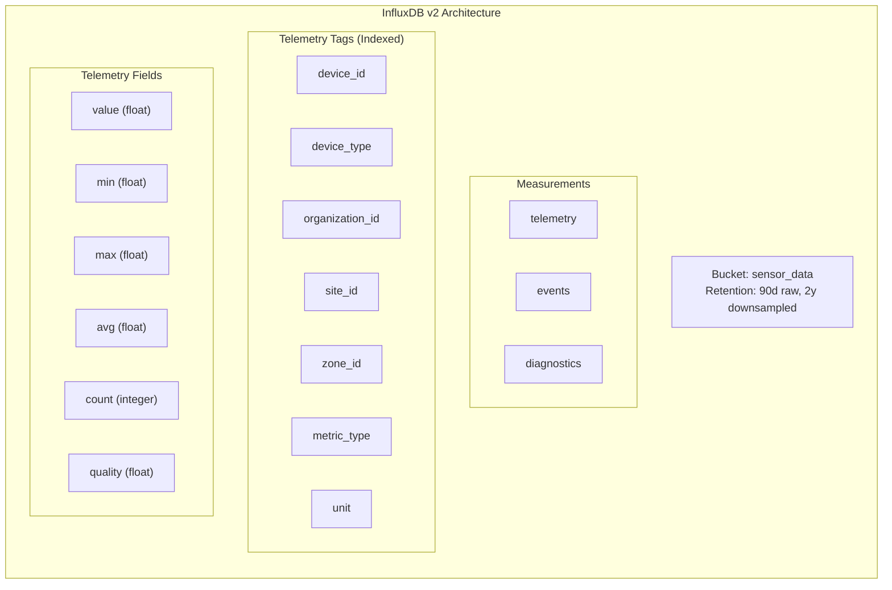

**InfluxDB Query Examples:**

```javascript
// Query raw telemetry for last hour
const query = `
  from(bucket: "sensor_data")
    |> range(start: -1h)
    |> filter(fn: (r) => r._measurement == "telemetry")
    |> filter(fn: (r) => r.device_id == "DEV-00123")
    |> filter(fn: (r) => r.metric_type == "temperature")
    |> aggregateWindow(every: 1m, fn: mean)
    |> yield(name: "mean_values")
`

// Query with multiple conditions
const query = `
  from(bucket: "sensor_data")
    |> range(start: -24h)
    |> filter(fn: (r) => r._measurement == "telemetry")
    |> filter(fn: (r) => r.organization_id == "org_acme")
    |> filter(fn: (r) => r.device_type == "temperature_sensor")
    |> filter(fn: (r) => r.metric_type == "temperature" or r.metric_type == "humidity")
    |> pivot(rowKey: ["_time"], columnKey: ["metric_type"], valueColumn: "_value")
    |> yield(name: "pivoted")
`

// Downsampling continuous query
CREATE CONTINUOUS QUERY "cq_5m" ON "sensor_data"
BEGIN
  SELECT mean(value) AS avg,
         min(value) AS min,
         max(value) AS max,
         count(value) AS count
  INTO "sensor_data"."downsampled"."telemetry_5m"
  FROM "sensor_data"."autogen"."telemetry"
  GROUP BY time(5m), device_id, metric_type
END
```

### 6.4 Redis Data Structures & Use Cases

| Key Pattern | Type | TTL | Use Case | Example |
|-------------|------|-----|----------|---------|
| `device:state:{device_id}` | Hash | 5min | Real-time device state | `HSET device:state:DEV-001 status "online" battery 85` |
| `device:telemetry:latest:{device_id}` | Hash | 1min | Latest telemetry value | `HSET device:telemetry:latest:DEV-001 temp "23.5" hum "52"` |
| `alert:cooldown:{rule_id}:{device_id}` | String | rule.cooldown | Prevent alert flooding | `SETEX alert:cooldown:R001:DEV-001 600 "2026-05-11T10:00:00Z"` |
| `rate:limit:{api_key}:{endpoint}` | String | 60s | API rate limiting | `INCR rate:limit:key123:devices` |
| `session:{session_id}` | Hash | 24h | User session storage | `HSET session:abc123 user_id "user_1" role "admin"` |
| `gql:query:{hash}` | String | 30s-5min | GraphQL query cache | `SET gql:query:abc123 '{"data":...}' EX 300` |
| `metrics:current:{org_id}:{metric}` | Sorted Set | 1min | Dashboard aggregation | `ZADD metrics:current:org123:temperature 23.5 "DEV-001"` |
| `workflow:lock:{workflow_id}` | String | 30s | Concurrency control | `SETNX workflow:lock:WF001 "locked"` |
| `mqtt:session:{client_id}` | Hash | 1h | MQTT session persistence | `HSET mqtt:session:client123 clean_start true` |
| `export:job:{job_id}` | String | 1h | Export job status tracking | `SET export:job:exp123 '{"status":"processing"}' EX 3600` |

**Redis Lua Script Example (Atomic Cooldown Check):**
```lua
-- check_and_set_cooldown.lua
-- KEYS[1]: cooldown key
-- ARGV[1]: cooldown seconds
-- ARGV[2]: current timestamp
-- Returns: 1 if allowed, 0 if in cooldown

local last_trigger = redis.call('GET', KEYS[1])
local current_time = tonumber(ARGV[2])
local cooldown_secs = tonumber(ARGV[1])

if last_trigger then
    local last_time = tonumber(last_trigger)
    if current_time - last_time < cooldown_secs then
        return 0  -- Still in cooldown
    end
end

-- Set new timestamp
redis.call('SETEX', KEYS[1], cooldown_secs, current_time)
return 1  -- Allowed to trigger
```

---

## 7. Real-time Communication Architecture

### 7.1 Complete Communication Stack

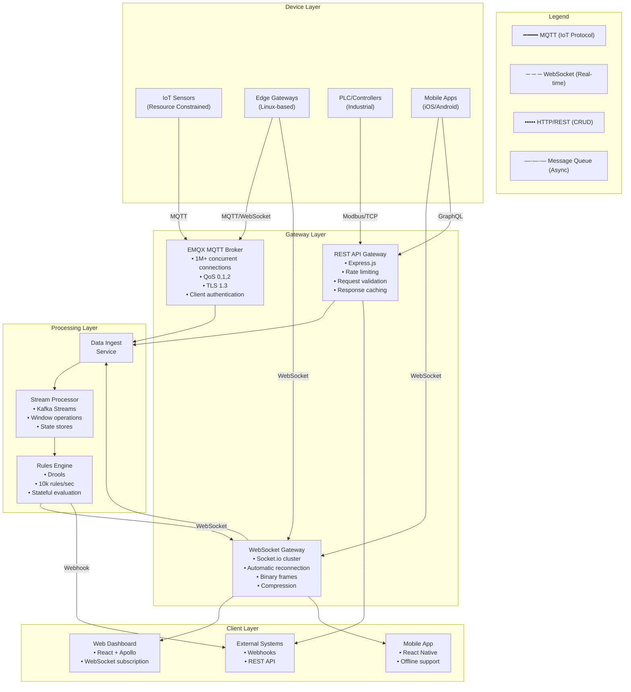

### 7.2 Message Queue Architecture (RabbitMQ)

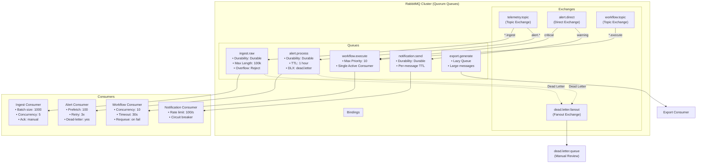

### 7.3 WebSocket Event Specifications

| Event Name | Direction | Payload Schema | Rate Limit | Use Case |
|------------|-----------|----------------|------------|----------|
| `telemetry:update` | Server → Client | `{ deviceId, timestamp, metrics: [{name, value, unit}] }` | 60 msg/s/device | Live dashboard updates |
| `alert:triggered` | Server → Client | `{ alertId, severity, title, deviceId, value, threshold }` | 10 msg/s | Real-time alert notification |
| `alert:resolved` | Server → Client | `{ alertId, resolvedBy, resolution, timestamp }` | 10 msg/s | Alert resolution sync |
| `device:status` | Server → Client | `{ deviceId, status, battery, signal, uptime }` | 1 msg/min/device | Device health monitoring |
| `workflow:executed` | Server → Client | `{ workflowId, executionId, status, actions }` | 5 msg/s | Automation audit trail |
| `dashboard:refresh` | Client → Server | `{ dashboardId, viewport, metrics }` | 1 msg/s | Manual refresh trigger |
| `device:command` | Client → Server | `{ deviceId, command, parameters, requestId }` | 5 msg/s/client | Send command to device |
| `subscription:subscribe` | Client → Server | `{ topics: [...], filter }` | On connect | Manage subscriptions |
| `subscription:unsubscribe` | Client → Server | `{ topics: [...] }` | On disconnect | Clean up subscriptions |

### 7.4 MQTT Topic Design

```
# Telemetry topics
nibe/v1/telemetry/{org_id}/{site_id}/{device_id}
nibe/v1/telemetry/batch/{org_id}/{gateway_id}

# Status topics
nibe/v1/status/{org_id}/{device_id}/heartbeat
nibe/v1/status/{org_id}/{device_id}/online
nibe/v1/status/{org_id}/{device_id}/offline

# Command topics (device subscription)
nibe/v1/command/{org_id}/{device_id}/config/set
nibe/v1/command/{org_id}/{device_id}/firmware/update
nibe/v1/command/{org_id}/{device_id}/calibration/start
nibe/v1/command/{org_id}/{device_id}/reset

# Command response topics
nibe/v1/command/{org_id}/{device_id}/response/{command_id}

# Alert topics
nibe/v1/alert/{org_id}/critical
nibe/v1/alert/{org_id}/warning
nibe/v1/alert/{org_id}/info

# System topics
nibe/v1/system/{org_id}/announce
nibe/v1/system/{org_id}/config/update
```

**MQTT QoS Level Usage:**

| QoS Level | Usage | Example Topic |
|-----------|-------|---------------|
| QoS 0 (At most once) | Non-critical telemetry | Archived sensor data |
| QoS 1 (At least once) | Standard telemetry, status | Active monitoring |
| QoS 2 (Exactly once) | Commands, critical alerts | Device configuration |

---

## 8. Frontend Dashboard Architecture

### 8.1 Complete Component Hierarchy

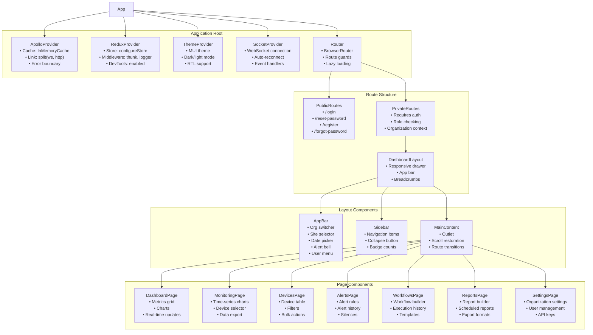

### 8.2 Redux State Structure

```javascript
// Complete Redux Store Structure
const rootReducer = {
  // Auth State
  auth: {
    user: {
      id: null,
      email: null,
      name: null,
      role: null,
      permissions: [],
      organizationId: null
    },
    tokens: {
      accessToken: null,
      refreshToken: null,
      expiresAt: null
    },
    isAuthenticated: false,
    isLoading: false,
    error: null
  },
  
  // Organization Context
  organization: {
    current: {
      id: null,
      name: null,
      plan: null,
      settings: {}
    },
    sites: [],
    selectedSiteId: null,
    hierarchy: null
  },
  
  // Device State
  devices: {
    items: {},
    pagination: {
      page: 1,
      limit: 50,
      total: 0
    },
    filters: {
      deviceTypes: [],
      status: [],
      siteId: null,
      zoneId: null,
      searchQuery: ''
    },
    selectedDeviceIds: [],
    loadingStates: {
      list: false,
      detail: false,
      update: false
    },
    realtime: {
      telemetry: {},
      status: {}
    }
  },
  
  // Alert State
  alerts: {
    active: [],
    history: {
      items: [],
      pagination: {}
    },
    rules: [],
    filters: {
      severity: [],
      status: [],
      timeRange: null
    },
    loadingStates: {
      active: false,
      history: false,
      rules: false
    }
  },
  
  // Workflow State
  workflows: {
    items: [],
    executing: {},
    history: [],
    builder: {
      currentWorkflow: null,
      isDirty: false,
      validationErrors: []
    }
  },
  
  // Dashboard State
  dashboard: {
    metrics: {
      temperature: { avg: null, min: null, max: null },
      humidity: { avg: null, min: null, max: null },
      activeAlerts: 0,
      onlineDevices: 0,
      totalDevices: 0
    },
    charts: {
      timeSeries: {},
      aggregation: 'hour',
      selectedDevices: []
    },
    refreshInterval: 30000,
    lastUpdated: null
  },
  
  // UI State
  ui: {
    theme: 'light',
    sidebarOpen: true,
    notifications: [],
    modals: {},
    loadingOverlay: false
  }
}
```

### 8.3 Frontend Performance Optimizations

| Optimization | Implementation | Benefit |
|--------------|----------------|---------|
| **Code Splitting** | React.lazy() + Suspense | Reduced initial bundle size (↓40%) |
| **Virtual Scrolling** | react-window for tables | Smooth scrolling with 10k+ rows |
| **Memoization** | useMemo, useCallback, React.memo | Prevent unnecessary re-renders |
| **GraphQL Caching** | Apollo InMemoryCache | Reduce network requests |
| **WebSocket Batching** | Batch multiple updates | Reduce connection overhead |
| **Image Optimization** | WebP, lazy loading | Faster page loads |
| **Service Worker** | Workbox for PWA | Offline support, faster repeat visits |
| **CDN** | CloudFront edge caching | Global low-latency delivery |
| **Bundle Analysis** | Webpack Bundle Analyzer | Identify optimization opportunities |
| **Tree Shaking** | ES6 modules | Remove unused code |

---

## 9. Security Architecture

### 9.1 Complete Security Stack

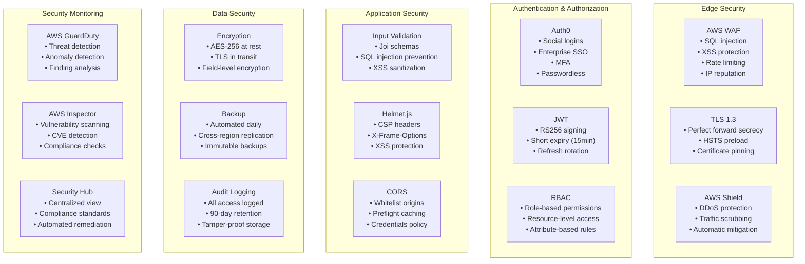

### 9.2 Role-Based Access Control (RBAC) Details

#### Role Hierarchy & Inheritance

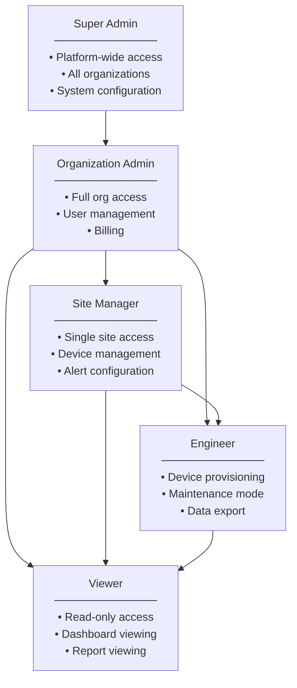

#### Detailed Permission Matrix

| Resource | Action | Super Admin | Org Admin | Site Mgr | Engineer | Viewer |
|----------|--------|-------------|-----------|----------|----------|--------|
| **Organizations** | Create | ✓ | - | - | - | - |
| | Read | ✓ | ✓ | ✓ | ✓ | ✓ |
| | Update | ✓ | ✓ | - | - | - |
| | Delete | ✓ | - | - | - | - |
| **Sites** | Create | ✓ | ✓ | - | - | - |
| | Read | ✓ | ✓ | ✓ | ✓ | ✓ |
| | Update | ✓ | ✓ | ✓ | - | - |
| | Delete | ✓ | ✓ | - | - | - |
| **Zones** | Create | ✓ | ✓ | ✓ | ✓ | - |
| | Read | ✓ | ✓ | ✓ | ✓ | ✓ |
| | Update | ✓ | ✓ | ✓ | ✓ | - |
| | Delete | ✓ | ✓ | ✓ | - | - |
| **Devices** | Register | ✓ | ✓ | ✓ | ✓ | - |
| | Read | ✓ | ✓ | ✓ | ✓ | ✓ |
| | Update Config | ✓ | ✓ | ✓ | ✓ | - |
| | Delete | ✓ | ✓ | ✓ | - | - |
| | Firmware Update | ✓ | ✓ | ✓ | ✓ | - |
| | Calibrate | ✓ | ✓ | ✓ | ✓ | - |
| **Telemetry** | Read | ✓ | ✓ | ✓ | ✓ | ✓ |
| | Export | ✓ | ✓ | ✓ | ✓ | ✓ |
| **Alert Rules** | Create | ✓ | ✓ | ✓ | - | - |
| | Read | ✓ | ✓ | ✓ | ✓ | ✓ |
| | Update | ✓ | ✓ | ✓ | - | - |
| | Delete | ✓ | ✓ | - | - | - |
| | Enable/Disable | ✓ | ✓ | ✓ | - | - |
| **Alerts** | Read | ✓ | ✓ | ✓ | ✓ | ✓ |
| | Acknowledge | ✓ | ✓ | ✓ | ✓ | - |
| | Resolve | ✓ | ✓ | ✓ | ✓ | - |
| | Silence | ✓ | ✓ | ✓ | ✓ | - |
| **Workflows** | Create | ✓ | ✓ | ✓ | - | - |
| | Read | ✓ | ✓ | ✓ | ✓ | ✓ |
| | Update | ✓ | ✓ | ✓ | - | - |
| | Delete | ✓ | ✓ | - | - | - |
| | Execute | ✓ | ✓ | ✓ | ✓ | - |
| **Reports** | Create | ✓ | ✓ | ✓ | ✓ | - |
| | Read | ✓ | ✓ | ✓ | ✓ | ✓ |
| | Schedule | ✓ | ✓ | ✓ | ✓ | - |
| **Users** | Invite | ✓ | ✓ | - | - | - |
| | Read | ✓ | ✓ | ✓ | - | - |
| | Update Role | ✓ | ✓ | - | - | - |
| | Remove | ✓ | ✓ | - | - | - |
| **API Keys** | Create | ✓ | ✓ | ✓ | ✓ | - |
| | Revoke | ✓ | ✓ | ✓ | ✓ | - |
| **Audit Logs** | Read | ✓ | ✓ | ✓ | - | - |
| **System** | Configure | ✓ | - | - | - | - |
| | Monitor | ✓ | ✓ | - | - | - |

### 9.3 JWT Token Specification

```javascript
// JWT Token Structure (RS256)
{
  // Header
  "alg": "RS256",
  "typ": "JWT",
  "kid": "key-2026-01",
  
  // Payload
  "iss": "https://auth.nibe.com",
  "sub": "user_12345",
  "aud": "api.nibe.com",
  "exp": 1743328800,      // 7 days from issue
  "iat": 1743242400,      // Issue time
  "nbf": 1743242400,      // Not before
  "jti": "unique-token-id-abc123",
  
  // Custom Claims
  "user_id": "usr_abc123",
  "email": "john.doe@acmecorp.com",
  "name": "John Doe",
  "role": "organization_admin",
  "organization_id": "org_acme_123",
  "organization_name": "Acme Corporation",
  "sites": ["site_blr_001", "site_del_002"],
  "permissions": [
    "devices:read",
    "devices:write",
    "alerts:read",
    "alerts:manage",
    "workflows:execute"
  ],
  "mfa_enabled": true,
  "mfa_verified": true,
  "session_id": "sess_xyz789",
  "device_id": "browser_fingerprint_hash"
}

// Token Rotation Policy
- Access Token: 15 minutes
- Refresh Token: 7 days
- Refresh Token Rotation: New token issued on each refresh
- Revocation: On logout, password change, or suspicious activity
```

### 9.4 API Security Controls

```javascript
// Rate Limiting Configuration
const rateLimitConfig = {
  // Authenticated endpoints
  authenticated: {
    windowMs: 60 * 1000,  // 1 minute
    max: 1000,             // 1000 requests per minute
    skipSuccessfulRequests: false,
    standardHeaders: true,
    legacyHeaders: false
  },
  
  // Unauthenticated endpoints
  unauthenticated: {
    windowMs: 60 * 1000,
    max: 100,              // 100 requests per minute
    skipFailedRequests: true
  },
  
  // GraphQL specific
  graphql: {
    windowMs: 60 * 1000,
    max: 500,
    keyGenerator: (req) => req.user?.id || req.ip,
    skip: (req) => req.body?.operationName === 'IntrospectionQuery'
  },
  
  // Device ingestion
  deviceIngestion: {
    windowMs: 60 * 1000,
    max: 6000,             // 6000 messages per minute per device
    keyGenerator: (req) => req.headers['x-device-id']
  }
}

// CORS Configuration
const corsConfig = {
  origin: [
    'https://app.nibe.com',
    'https://staging.nibe.com',
    'https://admin.nibe.com'
  ],
  methods: ['GET', 'POST', 'PUT', 'DELETE', 'OPTIONS'],
  allowedHeaders: [
    'Content-Type',
    'Authorization',
    'X-Request-ID',
    'X-API-Key',
    'X-Device-ID'
  ],
  exposedHeaders: ['X-RateLimit-Limit', 'X-RateLimit-Remaining'],
  credentials: true,
  maxAge: 86400  // 24 hours
}

// Content Security Policy
const cspConfig = {
  directives: {
    defaultSrc: ["'self'"],
    scriptSrc: ["'self'", "'unsafe-inline'", "https://cdn.nibe.com"],
    styleSrc: ["'self'", "'unsafe-inline'", "https://fonts.googleapis.com"],
    imgSrc: ["'self'", "data:", "https:", "blob:"],
    connectSrc: ["'self'", "https://api.nibe.com", "wss://ws.nibe.com"],
    fontSrc: ["'self'", "https://fonts.gstatic.com"],
    objectSrc: ["'none'"],
    mediaSrc: ["'self'"],
    frameSrc: ["'none'"],
    baseUri: ["'self'"],
    formAction: ["'self'"],
    frameAncestors: ["'none'"]
  },
  reportOnly: false,
  reportUri: "/api/csp-report"
}
```

---

## 10. Deployment Architecture

### 10.1 AWS Infrastructure Complete Diagram

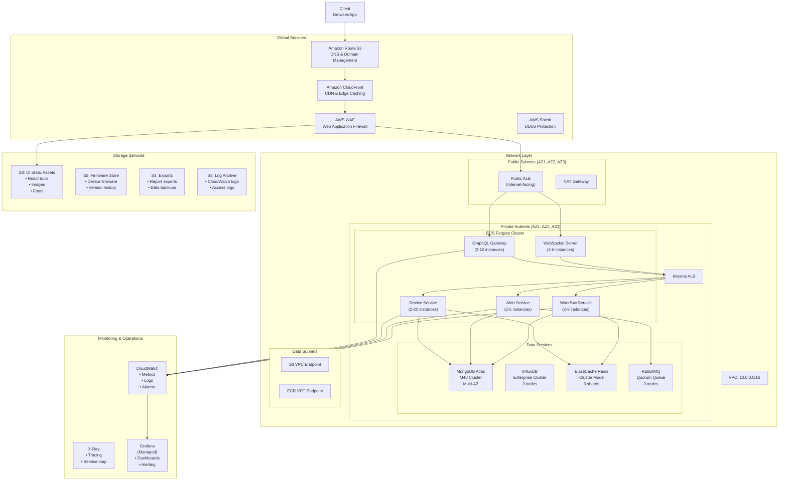

### 10.2 Container Specifications

| Service | CPU | Memory | Min Instances | Max Instances | Scaling Metric |
|---------|-----|--------|---------------|---------------|----------------|
| **GraphQL Gateway** | 2 vCPU | 4 GB | 2 | 10 | CPU > 70% for 2min |
| **WebSocket Server** | 2 vCPU | 4 GB | 2 | 8 | Connections > 5000 per instance |
| **Device Service** | 1 vCPU | 2 GB | 2 | 20 | SQS queue depth > 1000 |
| **Data Service** | 2 vCPU | 4 GB | 3 | 15 | CPU > 80% for 3min |
| **Alert Service** | 1 vCPU | 2 GB | 2 | 5 | Alert rate > 100/min |
| **Workflow Service** | 2 vCPU | 4 GB | 2 | 8 | Active workflows > 50 |

### 10.3 Multi-Region Disaster Recovery

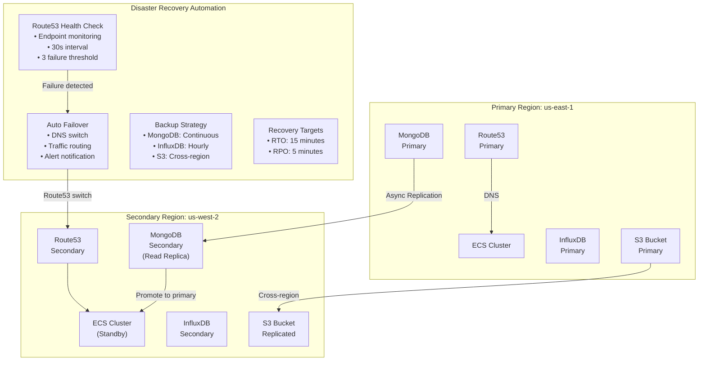

---

## 11. Monitoring & Observability

### 11.1 Complete Observability Stack

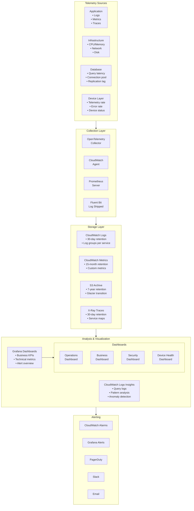

### 11.2 Key Metrics & Alerting Rules

| Category | Metric | Threshold | Severity | Action |
|----------|--------|-----------|----------|--------|
| **API Gateway** | p99 Latency | > 500ms | Warning | Page team |
| | Error Rate | > 1% | Critical | Page + Slack |
| | Request Rate | > 10,000/min | Warning | Auto-scale |
| **Device Service** | Ingestion Lag | > 5s | Critical | Page |
| | Device Offline % | > 10% | Warning | Slack |
| | Message Drop Rate | > 0.1% | Critical | Page |
| **Alert Service** | Alert Delivery Lag | > 10s | Warning | Slack |
| | Notification Failure | > 5% | Critical | Page |
| **Database** | MongoDB CPU | > 80% | Warning | Auto-scale |
| | InfluxDB Write Rate | > 50k points/s | Warning | Scale |
| | Redis Memory | > 80% | Warning | Alert |
| **Business** | Active Devices | < Expected | Warning | Slack |
| | Critical Alerts | > 10/min | Critical | Page |
| | System Uptime | < 99.9% | Critical | Page |

### 11.3 Distributed Tracing

```javascript
// OpenTelemetry Configuration
const { NodeTracerProvider } = require('@opentelemetry/sdk-trace-node');
const { AWSXRayIdGenerator } = require('@opentelemetry/id-generator-aws-xray');
const { OTLPTraceExporter } = require('@opentelemetry/exporter-trace-otlp-grpc');

const provider = new NodeTracerProvider({
  idGenerator: new AWSXRayIdGenerator(),
  resource: new Resource({
    'service.name': 'device-service',
    'service.version': '2.0.0',
    'deployment.environment': 'production'
  })
});

provider.addSpanProcessor(new BatchSpanProcessor(new OTLPTraceExporter({
  url: 'https://xray.us-east-1.amazonaws.com'
})));

// Trace Context Propagation
const trace = {
  traceId: '1-68123456-abcdef1234567890',
  spanId: 'span-12345',
  sampled: true,
  
  // Custom attributes
  attributes: {
    'device.id': 'DEV-00123',
    'organization.id': 'org_acme',
    'telemetry.count': 100,
    'processing.latency.ms': 45
  },
  
  // Additional metadata
  annotations: [
    { timestamp: Date.now(), value: 'validation.complete' },
    { timestamp: Date.now(), value: 'storage.write.start' }
  ]
}
```

---

## 12. Disaster Recovery & Business Continuity

### 12.1 RTO/RPO Targets

| Component | RTO (Recovery Time) | RPO (Recovery Point) | Strategy |
|-----------|--------------------|--------------------|----------|
| **GraphQL Gateway** | < 5 minutes | 0 minutes | Auto-scaling + Multi-AZ |
| **Microservices** | < 5 minutes | 0 minutes | ECS Fargate + Rolling updates |
| **MongoDB** | < 15 minutes | < 5 minutes | Multi-AZ replicas + Continuous backups |
| **InfluxDB** | < 30 minutes | < 15 minutes | Clustered + Point-in-time recovery |
| **Redis** | < 10 minutes | 0 minutes | Replication group + Auto-failover |
| **RabbitMQ** | < 15 minutes | < 1 minute | Quorum queues + Mirroring |
| **S3 Data** | < 5 minutes | 0 minutes | Cross-region replication |
| **Entire System** | < 60 minutes | < 15 minutes | DR region failover |

### 12.2 Backup Schedule

| Data Type | Backup Method | Frequency | Retention | Location |
|-----------|---------------|-----------|-----------|----------|
| **MongoDB** | Atlas Continuous Backup | Continuous | 30 days | Secondary region |
| **InfluxDB** | Custom backup script | Hourly | 90 days | S3 + Secondary region |
| **Device Config** | MongoDB (already covered) | - | - | - |
| **Alert History** | Export job | Daily | 1 year | S3 Glacier |
| **Audit Logs** | CloudWatch export | Daily | 7 years | S3 Glacier Deep |
| **Firmware** | S3 versioning | On upload | Indefinite | Cross-region replicated |

### 12.3 Disaster Recovery Runbook

```mermaid
flowchart TD
    START[Incident Detected] --> ASSESS{Assess Severity}
    
    ASSESS -->|Minor| MINOR["Minor Incident<br/>• Single service degraded<br/>• <5% impact"]
    ASSESS -->|Major| MAJOR["Major Incident<br/>• Service outage<br/>• 5-50% impact"]
    ASSESS -->|Critical| CRITICAL["Critical Incident<br/>• Full region outage<br/>• >50% impact"]
    
    MINOR --> STEP1["1. Page on-call engineer<br/>2. Review metrics<br/>3. Isolate issue<br/>4. Rollback or restart<br/>5. Document RCA"]
    
    MAJOR --> STEP2["1. Page incident team<br/>2. Declare incident<br/>3. Implement fix<br/>4. Communicate status<br/>5. Post-mortem"]
    
    CRITICAL --> DR_PLAN["Disaster Recovery Plan"]
    
    subgraph DR_PROCESS["DR Process (60 min target)"]
        DR1["1. Declare disaster (10 min)<br/>• Alert management<br/>• Assemble DR team"]
        DR2["2. Activate secondary region (15 min)<br/>• Route53 failover<br/>• Scale up ECS"]
        DR3["3. Restore data (20 min)<br/>• Promote DB replicas<br/>• Verify integrity"]
        DR4["4. Validate system (10 min)<br/>• Run health checks<br/>• Test critical flows"]
        DR5["5. Re-route traffic (5 min)<br/>• Update DNS<br/>• Monitor adoption"]
    end
    
    DR_PLAN --> DR_PROCESS
    DR_PROCESS --> COMPLETE["System Restored<br/>RTO: 60 min | RPO: 15 min"]
```

---

## 13. Future Roadmap Details

### 13.1 Phase 2: AI & Analytics (Q3 2026)

| Feature | Description | Impact | Effort |
|---------|-------------|--------|--------|
| **Anomaly Detection ML** | Auto-detect unusual patterns using LSTM neural networks | Reduce false positives by 70% | High |
| **Predictive Maintenance** | Forecast device failures using historical data | Prevent 90% of unexpected downtime | High |
| **Energy Optimization** | AI-suggested HVAC schedules based on occupancy | 15-30% energy savings | Medium |
| **Digital Twin** | 3D facility simulation with real-time data | Improved operational visibility | High |
| **Mobile App** | React Native app with push notifications | Field worker enablement | Medium |

### 13.2 Phase 3: Enterprise Features (Q4 2026)

| Feature | Description | Impact | Effort |
|---------|-------------|--------|--------|
| **Multi-site Analytics** | Cross-site correlation and benchmarking | Enterprise visibility | Medium |
| **Compliance Reporting** | Auto-generated ISO/FDA/GMP reports | Audit readiness | Medium |
| **Edge Computing** | Local processing gateway for edge sites | Reduce cloud dependency | High |
| **Custom Dashboard Builder** | Drag-drop widget configuration | User empowerment | Medium |
| **SLA Monitoring** | Contractual SLA tracking and reporting | Customer transparency | Low |

### 13.3 Phase 4: Expansion (2027)

| Feature | Description | Impact | Effort |
|---------|-------------|--------|--------|
| **Carbon Footprint Tracking** | Energy → carbon conversion | Sustainability reporting | Medium |
| **BMS Integration** | Native building management system connectors | Market expansion | High |
| **White-label Solution** | Partner-branded deployments | Revenue growth | High |
| **Global Multi-region** | Active-active deployment across 3+ regions | Global enterprise | High |
| **Marketplace** | Third-party app integration marketplace | Ecosystem growth | High |

---

## 14. Appendix

### 14.1 Glossary of Terms

| Term | Definition |
|------|------------|
| **DIM** | Digital Infrastructure Monitor - The product name |
| **HLD** | High-Level Design - Architectural document |
| **MQTT** | Message Queuing Telemetry Transport - Lightweight IoT protocol |
| **RTO** | Recovery Time Objective - Target time for system recovery |
| **RPO** | Recovery Point Objective - Maximum acceptable data loss |
| **RBAC** | Role-Based Access Control - Permission management system |
| **OTA** | Over-The-Air - Remote firmware updates |
| **QoS** | Quality of Service - Message delivery guarantee level |

### 14.2 Acronyms

| Acronym | Full Form |
|---------|-----------|
| API | Application Programming Interface |
| CDN | Content Delivery Network |
| CSP | Content Security Policy |
| CVE | Common Vulnerabilities and Exposures |
| DLQ | Dead Letter Queue |
| ECS | Elastic Container Service |
| FDA | Food and Drug Administration |
| GMP | Good Manufacturing Practice |
| HSTS | HTTP Strict Transport Security |
| HVAC | Heating, Ventilation, and Air Conditioning |
| IaC | Infrastructure as Code |
| JWT | JSON Web Token |
| MFA | Multi-Factor Authentication |
| MUI | Material-UI |
| P95 | 95th Percentile |
| PLC | Programmable Logic Controller |
| RCA | Root Cause Analysis |
| SSO | Single Sign-On |
| TLS | Transport Layer Security |
| TTL | Time To Live |
| VOC | Volatile Organic Compounds |
| WAF | Web Application Firewall |
| XSS | Cross-Site Scripting |

### 14.3 References & Resources

- **GraphQL Federation:** https://www.apollographql.com/docs/federation/
- **MongoDB Time-Series:** https://www.mongodb.com/docs/manual/core/timeseries/
- **InfluxDB Documentation:** https://docs.influxdata.com/influxdb/
- **MQTT 5.0 Specification:** https://docs.oasis-open.org/mqtt/mqtt/v5.0/
- **OpenTelemetry:** https://opentelemetry.io/
- **AWS Well-Architected Framework:** https://aws.amazon.com/architecture/well-architected/

### 14.4 Change Request Process

1. **Submit CR:** Create issue in Jira with label `architecture-change`
2. **Review:** Architecture Review Board (ARB) meets weekly
3. **Impact Assessment:** Technical and business impact analysis
4. **Approval:** ARB vote (majority required)
5. **Implementation:** Update documentation and track in Jira
6. **Communication:** Announce to stakeholders via email/Slack

---

## Document Sign-off

| Role | Name | Signature | Date |
|------|------|-----------|------|
| **Solution Architect** | __________________ | ___________ | ______ |
| **Tech Lead** | __________________ | ___________ | ______ |
| **Product Manager** | __________________ | ___________ | ______ |
| **Security Lead** | __________________ | ___________ | ______ |
| **Operations Lead** | __________________ | ___________ | ______ |

---

**End of Document**

*This High-Level Design Document is confidential and proprietary to Nibe DIM. Unauthorized distribution is prohibited.*

---

## Version History

| Version | Date | Author | Changes | Reviewers |
|---------|------|--------|---------|-----------|
| 1.0 | 2026-03-29 | Architecture Team | Initial draft | ARB |
| 1.1 | 2026-04-15 | Architecture Team | Added security section | Security Team |
| 2.0 | 2026-05-11 | Architecture Team | Complete rewrite with Mermaid diagrams, detailed explanations | All stakeholders |

---

This complete HLD provides a comprehensive architectural blueprint for the Nibe DIM Environmental Monitoring System, incorporating detailed explanations for every component, Mermaid diagrams for visual clarity, and practical implementation guidance for development, deployment, and operations teams.