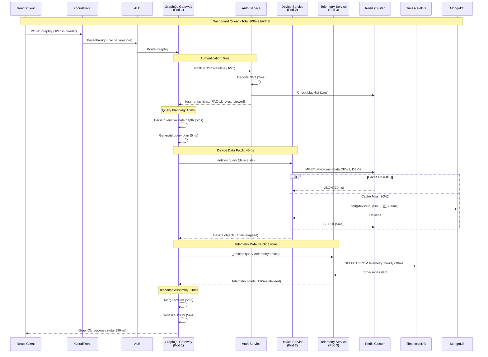
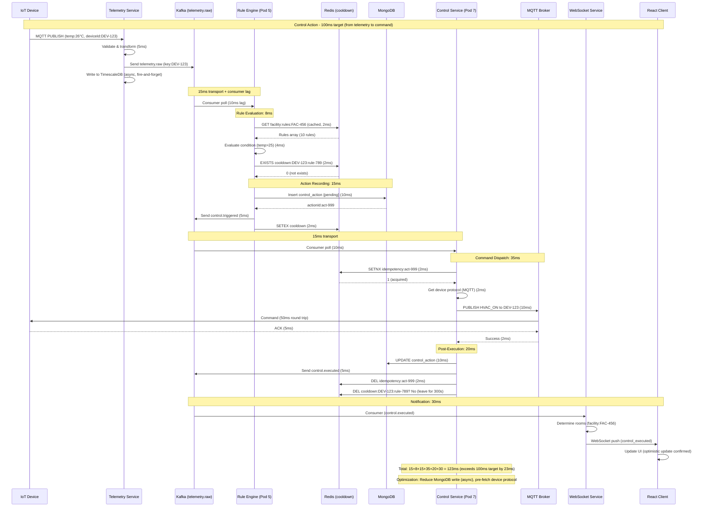

create barebones structure, set up whole project, without logic or anything else, following best practices, full backend first ,which can run:

## (MERN Stack + GraphQL + WebSocket + Microservices)

---

## PHASE 0 — SYSTEM OVERVIEW (EXPANDED)

**Problem Summary**  
Industrial environmental monitoring for Nibe DIM: 50,000+ sensors across manufacturing facilities, cold storage, and clean rooms. Requirements: real-time dashboards (<200ms latency), automated control actions (HVAC, ventilation based on thresholds), historical analytics for compliance reporting (ISO 14644-1 cleanroom standards), and bidirectional control loops.

**Architecture Type:** **Microservices** (Containerized, deployed to AWS EKS)  

**Justification Matrix:**

| Factor | Weight | Monolith Score | Microservices Score | Decision |
|--------|--------|----------------|---------------------|----------|
| Team structure (3 frontend, 4 backend, 2 DevOps) | High | 3/10 (single codebase conflicts) | 9/10 (parallel ownership) | Microservices |
| Control loop latency (sub-100ms) | Critical | 6/10 (shared resources contention) | 8/10 (dedicated control service) | Microservices |
| WebSocket scale (10K concurrent) | High | 4/10 (blocks event loop) | 9/10 (independent scaling) | Microservices |
| Deployment frequency (daily vs weekly) | Medium | 5/10 (risk of regression) | 8/10 (service isolation) | Microservices |
| Operational complexity tolerance | Medium | 8/10 (simple) | 5/10 (K8s + service mesh) | **Microservices wins** |

---

## PHASE 1 — REQUIREMENTS & SCALE (QUANTIFIED)

### Functional Requirements (MoSCoW)

| Priority | Feature | Success Metric |
|----------|---------|----------------|
| **Must** | Real-time sensor dashboard | Loads within 2s, updates every 1s |
| **Must** | Automated control rules | Trigger within 100ms of threshold breach |
| **Must** | Alert management (SMS/email) | 99.9% delivery within 30s |
| **Must** | Device configuration UI | Changes applied within 5s |
| **Should** | Historical analytics (30-day) | Query returns within 1s |
| **Should** | Compliance reports (PDF/CSV) | Generate within 10s |
| **Could** | ML anomaly detection | Detect within 5 minutes |
| **Won't v1** | Predictive maintenance | Post-MVP |

### Non-functional Requirements (SLOs)

```yaml
availability:
  overall_sla: "99.95%"
  critical_alerts: "99.99%"
  maintenance_window: "Sunday 02:00-04:00 UTC"

latency:
  dashboard_query:
    p50: "100ms"
    p95: "200ms"
    p99: "500ms"
  control_action:
    p50: "50ms"
    p95: "100ms"
    p99: "200ms"
  telemetry_ingest:
    p95: "50ms"
  historical_query_30d:
    p95: "1s"

throughput:
  telemetry_writes: "5,000 QPS (avg), 15,000 QPS (peak)"
  dashboard_reads: "2,000 QPS"
  control_actions: "500 QPS"
  graphql_operations: "3,000 QPS"

consistency:
  device_config: "Strong (linearizable)"
  telemetry: "Eventual (5s max lag)"
  control_commands: "Strong (idempotent)"
  analytics: "Eventual (5min lag)"

capacity:
  devices: "50,000 active, 100,000 registered"
  users: "2,000 concurrent dashboard, 200 facility managers"
  data_growth: "432M readings/day → 157B/year"
  storage: "15TB raw/year (90d retention), 3TB aggregates (5y)"
  websocket_connections: "10,000 concurrent"
  control_rules: "10,000 active, evaluated per reading"
```

### Scale Projection (3-year)

| Year | Devices | QPS Write | QPS Read | Storage (TB) | WebSocket Users | Monthly Cost |
|------|---------|-----------|----------|--------------|-----------------|---------------|
| 1 | 50,000 | 5,000 | 2,000 | 18 | 10,000 | $17,317 |
| 2 | 90,000 | 9,000 | 3,600 | 32 | 18,000 | $31,000 |
| 3 | 135,000 | 13,500 | 5,400 | 48 | 27,000 | $46,500 |

---

## PHASE 2 — WORKLOAD CHARACTERIZATION (DETAILED)

### Traffic Pattern Analysis

```yaml
daily_pattern:
  business_hours: "08:00-18:00 UTC"
  peak_qps: "15,000 (10:00-11:00)"
  avg_qps: "8,000"
  off_hours: "18:00-08:00"
  off_hours_qps: "2,000"
  weekend_qps: "1,500"

seasonal_patterns:
  summer: "HVAC control actions +40% (Jun-Aug)"
  winter: "Heating control actions +30% (Dec-Feb)"
  maintenance_windows: "Last Sunday each month, -80% traffic"

hot_paths:
  telemetry_ingestion:
    percentage: "95% of ops"
    peak_qps: "15,000"
    slo: "50ms p95"
    cacheable: "No (write-heavy)"
  
  dashboard_recent_data:
    percentage: "3% of ops"
    peak_qps: "2,000"
    slo: "200ms p95"
    cacheable: "Yes (5s TTL)"
  
  control_rule_evaluation:
    percentage: "1.5% of ops"
    peak_qps: "15,000 (per reading)"
    cpu_cost: "High (JSONata)"
    cacheable: "Rules cached"

cold_paths:
  historical_analytics:
    percentage: "0.5% of ops"
    qps: "50"
    slo: "1s p95"
    data_age: "30-90 days"
  
  compliance_report:
    percentage: "0.01% of ops"
    frequency: "500/day"
    slo: "10s"
    data_age: "1-365 days"
  
  device_provisioning:
    percentage: "0.001% of ops"
    frequency: "100/day"
    slo: "5s"
    consistency: "Strong"

data_temperature:
  hot:
    age: "0-6 hours"
    access: "90% of queries"
    storage: "TimescaleDB (SSD) + Redis cache"
    size: "1.5TB"
  
  warm:
    age: "6 hours - 30 days"
    access: "9% of queries"
    storage: "TimescaleDB (SSD compression)"
    size: "12TB"
  
  cold:
    age: "30-90 days"
    access: "1% of queries"
    storage: "S3 Standard (compressed)"
    size: "3TB"
  
  frozen:
    age: ">90 days"
    access: "<0.1% of queries (compliance only)"
    storage: "S3 Glacier Deep"
    size: "50TB"
```

### Read:Write Ratio by Component

| Component | Read % | Write % | Caching Strategy |
|-----------|--------|---------|------------------|
| Telemetry Pipeline | 10% | 90% | Write-through to TimescaleDB |
| Device Registry | 70% | 30% | Cache-aside (Redis, 5min TTL) |
| Alert Rules | 80% | 20% | Cache-aside (Redis, 10min TTL) |
| Audit Log | 5% | 95% | No cache (write-once) |
| Dashboard Aggregates | 95% | 5% | Pre-computed (Timescale continuous aggregates) |
| Control Actions | 40% | 60% | Idempotency cache (24h TTL) |

---

## PHASE 3 — DOMAIN DESIGN (DDD) - EXPANDED

### Domain Event Storming Results

```yaml
commands:
  - RegisterDevice
  - CalibrateSensor
  - UpdateThresholds
  - IngestTelemetry
  - EvaluateRule
  - ExecuteControl
  - AcknowledgeAlert
  - GenerateReport

events:
  - DeviceRegistered (device, facility, timestamp)
  - TelemetryIngested (deviceId, metrics, quality)
  - RuleTriggered (ruleId, deviceId, condition, action)
  - ControlExecuted (actionId, deviceId, command, status)
  - AlertRaised (alertId, deviceId, severity, message)
  - AlertAcknowledged (alertId, userId, timestamp)
  - ReportGenerated (reportId, type, userId)

aggregates:
  Device:
    commands:
      - register
      - calibrate
      - updateStatus
    events:
      - DeviceRegistered
      - DeviceCalibrated
      - DeviceStatusChanged
    invariants:
      - calibration_offset_abs <= 5.0
      - serial_number_unique
    state:
      - deviceId
      - facilityId
      - type
      - calibration
      - status
      - lastHeartbeat
  
  TelemetryReading:
    commands:
      - ingest
    events:
      - TelemetryIngested
    invariants:
      - timestamp <= now + 5min (no future data)
      - quality_score between 0 and 1
    state:
      - deviceId
      - timestamp
      - metrics
      - quality
  
  ControlRule:
    commands:
      - create
      - enable
      - disable
      - update
    events:
      - RuleCreated
      - RuleEnabled
      - RuleDisabled
    invariants:
      - cooldown_seconds between 0 and 3600
      - condition valid JSONata
    state:
      - ruleId
      - facilityId
      - condition
      - action
      - cooldown
      - enabled
  
  ControlAction:
    commands:
      - trigger
      - execute
      - retry
    events:
      - ControlTriggered
      - ControlExecuted
      - ControlFailed
    invariants:
      - idempotency_key unique
      - max_retries = 3
    state:
      - actionId
      - deviceId
      - command
      - status
      - attempts
      - result
  
  Alert:
    commands:
      - raise
      - acknowledge
      - resolve
      - escalate
    events:
      - AlertRaised
      - AlertAcknowledged
      - AlertResolved
      - AlertEscalated
    invariants:
      - escalation_delay = 15 minutes
    state:
      - alertId
      - deviceId
      - severity
      - status
      - acknowledgedBy
      - resolvedAt

bounded_contexts:
  DeviceManagement:
    domain: "Device lifecycle, calibration, configuration"
    aggregates: [Device]
    events: [DeviceRegistered, DeviceCalibrated]
    api: "GraphQL (Device Service)"
  
  TelemetryIngestion:
    domain: "Raw data ingestion, validation, storage"
    aggregates: [TelemetryReading]
    events: [TelemetryIngested]
    api: "Kafka producer + REST fallback"
  
  RuleEvaluation:
    domain: "Rule engine, condition evaluation, action triggering"
    aggregates: [ControlRule]
    events: [RuleTriggered]
    api: "Kafka consumer + producer"
  
  ControlExecution:
    domain: "Device command dispatch, idempotency, retries"
    aggregates: [ControlAction]
    events: [ControlExecuted, ControlFailed]
    api: "Kafka consumer + MQTT/HTTP"
  
  Alerting:
    domain: "Notification dispatch, escalation, acknowledgment"
    aggregates: [Alert]
    events: [AlertRaised, AlertAcknowledged]
    api: "GraphQL + Kafka consumer"
  
  Analytics:
    domain: "Aggregations, reporting, predictions"
    aggregates: []
    events: []
    api: "GraphQL + TimescaleDB continuous aggregates"

context_map:
  - source: "DeviceManagement"
    target: "TelemetryIngestion"
    relationship: "Customer-Supplier (upstream)"
    protocol: "Kafka device.status events"
  
  - source: "TelemetryIngestion"
    target: "RuleEvaluation"
    relationship: "Conformist"
    protocol: "Kafka telemetry.raw events"
  
  - source: "RuleEvaluation"
    target: "ControlExecution"
    relationship: "Customer-Supplier (downstream)"
    protocol: "Kafka control.triggered events"
  
  - source: "RuleEvaluation"
    target: "Alerting"
    relationship: "Customer-Supplier"
    protocol: "Kafka alert.triggered events"
  
  - source: "ControlExecution"
    target: "Analytics"
    relationship: "Shared Kernel"
    protocol: "ControlAction state shared via MongoDB"
```

---

## PHASE 4 — HIGH-LEVEL DESIGN (HLD) - NETWORK TOPOLOGY

### Component Network Diagram

```
┌─────────────────────────────────────────────────────────────────────────────┐
│                           Internet / Client Layer                            │
│  ┌──────────┐  ┌──────────┐  ┌──────────┐  ┌──────────┐  ┌──────────┐      │
│  │ React SPA│  │ReactNative│  │  Python  │  │  Grafana │  │ 3rd Party│      │
│  │ Web      │  │ Mobile    │  │ Scripts  │  │ Dashboards│  │ Webhooks │      │
│  └────┬─────┘  └─────┬────┘  └────┬─────┘  └─────┬────┘  └─────┬────┘      │
│       │              │            │              │              │           │
│       └──────────────┴────────────┴──────────────┴──────────────┘           │
│                                      │                                       │
│  ┌───────────────────────────────────┴───────────────────────────────────┐  │
│  │                         AWS CloudFront (CDN)                           │  │
│  │  - Static assets (JS/CSS) - TTL: 24h                                   │  │
│  │  - Public GraphQL responses - TTL: 1min (stale-while-revalidate)       │  │
│  │  - DDoS protection via AWS Shield                                      │  │
│  └───────────────────────────────────┬───────────────────────────────────┘  │
│                                      │                                       │
└──────────────────────────────────────┼───────────────────────────────────────┘
                                       │
┌──────────────────────────────────────┼───────────────────────────────────────┐
│                           AWS VPC (us-east-1)                                │
│                                      │                                       │
│  ┌───────────────────────────────────┴───────────────────────────────────┐  │
│  │                    Application Load Balancer (ALB)                     │  │
│  │  - SSL termination (TLS 1.3)                                           │  │
│  │  - Path-based routing (/graphql → Gateway, /api/* → REST fallback)     │  │
│  │  - Sticky sessions disabled (stateless)                                │  │
│  │  - WAF rules: SQL injection, XSS, rate limiting at edge                │  │
│  └───────────────────────────────────┬───────────────────────────────────┘  │
│                                      │                                       │
│  ┌───────────────────────────────────┴───────────────────────────────────┐  │
│  │                    Network Load Balancer (NLB)                         │  │
│  │  - TCP passthrough for WebSocket (wss://)                              │  │
│  │  - Preserves client IP                                                 │  │
│  │  - Cross-zone load balancing enabled                                   │  │
│  └───────────────────────────────────┬───────────────────────────────────┘  │
│                                      │                                       │
│         ┌────────────────────────────┴────────────────────────────┐         │
│         │                                                          │         │
│         ▼                                                          ▼         │
│  ┌─────────────┐                                            ┌─────────────┐  │
│  │ GraphQL     │                                            │ WebSocket   │  │
│  │ Gateway     │                                            │ Service     │  │
│  │ (4 pods)    │                                            │ (5 pods)    │  │
│  └──────┬──────┘                                            └──────┬──────┘  │
│         │                                                          │         │
│         │ (Internal ALB - mTLS)                                   │         │
│         ▼                                                          │         │
│  ┌─────────────────────────────────────────────────────────────┐  │         │
│  │                     Service Mesh (Linkerd)                  │  │         │
│  │  - Service discovery                                        │  │         │
│  │  - Retry budgets (max 3 retries)                            │  │         │
│  │  - Timeouts (30s default)                                   │  │         │
│  │  - Circuit breakers                                         │  │         │
│  └─────────────────────────────────────────────────────────────┘  │         │
│         │                                                          │         │
│         ├──────────────┬──────────────┬──────────────┬────────────┘         │
│         │              │              │              │                      │
│         ▼              ▼              ▼              ▼                      │
│  ┌──────────┐   ┌──────────┐   ┌──────────┐   ┌──────────┐                 │
│  │ Device   │   │Telemetry │   │ Rule     │   │ Control  │                 │
│  │ Service  │   │ Service  │   │ Engine   │   │ Service  │                 │
│  │ (3 pods) │   │ (6 pods) │   │ (8 pods) │   │ (4 pods) │                 │
│  └────┬─────┘   └────┬─────┘   └────┬─────┘   └────┬─────┘                 │
│       │              │              │              │                        │
│       │              │              │              │                        │
│  ┌────┴─────┐   ┌────┴─────┐   ┌────┴─────┐   ┌────┴─────┐                 │
│  │ MongoDB  │   │Timescale │   │  Redis   │   │  Kafka   │                 │
│  │ Sharded  │   │   DB     │   │ Cluster  │   │ (3 nodes)│                 │
│  │ (5 shards│   │ (3 nodes)│   │ (3+3)    │   │          │                 │
│  └──────────┘   └──────────┘   └──────────┘   └────┬─────┘                 │
│                                                     │                        │
│                                     ┌───────────────┴───────────────┐       │
│                                     │                               │       │
│                                     ▼                               ▼       │
│                              ┌────────────┐                  ┌────────────┐  │
│                              │ Alert      │                  │ Analytics  │  │
│                              │ Service    │                  │ Service    │  │
│                              │ (3 pods)   │                  │ (2 pods)   │  │
│                              └─────┬──────┘                  └─────┬──────┘  │
│                                    │                              │         │
│                                    │                              │         │
│                              ┌─────┴──────┐                  ┌─────┴──────┐  │
│                              │ External   │                  │   S3       │  │
│                              │ APIs       │                  │ Glacier    │  │
│                              │ (SendGrid, │                  │ (cold      │  │
│                              │ Twilio)    │                  │ storage)   │  │
│                              └────────────┘                  └────────────┘  │
│                                                                              │
└──────────────────────────────────────────────────────────────────────────────┘
```

### Data Center Resilience (Multi-AZ)

```
┌──────────────────────────────────────────────────────────────────┐
│                        AWS Region (us-east-1)                     │
│                                                                   │
│  ┌─────────────────┐  ┌─────────────────┐  ┌─────────────────┐   │
│  │   Availability  │  │   Availability  │  │   Availability  │   │
│  │   Zone 1 (us-   │  │   Zone 2 (us-   │  │   Zone 3 (us-   │   │
│  │   east-1a)      │  │   east-1b)      │  │   east-1c)      │   │
│  │                 │  │                 │  │                 │   │
│  │  ┌───────────┐  │  │  ┌───────────┐  │  │  ┌───────────┐  │   │
│  │  │ EKS Nodes │  │  │  │ EKS Nodes │  │  │  │ EKS Nodes │  │   │
│  │  │ (30% pods)│  │  │  │ (35% pods)│  │  │  │ (35% pods)│  │   │
│  │  └───────────┘  │  │  └───────────┘  │  │  └───────────┘  │   │
│  │                 │  │                 │  │                 │   │
│  │  ┌───────────┐  │  │  ┌───────────┐  │  │  ┌───────────┐  │   │
│  │  │ MongoDB   │  │  │  │ MongoDB   │  │  │  │ MongoDB   │  │   │
│  │  │ Primary   │  │  │  │ Secondary │  │  │  │ Secondary │  │   │
│  │  │ (Shard 1) │  │  │  │ (Shard 1) │  │  │  │ (Shard 1) │  │   │
│  │  └───────────┘  │  │  └───────────┘  │  │  └───────────┘  │   │
│  │                 │  │                 │  │                 │   │
│  │  ┌───────────┐  │  │  ┌───────────┐  │  │  ┌───────────┐  │   │
│  │  │Timescale  │  │  │  │Timescale  │  │  │  │Timescale  │  │   │
│  │  │Primary    │  │  │  │Replica    │  │  │  │Replica    │  │   │
│  │  └───────────┘  │  │  └───────────┘  │  │  └───────────┘  │   │
│  │                 │  │                 │  │                 │   │
│  │  ┌───────────┐  │  │  ┌───────────┐  │  │  ┌───────────┐  │   │
│  │  │ Kafka     │  │  │  │ Kafka     │  │  │  │ Kafka     │  │   │
│  │  │ Broker 1  │  │  │  │ Broker 2  │  │  │  │ Broker 3  │  │   │
│  │  └───────────┘  │  │  └───────────┘  │  │  └───────────┘  │   │
│  └─────────────────┘  └─────────────────┘  └─────────────────┘   │
│                                                                   │
│  Cross-AZ Traffic: $0.02/GB (adds 5-10ms latency)                │
└──────────────────────────────────────────────────────────────────┘
```

---

## PHASE 5 — HLD → LLD MAPPING (DETAILED)

### Service to Module Mapping

| HLD Component | LLD Module | Internal Port | External Port | Protocol | Language |
|---------------|------------|---------------|---------------|----------|----------|
| GraphQL Gateway | services/gateway/ | 4000 | 443 (ALB) | HTTP/2 | Node.js 18 |
| Device Service | services/device/ | 4001 | Internal | gRPC + GraphQL | Node.js 18 |
| Telemetry Service | services/telemetry/ | 4002 | 8080 (REST fallback) | HTTP/1.1 + Kafka | Node.js 18 |
| Rule Engine | services/rule-engine/ | 4003 | Internal | Kafka | Node.js 18 |
| Control Service | services/control/ | 4004 | Internal | Kafka + MQTT | Node.js 18 |
| Alert Service | services/alert/ | 4005 | Internal | Kafka + HTTP | Node.js 18 |
| Analytics Service | services/analytics/ | 4006 | Internal | gRPC | Node.js + Python |
| Audit Service | services/audit/ | 4007 | Internal | Kafka | Node.js 18 |
| WebSocket Service | services/websocket/ | 4008 | 443 (NLB) | WS/WSS | Node.js 18 |

### Service Dependencies Graph

```yaml
graphql_gateway:
  depends_on:
    - device_service
    - telemetry_service
    - analytics_service
    - alert_service
  calls:
    device_service: "GraphQL _entities query"
    telemetry_service: "GraphQL _entities query"
    analytics_service: "GraphQL _entities query"
    auth_service: "HTTP POST /validate (internal)"

device_service:
  depends_on:
    - mongodb
    - redis
    - kafka
  writes_to:
    mongodb: "devices collection"
    kafka: "device.status topic"
  reads_from:
    mongodb: "devices, facilities"
    redis: "device:metadata:*"

telemetry_service:
  depends_on:
    - timescaledb
    - kafka
    - redis
  writes_to:
    timescaledb: "telemetry_raw hypertable"
    kafka: "telemetry.raw topic"
  reads_from:
    redis: "device:metadata:* (cache)"

rule_engine:
  depends_on:
    - kafka
    - mongodb
    - redis
  consumes:
    kafka: "telemetry.raw topic"
  writes_to:
    kafka: "control.triggered, alert.triggered"
    mongodb: "control_actions collection"
  reads_from:
    mongodb: "control_rules collection"
    redis: "facility:rules:* (cache)"

control_service:
  depends_on:
    - kafka
    - mongodb
    - redis
  consumes:
    kafka: "control.triggered topic"
  writes_to:
    kafka: "control.executed topic"
    mongodb: "control_actions collection (update)"
  calls:
    mqtt_broker: "MQTT PUBLISH to devices"

alert_service:
  depends_on:
    - kafka
    - mongodb
  consumes:
    kafka: "alert.triggered topic"
  writes_to:
    mongodb: "alerts collection"
  calls:
    sendgrid: "HTTP POST /mail/send"
    twilio: "HTTP POST /2010-04-01/Accounts/{sid}/Messages"

analytics_service:
  depends_on:
    - timescaledb
    - kafka
    - s3
  consumes:
    kafka: "telemetry.raw topic"
  writes_to:
    timescaledb: "telemetry_hourly (continuous aggregate)"
    s3: "compliance_reports/*.pdf"

websocket_service:
  depends_on:
    - redis
    - kafka
  consumes:
    kafka: "control.executed, alert.triggered topics"
  writes_to:
    redis: "ws:presence:* (rooms)"
  maintains:
    websocket_connections: "up to 10,000 concurrent"
```

### API Contract Matrix

| Service | API Type | Endpoint Example | Auth | Rate Limit |
|---------|----------|------------------|------|------------|
| GraphQL Gateway | GraphQL | POST /graphql | JWT (Bearer) | 100/min/user |
| Device Service | GraphQL (federated) | _entities query | Internal (mTLS) | None |
| Telemetry Service | REST (fallback) | POST /api/v1/telemetry/batch | API Key | 1000/min/device |
| Control Service | gRPC (internal) | ExecuteCommand(CommandRequest) | mTLS | None |
| Analytics Service | GraphQL (federated) | _entities query | Internal | None |
| WebSocket Service | WebSocket | wss://api/graphql | JWT (query param) | 1 connection/user |

---

## PHASE 6 — LOW-LEVEL DESIGN (LLD) - EXPANDED

### Complete Microservices Directory Structure

```
services/
├── gateway/                              # GraphQL Federation Gateway
│   ├── src/
│   │   ├── index.js                      # Apollo Server entry point
│   │   ├── federation.js                 # Supergraph composition
│   │   ├── plugins/
│   │   │   ├── rateLimit.js              # Redis-based rate limiting plugin
│   │   │   ├── auth.js                   # JWT validation plugin
│   │   │   ├── logging.js                # Structured logging plugin
│   │   │   ├── tracing.js                # OpenTelemetry plugin
│   │   │   └── costLimit.js              # Query cost analysis (prevent DoS)
│   │   ├── security/
│   │   │   ├── shield.js                 # GraphQL Shield permissions
│   │   │   ├── depthLimit.js             # Query depth limiter (max 7)
│   │   │   ├── aliasLimit.js             # Alias limiter (max 10)
│   │   │   └── persistedQueries.js       # Persisted query whitelist
│   │   ├── services/
│   │   │   ├── serviceDiscovery.js       # Subgraph endpoint resolution
│   │   │   └── healthCheck.js            # Subgraph health monitoring
│   │   └── config/
│   │       ├── index.js                  # Convict config
│   │       └── schema.graphql            # Federation supergraph schema
│   ├── tests/
│   │   ├── unit/
│   │   ├── integration/
│   │   └── contract/
│   ├── Dockerfile
│   ├── package.json
│   └── supergraph.graphql
│
├── device-service/
│   ├── src/
│   │   ├── index.js                      # Express + Apollo federation entry
│   │   ├── resolvers/
│   │   │   ├── index.js                  # Resolver export
│   │   │   ├── Query.js                  # Query resolvers
│   │   │   │   ├── device.js
│   │   │   │   ├── devices.js
│   │   │   │   └── facility.js
│   │   │   ├── Mutation.js               # Mutation resolvers
│   │   │   │   ├── createDevice.js
│   │   │   │   ├── updateDevice.js
│   │   │   │   ├── calibrateDevice.js
│   │   │   │   └── deleteDevice.js
│   │   │   ├── Device.js                 # Device type resolvers
│   │   │   │   ├── __resolveReference.js # Federation reference resolver
│   │   │   │   ├── lastReading.js        # Requires telemetry service
│   │   │   │   └── alerts.js             # Requires alert service
│   │   │   └── Facility.js               # Facility type resolvers
│   │   ├── models/
│   │   │   ├── Device.js                 # Mongoose schema
│   │   │   ├── Facility.js
│   │   │   ├── Calibration.js            # Embedded sub-document
│   │   │   └── indexes.js                # Index definitions
│   │   ├── services/
│   │   │   ├── deviceService.js          # Domain logic
│   │   │   ├── calibrationService.js     # Calibration validation
│   │   │   ├── provisioningService.js    # Device provisioning workflow
│   │   │   └── validationService.js      # Input validation
│   │   ├── repositories/
│   │   │   ├── deviceRepository.js       # MongoDB operations
│   │   │   ├── facilityRepository.js
│   │   │   └── queryBuilders.js          # Complex aggregation pipelines
│   │   ├── events/
│   │   │   ├── publisher.js              # Kafka event publisher
│   │   │   ├── handlers.js               # Event handlers (device.updated)
│   │   │   └── topics.js                 # Topic definitions
│   │   ├── cache/
│   │   │   ├── deviceCache.js            # Redis device metadata cache
│   │   │   └── invalidation.js           # Cache invalidation logic
│   │   ├── middleware/
│   │   │   ├── auth.js                   # Internal auth middleware
│   │   │   ├── validation.js             # Request validation
│   │   │   └── errorHandler.js
│   │   └── utils/
│   │       ├── logger.js
│   │       ├── metrics.js
│   │       └── idGenerator.js            # Device ID generation (DEV-XXXXXXXXXXXXXX)
│   ├── tests/
│   │   ├── unit/
│   │   │   ├── deviceService.test.js
│   │   │   └── calibrationService.test.js
│   │   ├── integration/
│   │   │   ├── deviceRepository.test.js
│   │   │   └── graphql.test.js
│   │   └── fixtures/
│   │       └── devices.json
│   ├── Dockerfile
│   ├── package.json
│   └── schema.graphql                    # Device subgraph schema
│
├── telemetry-service/
│   ├── src/
│   │   ├── index.js                      # Express + Kafka consumer entry
│   │   ├── consumer.js                   # Kafka consumer main loop
│   │   ├── ingestion/
│   │   │   ├── validator.js              # JSON Schema validation
│   │   │   ├── transformer.js            # Unit conversion (Celsius, relative humidity)
│   │   │   ├── deduplicator.js           # Redis-based dedup (5min window)
│   │   │   ├── qualityScorer.js          # Data quality scoring (0-1)
│   │   │   └── batchProcessor.js         # Batch processing (1000 rows)
│   │   ├── timescale/
│   │   │   ├── client.js                 # pg-promise connection pool
│   │   │   ├── hypertable.js             # Schema management
│   │   │   ├── batchWriter.js            # Bulk insert (COPY protocol)
│   │   │   ├── queries.js                # Parameterized queries
│   │   │   └── migrations/               # Migration scripts
│   │   │       ├── 001_init.sql
│   │   │       ├── 002_add_quality.sql
│   │   │       └── 003_continuous_aggregates.sql
│   │   ├── cache/
│   │   │   ├── deviceMetadata.js         # Redis cache (5min TTL)
│   │   │   └── warming.js                # Cache warming for active devices
│   │   ├── api/
│   │   │   ├── rest.js                   # REST fallback endpoints
│   │   │   │   ├── batch.js              # POST /api/v1/telemetry/batch
│   │   │   │   └── health.js
│   │   │   └── graphql/                  # Telemetry subgraph
│   │   │       ├── resolvers.js
│   │   │       └── schema.graphql
│   │   ├── metrics/
│   │   │   ├── ingestionRate.js          # Prometheus metrics
│   │   │   ├── kafkaLag.js               # Consumer lag monitor
│   │   │   └── timescaleWriteLatency.js  # Write latency histogram
│   │   └── utils/
│   │       ├── compression.js            # gzip/brotli for REST
│   │       └── backpressure.js           # Adaptive batching
│   ├── tests/
│   │   ├── unit/
│   │   │   ├── validator.test.js
│   │   │   ├── transformer.test.js
│   │   │   └── deduplicator.test.js
│   │   ├── integration/
│   │   │   ├── timescale.test.js
│   │   │   ├── kafka.test.js
│   │   │   └── restAPI.test.js
│   │   └── performance/
│   │       └── writeStorm.test.js
│   ├── Dockerfile
│   └── package.json
│
├── rule-engine-service/
│   ├── src/
│   │   ├── index.js                      # Kafka consumer entry
│   │   ├── engine/
│   │   │   ├── RuleEngine.js             # Main evaluation orchestrator
│   │   │   ├── ConditionEvaluator.js     # JSONata expression runner
│   │   │   ├── ActionMapper.js           # Rule action → Control command
│   │   │   ├── CooldownManager.js        # Redis-based cooldown tracking
│   │   │   ├── PriorityQueue.js          # Priority-based rule evaluation
│   │   │   └── MetricsCollector.js       # Rule execution metrics
│   │   ├── consumer.js                   # Kafka consumer (telemetry.raw)
│   │   ├── producer.js                   # Kafka producer (control.triggered, etc)
│   │   ├── loader/
│   │   │   ├── ruleLoader.js             # Load rules from MongoDB
│   │   │   ├── ruleCache.js              # Redis cache (10 min TTL)
│   │   │   └── warmup.js                 # Warm cache on startup
│   │   ├── validators/
│   │   │   ├── ruleSchema.js             # JSON Schema for rules
│   │   │   ├── conditionValidator.js     # JSONata syntax check
│   │   │   └── actionValidator.js        # Action format validation
│   │   ├── compiler/
│   │   │   ├── preprocessor.js           # Rule preprocessing
│   │   │   └── optimizer.js              # Expression optimization
│   │   ├── partitions/
│   │   │   ├── consistentHashing.js      # Facility → pod mapping
│   │   │   └── ownership.js              # Partition ownership management
│   │   └── utils/
│   │       ├── telemetryEnricher.js      # Add facilityId, device metadata
│   │       └── idempotency.js            # Duplicate detection
│   ├── tests/
│   │   ├── unit/
│   │   │   ├── RuleEngine.test.js
│   │   │   ├── ConditionEvaluator.test.js
│   │   │   └── CooldownManager.test.js
│   │   ├── integration/
│   │   │   ├── kafka.test.js
│   │   │   ├── mongodb.test.js
│   │   │   └── redis.test.js
│   │   └── benchmark/
│   │       └── ruleEvaluation.bench.js
│   ├── Dockerfile
│   └── package.json
│
├── control-service/
│   ├── src/
│   │   ├── index.js                      # Kafka consumer + dispatcher
│   │   ├── dispatcher/
│   │   │   ├── CommandDispatcher.js      # Main dispatcher interface
│   │   │   ├── MQTTDispatcher.js         # MQTT (Eclipse Mosquitto)
│   │   │   ├── HTTPDispatcher.js         # REST API devices
│   │   │   ├── ModbusDispatcher.js       # Modbus TCP (industrial)
│   │   │   └── DispatcherFactory.js      # Protocol-specific dispatcher
│   │   ├── consumer.js                   # Kafka consumer (control.triggered)
│   │   ├── producer.js                   # Kafka producer (control.executed)
│   │   ├── idempotency/
│   │   │   ├── IdempotencyStore.js       # Redis + MongoDB
│   │   │   ├── KeyGenerator.js           # Idempotency key generation
│   │   │   └── CleanupScheduler.js       # Delete expired keys (24h)
│   │   ├── model/
│   │   │   ├── ControlAction.js          # Mongoose schema
│   │   │   ├── DeviceCommand.js          # Command value object
│   │   │   └── CommandResult.js
│   │   ├── circuitbreaker/
│   │   │   ├── DeviceBreaker.js          # Per-device circuit breaker
│   │   │   ├── FacilityBreaker.js        # Facility-level fallback
│   │   │   └── BreakerRegistry.js        # Redis-backed state
│   │   ├── retry/
│   │   │   ├── RetryPolicy.js            # Exponential backoff
│   │   │   ├── RetryQueue.js             # RabbitMQ persistent queue
│   │   │   └── DeadLetterHandler.js      # Failed commands → alert
│   │   ├── validation/
│   │   │   ├── deviceValidator.js        # Device online check
│   │   │   ├── commandValidator.js       # Command schema validation
│   │   │   └── rateLimiter.js            # Per-device command rate limit
│   │   └── monitoring/
│   │       ├── commandLatency.js         # Histogram metrics
│   │       ├── deviceHealth.js           # Device status tracking
│   │       └── alerting.js               # Circuit breaker alerts
│   ├── tests/
│   │   ├── unit/
│   │   │   ├── MQTTDispatcher.test.js
│   │   │   ├── IdempotencyStore.test.js
│   │   │   └── DeviceBreaker.test.js
│   │   ├── integration/
│   │   │   ├── mqttBroker.test.js
│   │   │   ├── kafka.test.js
│   │   │   └── mongodb.test.js
│   │   └── contract/
│   │       └── deviceAPI.pact.js
│   ├── Dockerfile
│   └── package.json
│
├── websocket-service/
│   ├── src/
│   │   ├── index.js                      # Socket.io server entry
│   │   ├── server.js                     # Socket.io configuration
│   │   ├── rooms/
│   │   │   ├── roomManager.js            # Room join/leave logic
│   │   │   ├── presence.js               # User presence tracking (Redis)
│   │   │   ├── authorization.js          # Room join permissions
│   │   │   └── broadcast.js              # Room-based broadcasting
│   │   ├── adapters/
│   │   │   ├── redisAdapter.js           # Socket.io Redis adapter
│   │   │   └── sharding.js               # Consistent hashing for room ownership
│   │   ├── subscriptions/
│   │   │   ├── telemetrySub.js           # Live telemetry subscription
│   │   │   ├── alertSub.js               # Real-time alerts
│   │   │   ├── controlSub.js             # Control action status
│   │   │   ├── facilitySummarySub.js     # Aggregated facility stats
│   │   │   └── registry.js               # Subscription client registry
│   │   ├── auth/
│   │   │   ├── socketAuth.js             # JWT authentication middleware
│   │   │   ├── tokenRefresh.js           # Automatic token refresh
│   │   │   └── revocations.js            # Token blacklist check
│   │   ├── compression/
│   │   │   ├── binaryProtocol.js         # Protobuf/MessagePack encoding
│   │   │   └── deltaCompression.js       # Send diffs only
│   │   ├── backpressure/
│   │   │   ├── clientBuffer.js           # Client send buffer
│   │   │   └── rateLimiter.js            # Per-client message rate (100 msg/s)
│   │   └── monitoring/
│   │       ├── connectionCounter.js      # Active connections gauge
│   │       ├── messageThroughput.js      # Messages/sec histogram
│   │       └── clientLatency.js          # Round-trip time metrics
│   ├── tests/
│   │   ├── unit/
│   │   │   ├── roomManager.test.js
│   │   │   ├── socketAuth.test.js
│   │   │   └── broadcast.test.js
│   │   ├── integration/
│   │   │   ├── redisAdapter.test.js
│   │   │   ├── kafkaConsumer.test.js
│   │   │   └── rooms.test.js
│   │   └── load/
│   │       └── 10000connections.test.js
│   ├── Dockerfile
│   └── package.json
│
├── alert-service/
│   ├── src/
│   │   ├── index.js                      # Kafka consumer entry
│   │   ├── consumer.js                   # Kafka consumer (alert.triggered)
│   │   ├── notifiers/
│   │   │   ├── EmailNotifier.js          # AWS SES / SendGrid
│   │   │   ├── SMSNotifier.js            # Twilio API
│   │   │   ├── SlackNotifier.js          # Slack webhook
│   │   │   ├── WebhookNotifier.js        # Generic HTTP callback
│   │   │   ├── InAppNotifier.js          # WebSocket push
│   │   │   └── NotifierFactory.js        # Choose notifier by severity
│   │   ├── escalation/
│   │   │   ├── EscalationPolicy.js       # 15min reminder, escalate to manager
│   │   │   ├── EscalationScheduler.js    # Cron-based escalation checks
│   │   │   └── OnCallRotation.js         # PagerDuty integration
│   │   ├── repository/
│   │   │   ├── alertRepository.js        # MongoDB operations
│   │   │   ├── ackRepository.js          # Acknowledgment tracking
│   │   │   └── suppression.js            # Suppression rules (downtime)
│   │   ├── deduplication/
│   │   │   ├── dedupKey.js               # Alert key generation
│   │   │   ├── debouncer.js              # Debounce similar alerts (5min)
│   │   │   └── rateLimiter.js            # Max 100 alerts/hour per device
│   │   ├── templates/
│   │   │   ├── emailTemplate.js          # Handlebars templates
│   │   │   ├── smsTemplate.js
│   │   │   └── slackTemplate.js
│   │   └── severity/
│   │       ├── severityMapper.js         # Rule severity → notification channel
│   │       └── priorities.js             # CRITICAL, HIGH, MEDIUM, LOW
│   ├── tests/
│   │   ├── unit/
│   │   │   ├── notifiers.test.js
│   │   │   ├── escalationPolicy.test.js
│   │   │   └── deduplication.test.js
│   │   ├── integration/
│   │   │   ├── sendgrid.test.js
│   │   │   ├── twilio.test.js
│   │   │   └── mongodb.test.js
│   │   └── contract/
│   │       └── sendgrid.pact.js
│   ├── Dockerfile
│   └── package.json
│
├── analytics-service/
│   ├── src/
│   │   ├── index.js                      # GraphQL + aggregator entry
│   │   ├── aggregators/
│   │   │   ├── AggregateEngine.js        # Orchestrator
│   │   │   ├── HourlyAggregator.js       # TimescaleDB continuous aggregates
│   │   │   ├── DailyAggregator.js
│   │   │   ├── MonthlyAggregator.js
│   │   │   └── CustomAggregator.js       # User-defined aggregations
│   │   ├── ml/
│   │   │   ├── AnomalyDetector.js        # Python sidecar (Prophet)
│   │   │   ├── ForecastModel.js          # ARIMA time-series
│   │   │   ├── TrendAnalyzer.js          # Linear regression
│   │   │   └── ModelTrainer.js           # Daily model retraining
│   │   ├── resolvers/
│   │   │   ├── Query.js
│   │   │   │   ├── anomalyReport.js
│   │   │   │   ├── forecast.js
│   │   │   │   ├── complianceReport.js
│   │   │   │   └── trends.js
│   │   │   └── Analytics.js              # Analytics type resolvers
│   │   ├── export/
│   │   │   ├── PDFGenerator.js           # Puppeteer (HTML → PDF)
│   │   │   ├── CSVExporter.js            # Stream CSV to S3
│   │   │   ├── ExcelExporter.js          # ExcelJS
│   │   │   └── S3Uploader.js             # Upload to S3, presigned URL
│   │   ├── queries/
│   │   │   ├── telemetryQueries.sql      # Parameterized SQL templates
│   │   │   ├── aggregateQueries.sql
│   │   │   └── reportingQueries.sql
│   │   ├── cache/
│   │   │   ├── aggregateCache.js         # Redis (1h TTL)
│   │   │   └── reportCache.js            # S3 report caching (7 days)
│   │   └── scheduler/
│   │       ├── cronJobs.js               # node-cron definitions
│   │       └── reportScheduler.js        # Scheduled compliance reports
│   ├── tests/
│   │   ├── unit/
│   │   │   ├── aggregators.test.js
│   │   │   ├── anomalyDetector.test.js
│   │   │   └── exporters.test.js
│   │   ├── integration/
│   │   │   ├── timescale.test.js
│   │   │   ├── s3.test.js
│   │   │   └── graphql.test.js
│   │   └── benchmark/
│   │       └── queries.bench.js
│   ├── Dockerfile
│   ├── requirements.txt                  # Python dependencies
│   └── package.json
│
├── audit-service/
│   ├── src/
│   │   ├── index.js                      # Kafka consumer entry
│   │   ├── consumer.js                   # Kafka consumer (audit.log)
│   │   ├── immutability/
│   │   │   ├── HashChain.js              # Blockchain-style hashing
│   │   │   ├── Verifier.js               # Periodic integrity check
│   │   │   └── ObjectLock.js             # S3 Object Lock integration
│   │   ├── repository/
│   │   │   ├── auditRepository.js        # Write-once MongoDB
│   │   │   └── S3Archive.js              # Archive to S3 after 30 days
│   │   ├── resolvers/
│   │   │   ├── Query.js
│   │   │   │   ├── auditLog.js
│   │   │   │   ├── complianceReport.js
│   │   │   │   └── tamperDetection.js
│   │   │   └── AuditEntry.js
│   │   ├── security/
│   │   │   ├── accessControl.js          # Auditor role only
│   │   │   └── encryption.js             # AES-256-GCM for sensitive fields
│   │   └── monitoring/
│   │       ├── integrityChecker.js       # Daily hash chain validation
│   │       └── alerting.js               # Alert on tampering detection
│   ├── tests/
│   │   ├── unit/
│   │   │   ├── hashChain.test.js
│   │   │   └── verifier.test.js
│   │   ├── integration/
│   │   │   ├── mongodb.test.js
│   │   │   ├── kafka.test.js
│   │   │   └── s3.test.js
│   │   └── security/
│   │       └── tamperProof.test.js
│   ├── Dockerfile
│   └── package.json
│
└── shared/
    ├── kafka/
    │   ├── client.js                     # KafkaJS singleton
    │   ├── producer.js                   # Shared producer wrapper
    │   ├── consumer.js                   # Shared consumer wrapper
    │   ├── topics.js                     # Topic constants
    │   ├── schemaRegistry.js             # Avro schema registry client
    │   └── admin.js                      # Topic creation utility
    ├── redis/
    │   ├── client.js                     # ioredis cluster singleton
    │   ├── lock.js                       # Distributed lock (Redlock)
    │   ├── rateLimiter.js                # Token bucket implementation
    │   └── pubsub.js                     # Redis pub/sub wrapper
    ├── mongodb/
    │   ├── client.js                     # Mongoose connection
    │   ├── transaction.js                # Transaction helper
    │   ├── outbox.js                     # Outbox pattern helper
    │   └── migrations.js                 # Migration runner
    ├── timescale/
    │   ├── client.js                     # pg-promise singleton
    │   ├── pool.js                       # Connection pool config
    │   └── retry.js                      # Retry logic for queries
    ├── tracing/
    │   ├── opentelemetry.js              # Tracer provider
    │   ├── propagation.js                # Trace context propagation
    │   └── middleware.js                 # Express/GraphQL middleware
    ├── errors/
    │   ├── DomainError.js                # Business logic errors
    │   ├── InfrastructureError.js        # DB/Kafka/Redis errors
    │   ├── AuthenticationError.js
    │   ├── AuthorizationError.js
    │   ├── retryable.js                  # Retryable error detection
    │   └── errorCodes.js                 # Error code enum
    ├── logging/
    │   ├── logger.js                     # Winston + Datadog
    │   ├── requestLogger.js              # HTTP request logging
    │   └── auditLogger.js                # Security audit logging
    ├── metrics/
    │   ├── prometheus.js                 # Prometheus client
    │   ├── metricsMiddleware.js          # HTTP metrics
    │   └── businessMetrics.js            # Custom business metrics
    ├── config/
    │   ├── index.js                      # Convict config loader
    │   ├── vault.js                      # HashiCorp Vault client
    │   └── featureFlags.js               # Feature flag manager
    └── utils/
        ├── idGenerator.js                # UUID, snowflake ID
        ├── timeUtils.js                  # Timezone handling (UTC)
        ├── crypto.js                     # Encryption helpers
        └── validation.js                 # Common validation (email, deviceId)
```

### Detailed Layer Enforcement (Clean Architecture per Service)

```javascript
// services/device-service/src/services/deviceService.js
// DOMAIN LAYER - Contains business logic only

class DeviceService {
  constructor(deviceRepository, eventPublisher, cacheService) {
    this.deviceRepository = deviceRepository;
    this.eventPublisher = eventPublisher;
    this.cacheService = cacheService;
  }
  
  async createDevice(input, userId) {
    // 1. Domain validation
    this.validateDeviceInput(input);
    
    // 2. Check business invariants
    const existingDevice = await this.deviceRepository.findBySerialNumber(input.serialNumber);
    if (existingDevice) {
      throw new DomainError('DUPLICATE_SERIAL', `Serial number ${input.serialNumber} already exists`);
    }
    
    // 3. Create domain entity
    const device = new Device({
      deviceId: generateDeviceId(),
      serialNumber: input.serialNumber,
      facilityId: input.facilityId,
      type: input.type,
      location: input.location,
      calibration: input.calibration || DEFAULT_CALIBRATION,
      settings: input.settings || DEFAULT_SETTINGS,
      status: 'active',
      createdAt: new Date(),
      createdBy: userId
    });
    
    // 4. Persist via repository (infrastructure)
    const savedDevice = await this.deviceRepository.save(device);
    
    // 5. Publish domain event (async)
    await this.eventPublisher.publish('device.created', {
      deviceId: savedDevice.deviceId,
      facilityId: savedDevice.facilityId,
      type: savedDevice.type,
      timestamp: savedDevice.createdAt
    });
    
    // 6. Invalidate cache (write-through)
    await this.cacheService.invalidate(`device:metadata:${savedDevice.deviceId}`);
    
    // 7. Audit log
    await this.eventPublisher.publish('audit.log', {
      userId,
      action: 'CREATE',
      entityType: 'device',
      entityId: savedDevice.deviceId,
      changes: { before: null, after: device.toJSON() }
    });
    
    return savedDevice;
  }
  
  async calibrateDevice(deviceId, calibrationInput, userId) {
    // ❌ NOT ALLOWED: Direct DB access
    // const device = await DeviceModel.findOne({ deviceId }); // NO!
    
    // ✅ ALLOWED: Use repository
    const device = await this.deviceRepository.findById(deviceId);
    if (!device) {
      throw new DomainError('DEVICE_NOT_FOUND', `Device ${deviceId} not found`);
    }
    
    // Domain validation
    if (Math.abs(calibrationInput.temperature.offset) > 5) {
      throw new DomainError('INVALID_CALIBRATION', 'Temperature offset cannot exceed ±5°C');
    }
    
    // Track changes for audit
    const before = device.calibration.toJSON();
    
    // Apply calibration
    device.calibration = {
      temperature: calibrationInput.temperature,
      humidity: calibrationInput.humidity,
      lastCalibrated: new Date(),
      calibratedBy: userId
    };
    device.updatedAt = new Date();
    
    // Save
    const updatedDevice = await this.deviceRepository.update(device);
    
    // Publish events
    await this.eventPublisher.publish('device.calibrated', {
      deviceId: updatedDevice.deviceId,
      before,
      after: updatedDevice.calibration,
      calibratedBy: userId
    });
    
    await this.eventPublisher.publish('audit.log', {
      userId,
      action: 'UPDATE',
      entityType: 'device',
      entityId: deviceId,
      changes: { before, after: updatedDevice.calibration }
    });
    
    // Invalidate cache
    await this.cacheService.invalidate(`device:metadata:${deviceId}`);
    
    return updatedDevice;
  }
  
  validateDeviceInput(input) {
    if (!input.serialNumber || !input.serialNumber.match(/^SEN-[A-Z0-9]{10}$/)) {
      throw new DomainError('VALIDATION_ERROR', 'Invalid serial number format');
    }
    
    if (input.calibration && Math.abs(input.calibration.temperature.offset) > 5) {
      throw new DomainError('VALIDATION_ERROR', 'Calibration offset out of range');
    }
    
    // More validation...
  }
}

// services/device-service/src/repositories/deviceRepository.js
// INFRASTRUCTURE LAYER - Database operations only

class DeviceRepository {
  constructor(deviceModel) {
    this.model = deviceModel;
  }
  
  async save(device) {
    try {
      const doc = new this.model(device.toJSON());
      const saved = await doc.save();
      return this.toDomain(saved);
    } catch (err) {
      if (err.code === 11000) {
        throw new InfrastructureError('DUPLICATE_KEY', 'Duplicate serial number', err);
      }
      throw new InfrastructureError('DB_ERROR', 'Failed to save device', err);
    }
  }
  
  async findById(deviceId) {
    const doc = await this.model.findOne({ deviceId });
    if (!doc) return null;
    return this.toDomain(doc);
  }
  
  async findBySerialNumber(serialNumber) {
    const doc = await this.model.findOne({ serialNumber });
    return doc ? this.toDomain(doc) : null;
  }
  
  async findByFacilityId(facilityId, limit = 100, offset = 0) {
    const docs = await this.model.find({ facilityId })
      .skip(offset)
      .limit(limit)
      .sort({ createdAt: -1 });
    return docs.map(doc => this.toDomain(doc));
  }
  
  async update(device) {
    const updated = await this.model.findOneAndUpdate(
      { deviceId: device.deviceId },
      { $set: device.toJSON() },
      { new: true, runValidators: true }
    );
    if (!updated) throw new InfrastructureError('DEVICE_NOT_FOUND', 'Device not found during update');
    return this.toDomain(updated);
  }
  
  async delete(deviceId) {
    const result = await this.model.deleteOne({ deviceId });
    if (result.deletedCount === 0) {
      throw new InfrastructureError('DEVICE_NOT_FOUND', 'Device not found during deletion');
    }
  }
  
  toDomain(doc) {
    // Convert Mongoose document to domain entity
    return new Device({
      id: doc._id,
      deviceId: doc.deviceId,
      serialNumber: doc.serialNumber,
      facilityId: doc.facilityId,
      type: doc.type,
      location: doc.location,
      calibration: doc.calibration,
      settings: doc.settings,
      status: doc.status,
      createdAt: doc.createdAt,
      updatedAt: doc.updatedAt,
      createdBy: doc.createdBy
    });
  }
}

// services/device-service/src/controllers/deviceController.js
// PRESENTATION LAYER - GraphQL resolvers

const resolvers = {
  Mutation: {
    createDevice: async (parent, { input }, { user, services }) => {
      // ✅ ALLOWED: Call service layer
      const device = await services.deviceService.createDevice(input, user.id);
      
      // ❌ FORBIDDEN: Direct DB access
      // await DeviceModel.create(input); // NO!
      
      // ❌ FORBIDDEN: Kafka publish outside service
      // await kafkaProducer.send(...); // NO!
      
      return device;
    },
    
    calibrateDevice: async (parent, { id, calibration }, { user, services }) => {
      return await services.deviceService.calibrateDevice(id, calibration, user.id);
    }
  },
  
  Device: {
    __resolveReference: async (reference, { services }) => {
      // Federation reference resolver
      return await services.deviceService.findById(reference.id);
    },
    
    lastReading: async (parent, args, { services }) => {
      // ❌ ALLOWED? Yes - cross-service call via federation
      // Telemetry service handles this @requires directive
      return { _typename: 'TelemetryPoint', deviceId: parent.id };
    }
  }
};
```

---

## PHASE 7 — REQUEST FLOW (CRITICAL) - DETAILED SEQUENCE

### GraphQL Query Flow with Timing



### Control Action Flow with Error Handling



---

## PHASE 10 — DATA DESIGN (EXPANDED)

### Complete MongoDB Collection Specifications

```json
{
  "collections": [
    {
      "name": "devices",
      "estimated_docs": "100,000",
      "size_gb": "50",
      "fields": {
        "_id": {"type": "ObjectId", "description": "MongoDB internal ID"},
        "deviceId": {"type": "string", "required": true, "unique": true, "pattern": "^DEV-[A-Z0-9]{16}$"},
        "serialNumber": {"type": "string", "required": true, "unique": true, "pattern": "^SEN-[A-Z0-9]{10}$"},
        "facilityId": {"type": "ObjectId", "required": true, "ref": "facilities", "index": true},
        "name": {"type": "string", "required": true, "maxlength": 100},
        "type": {"type": "string", "enum": ["sensor", "actuator", "controller"], "default": "sensor"},
        "subtype": {"type": "string", "enum": ["temperature", "humidity", "hvac", "ventilation", "co2", "voc"]},
        "location": {
          "type": "GeoJSON", "required": true,
          "coordinates": {"type": "array", "items": {"type": "number"}, "minItems": 2, "maxItems": 2}
        },
        "calibration": {
          "temperature": {
            "offset": {"type": "number", "min": -5, "max": 5, "default": 0},
            "factor": {"type": "number", "min": 0.9, "max": 1.1, "default": 1.0}
          },
          "humidity": {
            "offset": {"type": "number", "min": -20, "max": 20, "default": 0},
            "factor": {"type": "number", "min": 0.5, "max": 1.5, "default": 1.0}
          },
          "lastCalibrated": {"type": "Date", "required": true},
          "calibratedBy": {"type": "ObjectId", "ref": "users"}
        },
        "settings": {
          "reportingInterval": {"type": "number", "default": 60, "min": 10, "max": 3600},
          "thresholds": {
            "temperature": {"min": {"type": "number"}, "max": {"type": "number"}},
            "humidity": {"min": {"type": "number"}, "max": {"type": "number"}},
            "co2": {"max": {"type": "number", "min": 400, "max": 5000}}
          },
          "sleepSchedule": {
            "enabled": {"type": "boolean", "default": false},
            "startTime": {"type": "string", "pattern": "^([0-1]?[0-9]|2[0-3]):[0-5][0-9]$"},
            "endTime": {"type": "string", "pattern": "^([0-1]?[0-9]|2[0-3]):[0-5][0-9]$"},
            "timezone": {"type": "string", "default": "UTC"}
          }
        },
        "status": {"type": "string", "enum": ["active", "inactive", "maintenance", "deprecated"], "default": "active"},
        "lastHeartbeat": {"type": "Date", "index": true},
        "firmwareVersion": {"type": "string", "pattern": "^v\\d+\\.\\d+\\.\\d+$"},
        "metadata": {"type": "object", "additionalProperties": true},
        "createdAt": {"type": "Date", "required": true, "index": true},
        "updatedAt": {"type": "Date", "required": true},
        "createdBy": {"type": "ObjectId", "ref": "users"},
        "version": {"type": "number", "default": 1, "description": "Optimistic locking version"}
      },
      "indexes": [
        {"name": "idx_deviceId", "keys": ["deviceId"], "unique": true},
        {"name": "idx_serialNumber", "keys": ["serialNumber"], "unique": true},
        {"name": "idx_facility_status", "keys": ["facilityId", "status"]},
        {"name": "idx_location", "keys": ["location"], "geoJson": true, "2dsphere": true},
        {"name": "idx_lastHeartbeat", "keys": ["lastHeartbeat"], "expireAfterSeconds": 7776000},
        {"name": "idx_status_type", "keys": ["status", "type"]},
        {"name": "idx_facility_heartbeat", "keys": ["facilityId", "lastHeartbeat"]},
        {"name": "idx_createdAt", "keys": ["createdAt"]}
      ],
      "relations": [
        {"field": "facilityId", "collection": "facilities", "type": "many-to-one"},
        {"field": "deviceId", "collection": "telemetry_raw", "type": "one-to-many"},
        {"field": "deviceId", "collection": "alerts", "type": "one-to-many"},
        {"field": "deviceId", "collection": "control_actions", "type": "one-to-many"}
      ],
      "shard_key": "facilityId",
      "shard_strategy": "hashed",
      "write_concern": "majority",
      "read_preference": "primaryPreferred",
      "validation_level": "strict",
      "validation_action": "error"
    },
    
    {
      "name": "control_rules",
      "estimated_docs": "10,000",
      "size_gb": "1",
      "fields": {
        "_id": {"type": "ObjectId"},
        "ruleId": {"type": "string", "unique": true, "pattern": "^RUL-[A-Z0-9]{10}$"},
        "facilityId": {"type": "ObjectId", "required": true, "ref": "facilities", "index": true},
        "name": {"type": "string", "required": true, "maxlength": 100},
        "description": {"type": "string", "maxlength": 500},
        "condition": {
          "expression": {"type": "string", "required": true, "description": "JSONata expression"},
          "metrics": {"type": "array", "items": {"type": "string", "enum": ["temperature", "humidity", "co2", "voc", "pressure"]}},
          "thresholds": {"type": "object"},
          "timeWindow": {"type": "number", "min": 0, "max": 3600, "description": "Evaluate over N seconds"},
          "aggregation": {"type": "string", "enum": ["any", "avg", "min", "max"], "default": "any"}
        },
        "action": {
          "type": {"type": "string", "enum": ["command", "alert", "webhook"]},
          "target": {"type": "string", "description": "deviceId or webhook URL"},
          "command": {"type": "object", "properties": {
            "name": {"type": "string", "enum": ["HVAC_ON", "HVAC_OFF", "VENTILATION_ON", "VENTILATION_OFF", "ALARM"]},
            "params": {"type": "object"}
          }},
          "payload": {"type": "object"},
          "webhookHeaders": {"type": "object"}
        },
        "cooldownSeconds": {"type": "number", "min": 0, "max": 3600, "default": 300},
        "priority": {"type": "string", "enum": ["HIGH", "MEDIUM", "LOW"], "default": "MEDIUM"},
        "enabled": {"type": "boolean", "default": true},
        "triggeredCount": {"type": "number", "default": 0},
        "lastTriggered": {"type": "Date"},
        "createdBy": {"type": "ObjectId", "ref": "users"},
        "createdAt": {"type": "Date"},
        "updatedBy": {"type": "ObjectId", "ref": "users"},
        "updatedAt": {"type": "Date"}
      },
      "indexes": [
        {"name": "idx_ruleId", "keys": ["ruleId"], "unique": true},
        {"name": "idx_facility_enabled", "keys": ["facilityId", "enabled"]},
        {"name": "idx_priority", "keys": ["priority", "enabled"]},
        {"name": "idx_lastTriggered", "keys": ["lastTriggered"]},
        {"name": "idx_facility_priority", "keys": ["facilityId", "priority", "enabled"]}
      ],
      "relations": [
        {"field": "facilityId", "collection": "facilities", "type": "many-to-one"}
      ],
      "shard_key": "facilityId",
      "write_concern": "majority"
    },
    
    {
      "name": "control_actions",
      "estimated_docs": "5,000,000 (50K devices × 100 commands/day)",
      "size_gb": "50",
      "fields": {
        "_id": {"type": "ObjectId"},
        "actionId": {"type": "string", "unique": true, "pattern": "^ACT-[A-Z0-9]{16}$"},
        "ruleId": {"type": "string", "ref": "control_rules", "index": true},
        "deviceId": {"type": "string", "required": true, "ref": "devices", "index": true},
        "facilityId": {"type": "ObjectId", "ref": "facilities", "index": true},
        "command": {"type": "object", "required": true},
        "idempotencyKey": {"type": "string", "unique": true, "index": true},
        "status": {"type": "string", "enum": ["pending", "executing", "success", "failed", "retrying", "cancelled"], "default": "pending"},
        "attempts": {"type": "number", "min": 0, "max": 10, "default": 0},
        "lastAttemptAt": {"type": "Date"},
        "result": {"type": "object", "properties": {
          "success": {"type": "boolean"},
          "message": {"type": "string"},
          "errorCode": {"type": "string"},
          "durationMs": {"type": "number"}
        }},
        "triggeredAt": {"type": "Date", "required": true, "index": true},
        "executedAt": {"type": "Date"},
        "completedAt": {"type": "Date"},
        "retryScheduledAt": {"type": "Date"},
        "ttl": {"type": "Date", "expireAfterSeconds": 86400}
      },
      "indexes": [
        {"name": "idx_actionId", "keys": ["actionId"], "unique": true},
        {"name": "idx_idempotencyKey", "keys": ["idempotencyKey"], "unique": true},
        {"name": "idx_device_status", "keys": ["deviceId", "status"]},
        {"name": "idx_facility_status", "keys": ["facilityId", "status"]},
        {"name": "idx_triggeredAt", "keys": ["triggeredAt"]},
        {"name": "idx_status_attempts", "keys": ["status", "attempts"]},
        {"name": "idx_retryScheduledAt", "keys": ["retryScheduledAt"]}
      ],
      "relations": [
        {"field": "deviceId", "collection": "devices", "type": "many-to-one"},
        {"field": "ruleId", "collection": "control_rules", "type": "many-to-one"}
      ],
      "shard_key": "deviceId",
      "write_concern": "majority",
      "ttl_index": "ttl",
      "write_once": true
    },
    
    {
      "name": "alerts",
      "estimated_docs": "10,000,000",
      "size_gb": "20",
      "fields": {
        "_id": {"type": "ObjectId"},
        "alertId": {"type": "string", "unique": true, "pattern": "^ALT-[A-Z0-9]{12}$"},
        "deviceId": {"type": "string", "required": true, "ref": "devices", "index": true},
        "facilityId": {"type": "ObjectId", "required": true, "ref": "facilities", "index": true},
        "ruleId": {"type": "string", "ref": "control_rules"},
        "severity": {"type": "string", "enum": ["CRITICAL", "HIGH", "MEDIUM", "LOW", "INFO"], "required": true},
        "status": {"type": "string", "enum": ["active", "acknowledged", "resolved", "escalated"], "default": "active"},
        "title": {"type": "string", "required": true, "maxlength": 200},
        "message": {"type": "string", "required": true, "maxlength": 1000},
        "details": {"type": "object"},
        "triggeredAt": {"type": "Date", "required": true, "index": true},
        "acknowledgedAt": {"type": "Date"},
        "acknowledgedBy": {"type": "ObjectId", "ref": "users"},
        "resolvedAt": {"type": "Date"},
        "resolvedBy": {"type": "ObjectId", "ref": "users"},
        "resolutionNote": {"type": "string", "maxlength": 500},
        "escalatedAt": {"type": "Date"},
        "escalationLevel": {"type": "number", "min": 0, "max": 3, "default": 0},
        "notificationsSent": {"type": "array", "items": {
          "channel": {"type": "string", "enum": ["email", "sms", "slack", "webhook"]},
          "sentAt": {"type": "Date"},
          "status": {"type": "string", "enum": ["sent", "failed"]}
        }},
        "dedupKey": {"type": "string", "index": true},
        "ttl": {"type": "Date", "expireAfterSeconds": 31536000}
      },
      "indexes": [
        {"name": "idx_alertId", "keys": ["alertId"], "unique": true},
        {"name": "idx_device_status", "keys": ["deviceId", "status"]},
        {"name": "idx_facility_status", "keys": ["facilityId", "status"]},
        {"name": "idx_severity_status", "keys": ["severity", "status"]},
        {"name": "idx_triggeredAt", "keys": ["triggeredAt"]},
        {"name": "idx_dedupKey", "keys": ["dedupKey"]},
        {"name": "idx_status_escalation", "keys": ["status", "escalationLevel"]}
      ],
      "relations": [
        {"field": "deviceId", "collection": "devices", "type": "many-to-one"}
      ],
      "shard_key": "facilityId",
      "write_concern": "majority"
    },
    
    {
      "name": "audit_log",
      "estimated_docs": "100,000,000",
      "size_gb": "500",
      "fields": {
        "_id": {"type": "ObjectId"},
        "logId": {"type": "uuid", "unique": true},
        "timestamp": {"type": "Date", "required": true, "index": true},
        "userId": {"type": "ObjectId", "ref": "users", "required": true, "index": true},
        "action": {"type": "string", "enum": ["CREATE", "UPDATE", "DELETE", "EXECUTE", "ACKNOWLEDGE", "LOGIN", "LOGOUT", "EXPORT"]},
        "entityType": {"type": "string", "enum": ["device", "rule", "alert", "control", "user", "facility", "report"]},
        "entityId": {"type": "string", "required": true, "index": true},
        "changes": {
          "before": {"type": "object"},
          "after": {"type": "object"},
          "diff": {"type": "object"}
        },
        "metadata": {
          "ip": {"type": "string", "pattern": "^(?:[0-9]{1,3}\\.){3}[0-9]{1,3}$"},
          "userAgent": {"type": "string"},
          "traceId": {"type": "uuid"},
          "sessionId": {"type": "string"}
        },
        "hash": {"type": "string", "pattern": "^[a-f0-9]{64}$"},
        "previousHash": {"type": "string", "pattern": "^[a-f0-9]{64}$"},
        "signature": {"type": "string", "description": "HMAC-SHA256 signature using audit key"},
        "retention": {"type": "Date", "expireAfterSeconds": 31536000}
      },
      "indexes": [
        {"name": "idx_logId", "keys": ["logId"], "unique": true},
        {"name": "idx_entity", "keys": ["entityType", "entityId"]},
        {"name": "idx_user_timestamp", "keys": ["userId", "timestamp"]},
        {"name": "idx_timestamp", "keys": ["timestamp"]},
        {"name": "idx_action_entity", "keys": ["action", "entityType"]},
        {"name": "idx_hash_chain", "keys": ["previousHash"]}
      ],
      "relations": [
        {"field": "userId", "collection": "users", "type": "many-to-one"}
      ],
      "shard_key": "entityId",
      "write_concern": "majority",
      "write_once": true,
      "immutable": true
    }
  ]
}
```

### TimescaleDB Complete Schema

```sql
-- ============================================
-- TELEMETRY HYPERTABLE (RAW DATA)
-- ============================================

CREATE TABLE telemetry_raw (
  -- Primary time column
  time TIMESTAMPTZ NOT NULL,
  
  -- Partitioning keys
  device_id VARCHAR(50) NOT NULL,
  facility_id VARCHAR(50) NOT NULL,
  
  -- Metrics (nullable for different device types)
  temperature FLOAT CHECK (temperature >= -40 AND temperature <= 125),
  humidity FLOAT CHECK (humidity >= 0 AND humidity <= 100),
  co2 INTEGER CHECK (co2 >= 300 AND co2 <= 10000),
  voc FLOAT CHECK (voc >= 0 AND voc <= 100),
  pressure FLOAT CHECK (pressure >= 800 AND pressure <= 1100),
  battery FLOAT CHECK (battery >= 0 AND battery <= 100),
  
  -- Metadata
  quality FLOAT DEFAULT 1.0 CHECK (quality >= 0 AND quality <= 1),
  ingestion_time TIMESTAMPTZ DEFAULT NOW(),
  source_protocol VARCHAR(10) DEFAULT 'mqtt',
  gateway_id VARCHAR(50),
  
  -- For deduplication
  message_id UUID,
  original_timestamp TIMESTAMPTZ
);

-- Convert to hypertable
SELECT create_hypertable(
  'telemetry_raw', 
  'time',
  chunk_time_interval => INTERVAL '1 day',
  partitioning_column => 'device_id',
  number_partitions => 8
);

-- ============================================
-- INDEXES
-- ============================================

-- For device-specific time-range queries
CREATE INDEX idx_telemetry_device_time ON telemetry_raw (device_id, time DESC);

-- For facility dashboard queries
CREATE INDEX idx_telemetry_facility_time ON telemetry_raw (facility_id, time DESC);

-- For real-time monitoring (last hour)
CREATE INDEX idx_telemetry_time_quality ON telemetry_raw (time DESC, quality DESC) WHERE time > NOW() - INTERVAL '1 hour';

-- For anomaly detection (batch)
CREATE INDEX idx_telemetry_device_quality ON telemetry_raw (device_id, quality) WHERE quality > 0.5;

-- For deduplication
CREATE UNIQUE INDEX idx_telemetry_message_id ON telemetry_raw (message_id) WHERE message_id IS NOT NULL;

-- ============================================
-- CONTINUOUS AGGREGATES
-- ============================================

-- Hourly aggregates (5-year retention)
CREATE MATERIALIZED VIEW telemetry_hourly
WITH (timescaledb.continuous) AS
SELECT 
  device_id,
  facility_id,
  time_bucket('1 hour', time) AS bucket,
  
  -- Temperature
  AVG(temperature) AS temperature_avg,
  MIN(temperature) AS temperature_min,
  MAX(temperature) AS temperature_max,
  percentile_cont(0.95) WITHIN GROUP (ORDER BY temperature) AS temperature_p95,
  percentile_cont(0.99) WITHIN GROUP (ORDER BY temperature) AS temperature_p99,
  STDDEV(temperature) AS temperature_stddev,
  COUNT(temperature) FILTER (WHERE temperature IS NOT NULL) AS temperature_count,
  
  -- Humidity
  AVG(humidity) AS humidity_avg,
  MIN(humidity) AS humidity_min,
  MAX(humidity) AS humidity_max,
  STDDEV(humidity) AS humidity_stddev,
  
  -- CO2
  AVG(co2) AS co2_avg,
  MAX(co2) AS co2_max,
  
  -- Other metrics
  AVG(voc) AS voc_avg,
  AVG(pressure) AS pressure_avg,
  AVG(battery) AS battery_avg,
  
  -- Quality metrics
  AVG(quality) AS avg_quality,
  COUNT(*) AS total_samples,
  COUNT(*) FILTER (WHERE quality < 0.5) AS low_quality_samples
  
FROM telemetry_raw
WHERE quality > 0.1  -- Filter out very low quality data
GROUP BY device_id, facility_id, bucket
WITH NO DATA;

-- Create indexes on continuous aggregate
CREATE INDEX idx_hourly_device_bucket ON telemetry_hourly (device_id, bucket DESC);
CREATE INDEX idx_hourly_facility_bucket ON telemetry_hourly (facility_id, bucket DESC);

-- Refresh policy (every hour, covering last 2 hours)
SELECT add_continuous_aggregate_policy('telemetry_hourly',
  start_offset => INTERVAL '2 hours',
  end_offset => INTERVAL '1 hour',
  schedule_interval => INTERVAL '1 hour'
);

-- Daily aggregates (10-year retention)
CREATE MATERIALIZED VIEW telemetry_daily
WITH (timescaledb.continuous) AS
SELECT 
  device_id,
  facility_id,
  time_bucket('1 day', time) AS bucket,
  
  AVG(temperature) AS temperature_avg,
  MIN(temperature) AS temperature_min,
  MAX(temperature) AS temperature_max,
  AVG(humidity) AS humidity_avg,
  AVG(co2) AS co2_avg,
  COUNT(*) AS total_samples
  
FROM telemetry_raw
WHERE quality > 0.5
GROUP BY device_id, facility_id, bucket
WITH NO DATA;

SELECT add_continuous_aggregate_policy('telemetry_daily',
  start_offset => INTERVAL '3 days',
  end_offset => INTERVAL '1 day',
  schedule_interval => INTERVAL '1 day'
);

-- ============================================
-- COMPRESSION
-- ============================================

-- Enable compression on raw telemetry (compress chunks older than 7 days)
ALTER TABLE telemetry_raw SET (
  timescaledb.compress,
  timescaledb.compress_segmentby = 'device_id, facility_id',
  timescaledb.compress_orderby = 'time DESC'
);

SELECT add_compression_policy('telemetry_raw', INTERVAL '7 days');

-- Compression for hourly aggregates (compress after 30 days)
ALTER TABLE telemetry_hourly SET (
  timescaledb.compress,
  timescaledb.compress_segmentby = 'device_id, facility_id',
  timescaledb.compress_orderby = 'bucket DESC'
);

SELECT add_compression_policy('telemetry_hourly', INTERVAL '30 days');

-- ============================================
-- RETENTION POLICIES
-- ============================================

-- Raw telemetry: 90 days
SELECT add_retention_policy('telemetry_raw', INTERVAL '90 days');

-- Hourly aggregates: 5 years
SELECT add_retention_policy('telemetry_hourly', INTERVAL '5 years');

-- Daily aggregates: 10 years
SELECT add_retention_policy('telemetry_daily', INTERVAL '10 years');

-- ============================================
-- HELPER FUNCTIONS
-- ============================================

-- Function to get latest reading for a device
CREATE OR REPLACE FUNCTION get_latest_reading(p_device_id VARCHAR(50))
RETURNS TABLE(
  time TIMESTAMPTZ,
  temperature FLOAT,
  humidity FLOAT,
  co2 INTEGER,
  voc FLOAT,
  pressure FLOAT,
  battery FLOAT,
  quality FLOAT
) LANGUAGE SQL STABLE AS $$
  SELECT time, temperature, humidity, co2, voc, pressure, battery, quality
  FROM telemetry_raw
  WHERE device_id = p_device_id
  ORDER BY time DESC
  LIMIT 1;
$$;

-- Function to check if device is online (heartbeat in last 5 minutes)
CREATE OR REPLACE FUNCTION is_device_online(p_device_id VARCHAR(50))
RETURNS BOOLEAN LANGUAGE SQL STABLE AS $$
  SELECT EXISTS (
    SELECT 1 FROM telemetry_raw
    WHERE device_id = p_device_id
      AND time > NOW() - INTERVAL '5 minutes'
    LIMIT 1
  );
$$;

-- Function to get daily summary for facility
CREATE OR REPLACE FUNCTION get_facility_daily_summary(
  p_facility_id VARCHAR(50),
  p_date DATE
)
RETURNS TABLE(
  metric VARCHAR(20),
  avg_value FLOAT,
  min_value FLOAT,
  max_value FLOAT,
  p95_value FLOAT
) LANGUAGE SQL STABLE AS $$
  SELECT 'temperature' AS metric, AVG(temperature_avg), MIN(temperature_min), MAX(temperature_max), percentile_cont(0.95) WITHIN GROUP (ORDER BY temperature_avg)
  FROM telemetry_daily
  WHERE facility_id = p_facility_id AND bucket = p_date
  UNION ALL
  SELECT 'humidity', AVG(humidity_avg), MIN(humidity_avg), MAX(humidity_avg), NULL
  FROM telemetry_daily
  WHERE facility_id = p_facility_id AND bucket = p_date
  UNION ALL
  SELECT 'co2', AVG(co2_avg), MIN(co2_avg), MAX(co2_avg), NULL
  FROM telemetry_daily
  WHERE facility_id = p_facility_id AND bucket = p_date;
$$;
```

### MongoDB Aggregation Pipelines (Common Queries)

```javascript
// Get all devices with their latest reading (avoid N+1)
const devicesWithLatestReading = await db.collection('devices').aggregate([
  { $match: { facilityId: ObjectId(facilityId), status: 'active' } },
  { 
    $lookup: {
      from: 'telemetry_raw',
      let: { deviceId: '$deviceId' },
      pipeline: [
        { $match: { $expr: { $eq: ['$device_id', '$$deviceId'] } } },
        { $sort: { time: -1 } },
        { $limit: 1 },
        { $project: { _id: 0, time: 1, temperature: 1, humidity: 1, co2: 1 } }
      ],
      as: 'latestReading'
    }
  },
  { $unwind: { path: '$latestReading', preserveNullAndEmptyArrays: true } },
  { $sort: { name: 1 } },
  { $limit: 100 }
]).toArray();

// Facility dashboard summary (alerts count by severity)
const alertSummary = await db.collection('alerts').aggregate([
  { $match: { facilityId: ObjectId(facilityId), status: 'active' } },
  { $group: { _id: '$severity', count: { $sum: 1 } } },
  { $sort: { _id: 1 } }
]).toArray();

// Rule effectiveness report
const ruleEffectiveness = await db.collection('control_actions').aggregate([
  { $match: { triggeredAt: { $gte: startDate, $lte: endDate } } },
  { $group: {
      _id: '$ruleId',
      totalExecutions: { $sum: 1 },
      successCount: { $sum: { $cond: [{ $eq: ['$status', 'success'] }, 1, 0] } },
      failureCount: { $sum: { $cond: [{ $eq: ['$status', 'failed'] }, 1, 0] } },
      avgDurationMs: { $avg: '$result.durationMs' }
    }
  },
  { $lookup: { from: 'control_rules', localField: '_id', foreignField: 'ruleId', as: 'rule' } },
  { $unwind: '$rule' },
  { $project: { ruleName: '$rule.name', totalExecutions: 1, successCount: 1, failureCount: 1, avgDurationMs: 1 } },
  { $sort: { totalExecutions: -1 } },
  { $limit: 10 }
]).toArray();
```

---

## PHASE 15 — RELIABILITY (EXPANDED)

### Comprehensive Failure Matrix

| Failure Mode | Severity | Detection Method | Detection Time | Recovery Strategy | RTO | RPO | Automated | Runbook Link |
|--------------|----------|------------------|----------------|-------------------|-----|-----|-----------|--------------|
| **MongoDB Primary Down** | High | Atlas heartbeat (5s) | 10s | Automatic replica failover | 30s | 0 | Yes | /runbooks/mongo-failover.md |
| **MongoDB Shard Down** | Critical | Config server alert | 15s | Manual shard recovery + redirect reads to other shards | 5min | 5min | No | /runbooks/shard-recovery.md |
| **TimescaleDB Primary Down** | High | RDS monitoring (5s) | 10s | Automatic failover to replica (promote) | 60s | 0 | Yes | /runbooks/timescale-failover.md |
| **TimescaleDB Replica Lag > 1min** | Low | Replication lag metric | 10s | Read from primary temporarily | 1min | N/A | Yes | /runbooks/replica-lag.md |
| **Kafka Broker Down** | Medium | JMX metrics (10s) | 15s | Auto-rebalance (2/3 brokers remain) | 5min | 0 | Yes | /runbooks/kafka-broker.md |
| **Kafka Topic Full** | High | Log size alert | 1min | Increase retention, add partitions | 10min | Message loss possible | No | /runbooks/kafka-full.md |
| **Redis Cluster Partition** | High | Sentinel down detection | 5s | Circuit breaker → direct DB reads | 10s | N/A | Yes | /runbooks/redis-partition.md |
| **Redis Memory Full** | Medium | Eviction rate > 100/s | 1min | Increase memory, LRU eviction | 5min | Cache loss | Yes | /runbooks/redis-memory.md |
| **GraphQL Gateway Pod Crash** | Medium | K8s liveness probe | 5s | K8s restart (CrashLoopBackoff) | 30s | N/A | Yes | /runbooks/pod-crash.md |
| **Telemetry Service Outage** | Critical | Kafka consumer lag > 10k | 10s | HPA scale up, pod restart | 1min | 0 (Kafka buffers) | Yes | /runbooks/telemetry-outage.md |
| **Rule Engine Lag > 10k messages** | High | Consumer lag metric | 10s | Scale rule-engine pods (HPA) | 2min | 5min (delayed actions) | Yes | /runbooks/rule-engine-lag.md |
| **Control Service Failure** | High | Command failure rate > 10% | 30s | Circuit breaker, fallback to queue | 1min | 0 | Yes | /runbooks/control-failure.md |
| **WebSocket Service OOM** | Medium | Pod memory > 90% | 10s | OOMKill, auto-restart | 1min | N/A | Yes | /runbooks/websocket-oom.md |
| **MQTT Broker Down** | High | Connection refused | 5s | Failover to secondary broker | 30s | Messages queued | Yes | /runbooks/mqtt-down.md |
| **AWS AZ Failure** | Critical | AZ health check | 1min | Traffic routed to healthy AZs | 0 | 0 | Yes (ELB) | /runbooks/az-failure.md |
| **AWS Region Failure** | Catastrophic | External health check | 5min | Manual failover to DR region (read-only) | 30min | 15min | No | /runbooks/region-failure.md |
| **SendGrid API Outage** | Medium | HTTP 5xx responses | 30s | Fallback to AWS SES | 1min | N/A | Yes | /runbooks/email-fallback.md |
| **Twilio Outage** | Medium | HTTP 5xx responses | 30s | Queue SMS, retry with backoff | 5min | SMS queued | Yes | /runbooks/sms-fallback.md |
| **Device Network Timeout** | Medium | Command timeout > 10s | 10s | Retry 3x with exponential backoff | 30s | Command queued | Yes | /runbooks/device-timeout.md |
# DESIGN: Nibe DIM – Environmental Monitoring System (CONTINUED)

---

## PHASE 15 — RELIABILITY (EXPANDED - CONTINUED)

### Comprehensive Failure Matrix (Continued)

| Failure Mode | Severity | Detection Method | Detection Time | Recovery Strategy | RTO | RPO | Automated | Runbook Link |
|--------------|----------|------------------|----------------|-------------------|-----|-----|-----------|--------------|
| **Device Network Timeout** | Medium | Command timeout > 10s | 10s | Retry 3x with exponential backoff | 30s | Command queued | Yes | /runbooks/device-timeout.md |
| **Device Offline > 1 hour** | High | Last heartbeat > 1h | 1h | Raise alert, disable control rules for device | 1h | N/A | Yes | /runbooks/device-offline.md |
| **S3 Archive Failure** | Low | S3 API error rate > 1% | 1min | Retry with exponential backoff, log error | 5min | Archive delayed | Yes | /runbooks/s3-failure.md |
| **Audit Log Hash Mismatch** | Critical | Daily verification job | 24h | Alert security team, isolate tampered logs | N/A | Tamper detected | No | /runbooks/audit-tamper.md |
| **Certificate Expiry** | High | Cert expiry check (30d warning) | 30d before | Auto-renew via cert-manager | 0 | N/A | Yes | /runbooks/cert-expiry.md |
| **Database Connection Pool Exhaustion** | High | Connection wait time > 1s | 10s | Increase pool size, restart service | 2min | N/A | Yes | /runbooks/pool-exhaustion.md |
| **Disk Full (TimescaleDB)** | Critical | Disk usage > 85% | 5min | Auto-cleanup old chunks, alert ops | 30min | Data loss possible | No | /runbooks/disk-full.md |
| **Kafka Rebalance Storm** | Medium | Rebalance frequency > 10/hour | 10min | Increase session timeout, reduce consumers | 30min | N/A | No | /runbooks/rebalance-storm.md |

### Detailed Recovery Procedures

```javascript
// runbooks/telemetry-outage.md - Automated recovery implementation

class TelemetryServiceRecovery {
  constructor(kafka, timescale, redis) {
    this.kafka = kafka;
    this.timescale = timescale;
    this.redis = redis;
    this.recoveryAttempts = 0;
  }
  
  async monitorHealth() {
    setInterval(async () => {
      const isHealthy = await this.checkHealth();
      
      if (!isHealthy && this.recoveryAttempts < 3) {
        await this.initiateRecovery();
      } else if (!isHealthy && this.recoveryAttempts >= 3) {
        await this.escalateToOnCall();
      }
    }, 10000); // Check every 10 seconds
  }
  
  async initiateRecovery() {
    this.recoveryAttempts++;
    logger.warn(`Telemetry service unhealthy, recovery attempt ${this.recoveryAttempts}`);
    
    // Step 1: Check Kafka consumer lag (source of truth)
    const lag = await this.getKafkaConsumerLag();
    if (lag > 10000) {
      logger.info(`Kafka lag detected: ${lag} messages, scaling up consumers`);
      await this.scaleUpConsumers();
      await this.sleep(30000); // Wait 30 seconds for scale-up
    }
    
    // Step 2: Check TimescaleDB connection
    const timescaleOk = await this.checkTimescaleConnection();
    if (!timescaleOk) {
      logger.info('TimescaleDB connection failed, attempting to reconnect');
      await this.reconnectTimescale();
      
      // Verify write capability
      const canWrite = await this.testTimescaleWrite();
      if (!canWrite) {
        throw new Error('TimescaleDB write test failed');
      }
    }
    
    // Step 3: Check Redis cache
    const redisOk = await this.redis.ping();
    if (redisOk !== 'PONG') {
      logger.info('Redis connection failed, reconnecting');
      await this.reconnectRedis();
    }
    
    // Step 4: Resume consumption from last committed offset
    await this.resumeConsumption();
    
    // Step 5: Verify recovery
    const recovered = await this.verifyRecovery();
    if (recovered) {
      logger.info('Telemetry service recovered successfully');
      this.recoveryAttempts = 0;
      await this.sendRecoveryAlert();
    }
  }
  
  async getKafkaConsumerLag() {
    const admin = this.kafka.admin();
    const descriptions = await admin.describeConsumerGroups(['telemetry-service']);
    const lag = descriptions.groups[0].members.reduce((sum, member) => {
      return sum + member.assignment.topicPartitions.reduce((s, tp) => s + tp.partitionLag, 0);
    }, 0);
    return lag;
  }
  
  async testTimescaleWrite() {
    const testId = `test_${Date.now()}`;
    try {
      await this.timescale.query(
        'INSERT INTO telemetry_raw (time, device_id, facility_id, temperature) VALUES ($1, $2, $3, $4)',
        [new Date(), 'TEST_DEVICE', 'TEST_FACILITY', 23.5]
      );
      await this.timescale.query('DELETE FROM telemetry_raw WHERE device_id = $1', ['TEST_DEVICE']);
      return true;
    } catch (err) {
      logger.error('Timescale write test failed', { error: err.message });
      return false;
    }
  }
  
  async verifyRecovery() {
    // Verify we can ingest a test message end-to-end
    const testMessage = {
      deviceId: 'HEALTH_CHECK',
      facilityId: 'HEALTH_CHECK',
      timestamp: new Date(),
      metrics: { temperature: 23.5 }
    };
    
    try {
      await this.kafka.producer.send({
        topic: 'telemetry.raw',
        messages: [{ key: 'HEALTH_CHECK', value: JSON.stringify(testMessage) }]
      });
      
      // Wait for processing
      await this.sleep(5000);
      
      // Verify in TimescaleDB
      const result = await this.timescale.query(
        'SELECT 1 FROM telemetry_raw WHERE device_id = $1 AND time > NOW() - INTERVAL \'1 minute\'',
        ['HEALTH_CHECK']
      );
      
      return result.rowCount > 0;
    } catch (err) {
      logger.error('Recovery verification failed', { error: err.message });
      return false;
    }
  }
}
```

### Retry Strategy Implementation

```javascript
// shared/utils/retry.js - Comprehensive retry with circuit breaker

class RetryPolicy {
  constructor(config = {}) {
    this.maxAttempts = config.maxAttempts || 3;
    this.baseDelayMs = config.baseDelayMs || 100;
    this.maxDelayMs = config.maxDelayMs || 5000;
    this.backoffMultiplier = config.backoffMultiplier || 2;
    this.jitterFactor = config.jitterFactor || 0.2;
    this.retryableErrors = config.retryableErrors || [
      'ECONNRESET', 'ETIMEDOUT', 'EPIPE', 'ENOTFOUND',
      'RATE_LIMITED', 'SERVICE_UNAVAILABLE', 'CONNECTION_REFUSED'
    ];
  }
  
  async execute(fn, context = {}) {
    let lastError;
    let attempt = 1;
    
    while (attempt <= this.maxAttempts) {
      try {
        const startTime = Date.now();
        const result = await fn();
        const duration = Date.now() - startTime;
        
        // Record success metric
        metrics.retrySuccess.inc({
          operation: context.operation,
          attempt: attempt
        });
        
        if (attempt > 1) {
          logger.info('Retry succeeded', {
            operation: context.operation,
            attempt,
            duration,
            originalError: lastError?.message
          });
        }
        
        return result;
        
      } catch (err) {
        lastError = err;
        const isRetryable = this.isRetryable(err);
        
        // Record failure metric
        metrics.retryFailure.inc({
          operation: context.operation,
          attempt,
          retryable: isRetryable
        });
        
        if (!isRetryable || attempt === this.maxAttempts) {
          logger.error('Operation failed permanently', {
            operation: context.operation,
            attempts: attempt,
            error: err.message,
            stack: err.stack
          });
          throw err;
        }
        
        // Calculate delay with exponential backoff and jitter
        const delay = this.calculateDelay(attempt);
        
        logger.warn('Retrying operation', {
          operation: context.operation,
          attempt,
          delayMs: delay,
          maxAttempts: this.maxAttempts,
          error: err.message
        });
        
        await this.sleep(delay);
        attempt++;
      }
    }
  }
  
  calculateDelay(attempt) {
    const exponentialDelay = this.baseDelayMs * Math.pow(this.backoffMultiplier, attempt - 1);
    const cappedDelay = Math.min(exponentialDelay, this.maxDelayMs);
    const jitter = cappedDelay * this.jitterFactor * (Math.random() - 0.5);
    return Math.max(0, cappedDelay + jitter);
  }
  
  isRetryable(error) {
    // Check error code
    if (this.retryableErrors.includes(error.code)) return true;
    
    // Check HTTP status codes (4xx/5xx)
    if (error.statusCode) {
      // Retry on 5xx, ratelimit, conflict
      if (error.statusCode >= 500) return true;
      if (error.statusCode === 429) return true;
      if (error.statusCode === 409) return true; // Conflict (idempotency)
    }
    
    // Check error message patterns
    const retryablePatterns = [
      /timeout/i,
      /temporarily unavailable/i,
      /connection refused/i,
      /too many requests/i
    ];
    
    return retryablePatterns.some(pattern => pattern.test(error.message));
  }
  
  sleep(ms) {
    return new Promise(resolve => setTimeout(resolve, ms));
  }
}

// Usage example
const retryPolicy = new RetryPolicy({
  maxAttempts: 5,
  baseDelayMs: 50,
  maxDelayMs: 10000,
  retryableErrors: ['ECONNRESET', 'ETIMEDOUT', 'EPIPE']
});

// In device service
async function sendDeviceCommand(deviceId, command) {
  return retryPolicy.execute(
    async () => {
      const response = await mqttClient.publish(`devices/${deviceId}/command`, JSON.stringify(command));
      return response;
    },
    { operation: 'device_command', deviceId, command: command.name }
  );
}
```

### Circuit Breaker Implementation (Detailed)

```javascript
// services/control-service/src/circuitbreaker/DeviceBreaker.js

class DeviceCircuitBreaker {
  constructor(deviceId, options = {}) {
    this.deviceId = deviceId;
    this.failureThreshold = options.failureThreshold || 5;
    this.timeoutMs = options.timeoutMs || 30000;  // 30 seconds
    this.halfOpenAttempts = options.halfOpenAttempts || 3;
    this.recordFailureRateWindow = options.recordFailureRateWindow || 60000; // 1 minute
    
    // State
    this.state = 'CLOSED'; // CLOSED, OPEN, HALF_OPEN
    this.failures = 0;
    this.successes = 0;
    this.lastFailureTime = null;
    this.lastStateChangeTime = Date.now();
    
    // Failure history (sliding window)
    this.failureHistory = [];
    
    // Metrics
    this.totalRequests = 0;
    this.totalSuccesses = 0;
    this.totalFailures = 0;
    this.totalTimeouts = 0;
  }
  
  async call(commandFn, context = {}) {
    this.totalRequests++;
    
    // Check current state
    if (this.state === 'OPEN') {
      if (Date.now() - this.lastFailureTime > this.timeoutMs) {
        this.transitionTo('HALF_OPEN');
        logger.info(`Circuit breaker half-open for device ${this.deviceId}`);
      } else {
        const waitTime = Math.ceil((this.timeoutMs - (Date.now() - this.lastFailureTime)) / 1000);
        metrics.circuitBreakerRejected.inc({ deviceId: this.deviceId });
        throw new CircuitBreakerError(
          `Circuit breaker OPEN for device ${this.deviceId}. ${waitTime}s remaining until retry`,
          'CIRCUIT_BREAKER_OPEN',
          { waitTime, deviceId: this.deviceId }
        );
      }
    }
    
    const startTime = Date.now();
    
    try {
      const result = await commandFn();
      const duration = Date.now() - startTime;
      
      this.onSuccess();
      
      metrics.commandSuccess.inc({
        deviceId: this.deviceId,
        state: this.state,
        durationMs: duration
      });
      
      return result;
      
    } catch (err) {
      const duration = Date.now() - startTime;
      const isTimeout = err.code === 'TIMEOUT' || duration > 10000;
      
      this.onFailure(isTimeout);
      
      metrics.commandFailure.inc({
        deviceId: this.deviceId,
        state: this.state,
        errorCode: err.code,
        isTimeout
      });
      
      throw err;
    }
  }
  
  onSuccess() {
    this.totalSuccesses++;
    this.successes++;
    
    if (this.state === 'HALF_OPEN') {
      if (this.successes >= this.halfOpenAttempts) {
        this.transitionTo('CLOSED');
        this.reset();
        logger.info(`Circuit breaker closed for device ${this.deviceId} after ${this.successes} successes`);
      }
    }
    
    // Record success in sliding window
    this.recordOutcome(true);
  }
  
  onFailure(isTimeout = false) {
    this.totalFailures++;
    this.failures++;
    
    if (isTimeout) this.totalTimeouts++;
    
    // Record failure in sliding window
    this.recordOutcome(false);
    
    // Calculate failure rate in window
    const failureRate = this.getFailureRateInWindow();
    
    if (this.state === 'CLOSED' && failureRate > 0.5) { // 50% failure rate
      this.transitionTo('OPEN');
      this.lastFailureTime = Date.now();
      logger.error(`Circuit breaker OPEN for device ${this.deviceId}`, {
        failureRate,
        failures: this.failures,
        totalRequests: this.totalRequests,
        windowMs: this.recordFailureRateWindow
      });
      
      // Send alert for persistent failure
      this.sendFailureAlert(failureRate);
    }
    
    if (this.state === 'HALF_OPEN') {
      this.transitionTo('OPEN');
      this.lastFailureTime = Date.now();
      logger.warn(`Circuit breaker re-opened for device ${this.deviceId} after half-open failure`);
    }
  }
  
  recordOutcome(isSuccess) {
    const now = Date.now();
    this.failureHistory.push({ timestamp: now, isSuccess });
    
    // Clean up old entries outside window
    this.failureHistory = this.failureHistory.filter(
      entry => entry.timestamp > now - this.recordFailureRateWindow
    );
  }
  
  getFailureRateInWindow() {
    if (this.failureHistory.length === 0) return 0;
    
    const failures = this.failureHistory.filter(entry => !entry.isSuccess).length;
    return failures / this.failureHistory.length;
  }
  
  transitionTo(newState) {
    const oldState = this.state;
    this.state = newState;
    this.lastStateChangeTime = Date.now();
    
    logger.info(`Circuit breaker transition`, {
      deviceId: this.deviceId,
      from: oldState,
      to: newState,
      timestamp: this.lastStateChangeTime
    });
    
    metrics.circuitBreakerStateChange.inc({
      deviceId: this.deviceId,
      from: oldState,
      to: newState
    });
    
    // Record state duration
    if (oldState !== newState) {
      const duration = Date.now() - (this.lastStateChangeTime || Date.now());
      metrics.circuitBreakerStateDuration.observe({
        state: oldState,
        deviceId: this.deviceId
      }, duration / 1000);
    }
  }
  
  reset() {
    this.failures = 0;
    this.successes = 0;
    this.lastFailureTime = null;
    this.failureHistory = [];
    // Keep total counters for metrics
  }
  
  getState() {
    return {
      deviceId: this.deviceId,
      state: this.state,
      failures: this.failures,
      successes: this.successes,
      totalRequests: this.totalRequests,
      totalFailures: this.totalFailures,
      totalSuccesses: this.totalSuccesses,
      failureRate: this.getFailureRateInWindow(),
      lastFailureTime: this.lastFailureTime,
      stateDurationMs: Date.now() - this.lastStateChangeTime,
      timeoutMs: this.timeoutMs
    };
  }
  
  async sendFailureAlert(failureRate) {
    await alertService.trigger({
      deviceId: this.deviceId,
      severity: failureRate > 0.8 ? 'HIGH' : 'MEDIUM',
      title: `Circuit breaker opened for device ${this.deviceId}`,
      message: `Device ${this.deviceId} has ${failureRate * 100}% failure rate over last minute. Circuit breaker opened for ${this.timeoutMs / 1000}s.`,
      details: this.getState()
    });
  }
}

// Circuit breaker registry (Redis-backed for multi-pod coordination)
class CircuitBreakerRegistry {
  constructor(redis) {
    this.redis = redis;
    this.localCache = new Map();
  }
  
  async getBreaker(deviceId) {
    // Check local cache
    if (this.localCache.has(deviceId)) {
      return this.localCache.get(deviceId);
    }
    
    // Load from Redis or create new
    const state = await this.redis.get(`circuitbreaker:${deviceId}`);
    let breaker;
    
    if (state) {
      const parsed = JSON.parse(state);
      breaker = new DeviceCircuitBreaker(deviceId, parsed.options);
      breaker.state = parsed.state;
      breaker.failures = parsed.failures;
      breaker.lastFailureTime = parsed.lastFailureTime;
    } else {
      breaker = new DeviceCircuitBreaker(deviceId);
    }
    
    // Cache locally for 1 minute
    this.localCache.set(deviceId, breaker);
    setTimeout(() => this.localCache.delete(deviceId), 60000);
    
    return breaker;
  }
  
  async saveState(deviceId, breaker) {
    const state = {
      state: breaker.state,
      failures: breaker.failures,
      lastFailureTime: breaker.lastFailureTime,
      options: {
        failureThreshold: breaker.failureThreshold,
        timeoutMs: breaker.timeoutMs
      }
    };
    await this.redis.setex(`circuitbreaker:${deviceId}`, 3600, JSON.stringify(state));
  }
}
```

### Graceful Degradation Strategy

```javascript
// services/telemetry-service/src/ingestion/degradation.js

class GracefulDegradation {
  constructor(config) {
    this.levels = {
      NORMAL: { priority: 0, features: ['write_timescale', 'publish_kafka', 'cache_device'] },
      DEGRADED: { priority: 1, features: ['write_timescale', 'publish_kafka'] },
      LIMITED: { priority: 2, features: ['publish_kafka'] },
      MINIMAL: { priority: 3, features: ['local_buffer'] },
      FAILED: { priority: 4, features: [] }
    };
    
    this.currentLevel = 'NORMAL';
    this.failureCounts = {
      timescale: 0,
      kafka: 0,
      redis: 0
    };
  }
  
  async processTelemetry(telemetry) {
    // Check current degradation level
    await this.updateDegradationLevel();
    
    switch (this.currentLevel) {
      case 'NORMAL':
        await this.fullPipeline(telemetry);
        break;
        
      case 'DEGRADED':
        await this.withoutCache(telemetry);
        break;
        
      case 'LIMITED':
        await this.kafkaOnly(telemetry);
        break;
        
      case 'MINIMAL':
        await this.localBuffer(telemetry);
        break;
        
      case 'FAILED':
        throw new Error('Service degraded to FAILED state - rejecting requests');
    }
  }
  
  async updateDegradationLevel() {
    // Check TimescaleDB health
    const timescaleHealthy = await this.checkTimescaleHealth();
    if (!timescaleHealthy) this.failureCounts.timescale++;
    else this.failureCounts.timescale = Math.max(0, this.failureCounts.timescale - 1);
    
    // Check Kafka health
    const kafkaHealthy = await this.checkKafkaHealth();
    if (!kafkaHealthy) this.failureCounts.kafka++;
    else this.failureCounts.kafka = Math.max(0, this.failureCounts.kafka - 1);
    
    // Determine level
    if (this.failureCounts.timescale >= 2 && this.failureCounts.kafka >= 2) {
      this.currentLevel = 'MINIMAL';
    } else if (this.failureCounts.timescale >= 2) {
      this.currentLevel = 'LIMITED';
    } else if (this.failureCounts.kafka >= 2) {
      this.currentLevel = 'DEGRADED';
    } else {
      this.currentLevel = 'NORMAL';
    }
    
    if (this.currentLevel !== this.lastLoggedLevel) {
      logger.warn(`Degradation level changed`, {
        from: this.lastLoggedLevel,
        to: this.currentLevel,
        failures: this.failureCounts
      });
      this.lastLoggedLevel = this.currentLevel;
    }
  }
  
  async fullPipeline(telemetry) {
    // All features enabled
    await Promise.all([
      this.writeToTimescale(telemetry),
      this.publishToKafka(telemetry),
      this.cacheDeviceMetadata(telemetry.deviceId)
    ]);
  }
  
  async withoutCache(telemetry) {
    // Skip Redis cache (Redis degraded)
    await Promise.all([
      this.writeToTimescale(telemetry),
      this.publishToKafka(telemetry)
    ]);
  }
  
  async kafkaOnly(telemetry) {
    // Only publish to Kafka (TimescaleDB degraded)
    await this.publishToKafka(telemetry);
    
    // Log data loss for later recovery
    await this.logToDeadLetterQueue(telemetry, 'TIMESCALE_DEGRADED');
  }
  
  async localBuffer(telemetry) {
    // Buffer to local disk (both Timescale and Kafka degraded)
    const bufferPath = '/data/telemetry_buffer.jsonl';
    await fs.appendFile(bufferPath, JSON.stringify(telemetry) + '\n');
    
    // Alert ops team
    if (this.bufferSize > 1000 && !this.alerted) {
      await alertService.trigger({
        severity: 'HIGH',
        title: 'Telemetry buffer exceeding 1000 messages',
        message: `Local buffer has ${this.bufferSize} messages. Both TimescaleDB and Kafka are unavailable.`
      });
      this.alerted = true;
    }
  }
  
  async recoverFromBuffer() {
    const bufferPath = '/data/telemetry_buffer.jsonl';
    if (!await fs.exists(bufferPath)) return;
    
    const lines = await fs.readFile(bufferPath, 'utf-8');
    const messages = lines.split('\n').filter(l => l.trim()).map(l => JSON.parse(l));
    
    logger.info(`Recovering ${messages.length} messages from buffer`);
    
    for (const message of messages) {
      try {
        await this.fullPipeline(message);
      } catch (err) {
        logger.error('Failed to recover message from buffer', { error: err.message, message });
      }
    }
    
    await fs.unlink(bufferPath);
  }
}
```

---

## PHASE 16 — ERROR HANDLING (EXPANDED)

### Complete Error Taxonomy

```javascript
// shared/errors/ErrorHierarchy.js

// Base domain error (all business errors extend this)
class DomainError extends Error {
  constructor(code, message, details = {}) {
    super(message);
    this.name = this.constructor.name;
    this.code = code;
    this.details = details;
    this.timestamp = new Date();
    this.traceId = process.env.TRACE_ID || uuid();
  }
  
  toJSON() {
    return {
      name: this.name,
      code: this.code,
      message: this.message,
      details: this.details,
      timestamp: this.timestamp.toISOString(),
      traceId: this.traceId
    };
  }
}

// Validation errors (400)
class ValidationError extends DomainError {
  constructor(field, value, constraint, details = {}) {
    super('VALIDATION_ERROR', `Validation failed for field '${field}': ${constraint}`, {
      field,
      value,
      constraint,
      ...details
    });
  }
}

class InvalidDeviceIdError extends ValidationError {
  constructor(deviceId) {
    super('deviceId', deviceId, 'Must match pattern ^DEV-[A-Z0-9]{16}$');
    this.code = 'INVALID_DEVICE_ID';
  }
}

class InvalidTimestampError extends ValidationError {
  constructor(timestamp, reason) {
    super('timestamp', timestamp, `Invalid timestamp: ${reason}`);
    this.code = 'INVALID_TIMESTAMP';
  }
}

// Not found errors (404)
class NotFoundError extends DomainError {
  constructor(entityType, entityId) {
    super('NOT_FOUND', `${entityType} with id '${entityId}' not found`, { entityType, entityId });
  }
}

class DeviceNotFoundError extends NotFoundError {
  constructor(deviceId) {
    super('Device', deviceId);
    this.code = 'DEVICE_NOT_FOUND';
  }
}

class RuleNotFoundError extends NotFoundError {
  constructor(ruleId) {
    super('ControlRule', ruleId);
    this.code = 'RULE_NOT_FOUND';
  }
}

// Authorization errors (401, 403)
class AuthenticationError extends DomainError {
  constructor(reason) {
    super('UNAUTHORIZED', `Authentication failed: ${reason}`, { reason });
  }
}

class AuthorizationError extends DomainError {
  constructor(operation, resource, userId) {
    super('FORBIDDEN', `User '${userId}' not authorized to perform '${operation}' on '${resource}'`, {
      operation,
      resource,
      userId
    });
  }
}

// Conflict errors (409)
class ConflictError extends DomainError {
  constructor(resource, identifier, reason) {
    super('CONFLICT', `Conflict on '${resource}' with identifier '${identifier}': ${reason}`, {
      resource,
      identifier,
      reason
    });
  }
}

class DuplicateSerialError extends ConflictError {
  constructor(serialNumber) {
    super('Device', serialNumber, 'Serial number already registered');
    this.code = 'DUPLICATE_SERIAL';
  }
}

class IdempotencyConflictError extends ConflictError {
  constructor(commandId) {
    super('ControlAction', commandId, 'Command already processed');
    this.code = 'IDEMPOTENCY_CONFLICT';
  }
}

// Rate limiting errors (429)
class RateLimitError extends DomainError {
  constructor(limit, windowSeconds, remainingMs) {
    super('RATE_LIMITED', `Rate limit exceeded: ${limit} requests per ${windowSeconds}s`, {
      limit,
      windowSeconds,
      remainingMs,
      retryAfter: Math.ceil(remainingMs / 1000)
    });
  }
}

// Service errors (5xx)
class ServiceError extends DomainError {
  constructor(service, operation, cause) {
    super('SERVICE_ERROR', `${service} service failed during '${operation}': ${cause.message}`, {
      service,
      operation,
      cause: cause.message
    });
    this.cause = cause;
  }
}

class CircuitBreakerError extends ServiceError {
  constructor(message, code, details) {
    super('CircuitBreaker', 'call', new Error(message));
    this.code = code || 'CIRCUIT_BREAKER_OPEN';
    this.details = details;
  }
}

class DatabaseError extends ServiceError {
  constructor(operation, cause) {
    super('Database', operation, cause);
    this.code = 'DATABASE_ERROR';
  }
}

class KafkaError extends ServiceError {
  constructor(operation, cause) {
    super('Kafka', operation, cause);
    this.code = 'KAFKA_ERROR';
  }
}

// Timeout errors (504)
class TimeoutError extends DomainError {
  constructor(operation, timeoutMs) {
    super('TIMEOUT', `Operation '${operation}' timed out after ${timeoutMs}ms`, {
      operation,
      timeoutMs
    });
  }
}

// Error mapping for HTTP/GraphQL
const ErrorToStatusCode = {
  ValidationError: 400,
  InvalidDeviceIdError: 400,
  InvalidTimestampError: 400,
  AuthenticationError: 401,
  AuthorizationError: 403,
  NotFoundError: 404,
  DeviceNotFoundError: 404,
  RuleNotFoundError: 404,
  ConflictError: 409,
  DuplicateSerialError: 409,
  IdempotencyConflictError: 409,
  RateLimitError: 429,
  CircuitBreakerError: 503,
  TimeoutError: 504,
  DatabaseError: 500,
  KafkaError: 503,
  ServiceError: 500
};

// Express error handler middleware
function errorHandler(err, req, res, next) {
  const statusCode = ErrorToStatusCode[err.constructor.name] || 500;
  const traceId = req.traceId || uuid();
  
  // Log error with context
  logger.error(err.message, {
    traceId,
    statusCode,
    path: req.path,
    method: req.method,
    ip: req.ip,
    userId: req.user?.id,
    error: {
      name: err.name,
      code: err.code,
      details: err.details,
      stack: process.env.NODE_ENV !== 'production' ? err.stack : undefined
    }
  });
  
  // Send to Sentry for critical errors
  if (statusCode >= 500) {
    Sentry.captureException(err, {
      tags: { traceId, service: process.env.SERVICE_NAME },
      extra: { req: { path: req.path, method: req.method, userId: req.user?.id } }
    });
  }
  
  // Build response
  const response = {
    error: {
      code: err.code || 'INTERNAL_ERROR',
      message: statusCode >= 500 && process.env.NODE_ENV === 'production'
        ? 'An internal error occurred. Please contact support with your trace ID.'
        : err.message,
      traceId,
      timestamp: new Date().toISOString()
    }
  };
  
  if (err.details && Object.keys(err.details).length > 0) {
    response.error.details = err.details;
  }
  
  if (err.retryAfter) {
    response.error.retryAfter = err.retryAfter;
    res.setHeader('Retry-After', err.retryAfter);
  }
  
  res.status(statusCode).json(response);
}
```

---

## PHASE 17 — SECURITY (EXPANDED)

### JWT Token Lifecycle Management

```javascript
// services/device-service/src/security/JWTManager.js

class JWTManager {
  constructor(redis, config) {
    this.redis = redis;
    this.jwtSecret = config.auth.jwtSecret;
    this.accessTokenExpiry = config.auth.jwtExpirySeconds || 3600;
    this.refreshTokenExpiry = config.auth.refreshTokenExpiryDays || 7;
  }
  
  async generateTokens(user) {
    const accessTokenId = uuid();
    const refreshTokenId = uuid();
    
    // Access token (short-lived, 1 hour)
    const accessToken = jwt.sign(
      {
        jti: accessTokenId,
        sub: user.id,
        email: user.email,
        facilities: user.facilities,
        roles: user.roles,
        permissions: user.permissions,
        iat: Math.floor(Date.now() / 1000),
        exp: Math.floor(Date.now() / 1000) + this.accessTokenExpiry,
        type: 'access'
      },
      this.jwtSecret,
      { algorithm: 'RS256' }
    );
    
    // Refresh token (long-lived, stored in Redis)
    const refreshToken = jwt.sign(
      {
        jti: refreshTokenId,
        sub: user.id,
        iat: Math.floor(Date.now() / 1000),
        exp: Math.floor(Date.now() / 1000) + (this.refreshTokenExpiry * 86400),
        type: 'refresh'
      },
      this.jwtSecret,
      { algorithm: 'RS256' }
    );
    
    // Store refresh token in Redis with user mapping
    await this.redis.setex(
      `refresh:${refreshTokenId}`,
      this.refreshTokenExpiry * 86400,
      JSON.stringify({
        userId: user.id,
        accessTokenId,
        createdAt: new Date().toISOString(),
        lastUsed: new Date().toISOString(),
        userAgent: user.userAgent,
        ip: user.ip
      })
    );
    
    // Store access token → refresh token mapping (for rotation)
    await this.redis.setex(
      `access:${accessTokenId}`,
      this.accessTokenExpiry,
      refreshTokenId
    );
    
    return { accessToken, refreshToken, expiresIn: this.accessTokenExpiry };
  }
  
  async refreshAccessToken(refreshToken) {
    try {
      // Verify refresh token
      const decoded = jwt.verify(refreshToken, this.jwtSecret, { algorithms: ['RS256'] });
      
      if (decoded.type !== 'refresh') {
        throw new AuthenticationError('Invalid token type');
      }
      
      // Check if refresh token exists in Redis
      const stored = await this.redis.get(`refresh:${decoded.jti}`);
      if (!stored) {
        throw new AuthenticationError('Refresh token not found or revoked');
      }
      
      const tokenData = JSON.parse(stored);
      
      // Update last used timestamp
      tokenData.lastUsed = new Date().toISOString();
      await this.redis.setex(`refresh:${decoded.jti}`, this.refreshTokenExpiry * 86400, JSON.stringify(tokenData));
      
      // Generate new access token
      const user = await this.getUserById(tokenData.userId);
      const newAccessToken = jwt.sign(
        {
          jti: uuid(),
          sub: user.id,
          email: user.email,
          facilities: user.facilities,
          roles: user.roles,
          permissions: user.permissions,
          iat: Math.floor(Date.now() / 1000),
          exp: Math.floor(Date.now() / 1000) + this.accessTokenExpiry,
          type: 'access'
        },
        this.jwtSecret,
        { algorithm: 'RS256' }
      );
      
      return { accessToken: newAccessToken, expiresIn: this.accessTokenExpiry };
      
    } catch (err) {
      if (err.name === 'TokenExpiredError') {
        throw new AuthenticationError('Refresh token expired');
      }
      throw new AuthenticationError('Invalid refresh token');
    }
  }
  
  async revokeTokens(userId, reason = 'user_logout') {
    // Find all refresh tokens for user
    const pattern = `refresh:*`;
    const keys = await this.redis.keys(pattern);
    
    for (const key of keys) {
      const stored = await this.redis.get(key);
      if (stored) {
        const tokenData = JSON.parse(stored);
        if (tokenData.userId === userId) {
          await this.redis.del(key);
          logger.info('Token revoked', { userId, tokenId: key.split(':')[1], reason });
        }
      }
    }
    
    // Also blacklist the current access token (add to denylist)
    await this.blacklistAccessToken(userId, reason);
  }
  
  async blacklistAccessToken(accessTokenId, reason) {
    // Add to Redis denylist with TTL (remainder of token expiry)
    const ttl = await this.redis.ttl(`access:${accessTokenId}`);
    if (ttl > 0) {
      await this.redis.setex(`denylist:${accessTokenId}`, ttl, reason);
    }
  }
  
  async validateAccessToken(accessToken) {
    try {
      const decoded = jwt.verify(accessToken, this.jwtSecret, { algorithms: ['RS256'] });
      
      if (decoded.type !== 'access') {
        throw new AuthenticationError('Invalid token type');
      }
      
      // Check denylist
      const isDenylisted = await this.redis.get(`denylist:${decoded.jti}`);
      if (isDenylisted) {
        throw new AuthenticationError('Token has been revoked');
      }
      
      // Check if session still active
      const session = await this.redis.get(`session:${decoded.sub}`);
      if (!session) {
        throw new AuthenticationError('Session expired');
      }
      
      return decoded;
      
    } catch (err) {
      if (err.name === 'TokenExpiredError') {
        throw new AuthenticationError('Access token expired');
      }
      if (err.name === 'JsonWebTokenError') {
        throw new AuthenticationError('Invalid token signature');
      }
      throw err;
    }
  }
  
  async rotateCredentials(userId, reason = 'scheduled_rotation') {
    // Revoke all existing tokens
    await this.revokeTokens(userId, reason);
    
    // Force user to re-authenticate
    await this.redis.del(`session:${userId}`);
    
    logger.info('Credentials rotated', { userId, reason });
    
    return { message: 'All tokens revoked. Please re-authenticate.' };
  }
}
```

### RBAC Implementation with Casbin (Enterprise-grade)

```javascript
// services/gateway/src/security/rbac.js

const { Enforcer } = require('casbin');
const { MongooseAdapter } = require('casbin-mongoose-adapter');

class AuthorizationManager {
  constructor(mongoUrl) {
    this.adapter = null;
    this.enforcer = null;
  }
  
  async init() {
    // Use MongoDB adapter for policy storage
    this.adapter = await MongooseAdapter.newAdapter(mongoUrl);
    
    // RBAC model definition (casbin model.conf)
    const model = `
      [request_definition]
      r = sub, obj, act
      
      [policy_definition]
      p = sub, obj, act, effect
      
      [role_definition]
      g = _, _
      
      [policy_effect]
      e = some(where (p.eft == allow)) && !some(where (p.eft == deny))
      
      [matchers]
      m = g(r.sub, p.sub) && (keyMatch2(r.obj, p.obj)) && (r.act == p.act || p.act == '*')
    `;
    
    this.enforcer = await new Enforcer(model, this.adapter);
    
    // Load policies from MongoDB
    await this.enforcer.loadPolicy();
    
    // Start watcher for policy changes (multi-pod sync)
    await this.startWatcher();
  }
  
  // Define policies (run on startup or via admin API)
  async setupPolicies() {
    // Role definitions
    await this.enforcer.addGroupingPolicy('alice', 'facility_manager');
    await this.enforcer.addGroupingPolicy('bob', 'operator');
    await this.enforcer.addGroupingPolicy('charlie', 'viewer');
    
    // Facility-specific roles (using domain)
    await this.enforcer.addGroupingPolicy('alice', 'facility_manager', 'FAC-456');
    await this.enforcer.addGroupingPolicy('david', 'maintenance', 'FAC-789');
    
    // Permission definitions
    // Global admin (everything)
    await this.enforcer.addPolicy('global_admin', '*', '*', 'allow');
    
    // Facility manager
    await this.enforcer.addPolicy('facility_manager', '/api/v1/devices/*', 'GET', 'allow');
    await this.enforcer.addPolicy('facility_manager', '/api/v1/devices/*', 'POST', 'allow');
    await this.enforcer.addPolicy('facility_manager', '/api/v1/devices/*', 'PUT', 'allow');
    await this.enforcer.addPolicy('facility_manager', '/api/v1/rules/*', '*', 'allow');
    await this.enforcer.addPolicy('facility_manager', '/api/v1/alerts/*', 'POST', 'allow');
    
    // Operator
    await this.enforcer.addPolicy('operator', '/api/v1/dashboard', 'GET', 'allow');
    await this.enforcer.addPolicy('operator', '/api/v1/control/*', 'POST', 'allow');
    await this.enforcer.addPolicy('operator', '/api/v1/alerts/*', 'POST', 'allow');
    
    // Viewer
    await this.enforcer.addPolicy('viewer', '/api/v1/dashboard', 'GET', 'allow');
    await this.enforcer.addPolicy('viewer', '/api/v1/telemetry/*', 'GET', 'allow');
    await this.enforcer.addPolicy('viewer', '/api/v1/alerts', 'GET', 'allow');
    
    // Deny rules (override allow)
    await this.enforcer.addPolicy('viewer', '/api/v1/control/*', '*', 'deny');
    await this.enforcer.addPolicy('operator', '/api/v1/devices', 'DELETE', 'deny');
    
    logger.info('RBAC policies initialized');
  }
  
  async enforce(subject, object, action, domain = null) {
    // Check if user has role in domain (facility)
    let allowed = false;
    
    if (domain) {
      // Check domain-specific roles
      const roles = await this.enforcer.getRolesForUser(subject, domain);
      for (const role of roles) {
        allowed = await this.enforcer.enforce(role, object, action);
        if (allowed) break;
      }
    } else {
      // Check global roles
      allowed = await this.enforcer.enforce(subject, object, action);
    }
    
    // Log authorization decision
    logger.debug('Authorization check', {
      subject,
      object,
      action,
      domain,
      allowed,
      timestamp: new Date().toISOString()
    });
    
    return allowed;
  }
  
  // GraphQL Shield integration
  createShieldRule() {
    return async (parent, args, ctx) => {
      const { user, operation, fieldName } = ctx;
      
      if (!user) {
        throw new AuthenticationError('Not authenticated');
      }
      
      // Construct resource path from GraphQL field
      const resource = `/graphql/${operation}/${fieldName}`;
      const allowed = await this.enforce(user.id, resource, 'QUERY', user.facilityId);
      
      if (!allowed) {
        throw new AuthorizationError('QUERY', resource, user.id);
      }
      
      return true;
    };
  }
}
```

### Rate Limiting Implementation (Token Bucket + Sliding Window)

```javascript
// services/gateway/src/plugins/rateLimit.js

class DistributedRateLimiter {
  constructor(redis) {
    this.redis = redis;
    this.limiters = new Map(); // Local cache for performance
  }
  
  // Sliding window rate limiter (accurate but more expensive)
  async slidingWindow(key, limit, windowSeconds, options = {}) {
    const now = Date.now();
    const windowStart = now - (windowSeconds * 1000);
    
    const script = `
      local key = KEYS[1]
      local limit = tonumber(ARGV[1])
      local windowStart = tonumber(ARGV[2])
      local now = tonumber(ARGV[3])
      local expireSeconds = tonumber(ARGV[4])
      
      -- Remove old entries
      redis.call('ZREMRANGEBYSCORE', key, 0, windowStart)
      
      -- Count current requests
      local count = redis.call('ZCARD', key)
      
      -- Check limit
      if count < limit then
        redis.call('ZADD', key, now, now .. ':' .. math.random())
        redis.call('EXPIRE', key, expireSeconds)
        return {1, limit - count - 1, 0}
      else
        local oldest = redis.call('ZRANGE', key, 0, 0, 'WITHSCORES')
        local retryAfter = math.ceil((tonumber(oldest[2]) - windowStart) / 1000)
        return {0, 0, retryAfter}
      end
    `;
    
    const result = await this.redis.eval(script, 1, key, limit, windowStart, now, windowSeconds + 1);
    
    return {
      allowed: result[0] === 1,
      remaining: result[1],
      retryAfter: result[2]
    };
  }
  
  // Token bucket for burst tolerance
  async tokenBucket(key, capacity, refillRatePerSecond, options = {}) {
    const now = Math.floor(Date.now() / 1000);
    
    const script = `
      local key = KEYS[1]
      local capacity = tonumber(ARGV[1])
      local refillRate = tonumber(ARGV[2])
      local now = tonumber(ARGV[3])
      local requested = tonumber(ARGV[4] or 1)
      
      local bucket = redis.call('HMGET', key, 'tokens', 'lastRefill')
      local tokens = tonumber(bucket[1])
      local lastRefill = tonumber(bucket[2])
      
      if tokens == nil then
        tokens = capacity
        lastRefill = now
      end
      
      -- Refill tokens
      local refillAmount = (now - lastRefill) * refillRate
      tokens = math.min(capacity, tokens + refillAmount)
      
      -- Check if enough tokens
      if tokens >= requested then
        tokens = tokens - requested
        redis.call('HMSET', key, 'tokens', tokens, 'lastRefill', now)
        redis.call('EXPIRE', key, 60)
        return {1, math.floor(tokens), 0}
      else
        local waitSeconds = math.ceil((requested - tokens) / refillRate)
        return {0, math.floor(tokens), waitSeconds}
      end
    `;
    
    const result = await this.redis.eval(script, 1, key, capacity, refillRatePerSecond, now);
    
    return {
      allowed: result[0] === 1,
      remaining: result[1],
      waitSeconds: result[2]
    };
  }
  
  // Per-endpoint rate limit middleware for GraphQL
  rateLimitMiddleware(limitConfig) {
    return async (req, res, next) => {
      const userId = req.user?.id || req.ip;
      const operation = req.body?.operationName || 'unknown';
      
      // Get tier-specific limits
      const tier = req.user?.tier || 'free';
      const tierLimit = limitConfig.tiers[tier] || limitConfig.default;
      
      const key = `ratelimit:${userId}:${operation}`;
      
      let result;
      
      if (limitConfig.strategy === 'token_bucket') {
        result = await this.tokenBucket(key, tierLimit.capacity, tierLimit.refillRate);
      } else {
        result = await this.slidingWindow(key, tierLimit.requests, tierLimit.windowSeconds);
      }
      
      // Set headers
      res.setHeader('X-RateLimit-Limit', tierLimit.requests || tierLimit.capacity);
      res.setHeader('X-RateLimit-Remaining', result.remaining);
      if (result.retryAfter) {
        res.setHeader('Retry-After', result.retryAfter);
      }
      
      if (!result.allowed) {
        const error = new RateLimitError(
          tierLimit.requests || tierLimit.capacity,
          tierLimit.windowSeconds || 60,
          result.retryAfter * 1000 || 60000
        );
        return next(error);
      }
      
      next();
    };
  }
}

// Rate limit configurations per tier
const rateLimitConfig = {
  endpoints: {
    '/graphql': {
      strategy: 'token_bucket',
      tiers: {
        free: { capacity: 100, refillRate: 2 },     // 100 requests, 2 per second refill
        pro: { capacity: 1000, refillRate: 20 },    // 1000 requests, 20 per second
        enterprise: { capacity: 10000, refillRate: 200 }
      },
      default: { capacity: 50, refillRate: 1 }
    },
    '/api/v1/telemetry/batch': {
      strategy: 'sliding_window',
      tiers: {
        free: { requests: 1000, windowSeconds: 60 },
        pro: { requests: 5000, windowSeconds: 60 },
        enterprise: { requests: 50000, windowSeconds: 60 }
      },
      default: { requests: 100, windowSeconds: 60 },
      keyPrefix: 'device_id'  // Rate limit by device, not user
    },
    '/api/v1/control': {
      strategy: 'token_bucket',
      tiers: {
        free: { capacity: 20, refillRate: 1 },      // Strict limits for control
        pro: { capacity: 100, refillRate: 5 },
        enterprise: { capacity: 500, refillRate: 25 }
      },
      default: { capacity: 5, refillRate: 0.5 }
    }
  }
};
```

### Data Encryption at Rest and in Transit

```javascript
// shared/security/encryption.js

const crypto = require('crypto');

class EncryptionService {
  constructor(config) {
    this.algorithm = 'aes-256-gcm';
    this.key = Buffer.from(config.encryptionKey, 'base64');
    this.keyRotationDays = config.keyRotationDays || 90;
  }
  
  encrypt(text, context = {}) {
    // Generate unique IV for each encryption
    const iv = crypto.randomBytes(16);
    
    // Add context to AD (Additional Authenticated Data)
    const aad = Buffer.from(JSON.stringify({
      purpose: context.purpose || 'generic',
      timestamp: Date.now(),
      userId: context.userId || 'system'
    }));
    
    const cipher = crypto.createCipheriv(this.algorithm, this.key, iv, { authTagLength: 16 });
    cipher.setAAD(aad);
    
    let encrypted = cipher.update(text, 'utf8', 'base64');
    encrypted += cipher.final('base64');
    const authTag = cipher.getAuthTag();
    
    // Combine: IV + AuthTag + AAD + EncryptedData
    const result = {
      iv: iv.toString('base64'),
      authTag: authTag.toString('base64'),
      aad: aad.toString('base64'),
      data: encrypted,
      algorithm: this.algorithm,
      keyVersion: this.getKeyVersion()
    };
    
    return Buffer.from(JSON.stringify(result)).toString('base64');
  }
  
  decrypt(encryptedData, context = {}) {
    const parsed = JSON.parse(Buffer.from(encryptedData, 'base64').toString());
    
    const iv = Buffer.from(parsed.iv, 'base64');
    const authTag = Buffer.from(parsed.authTag, 'base64');
    const aad = Buffer.from(parsed.aad, 'base64');
    const encrypted = parsed.data;
    
    const decipher = crypto.createDecipheriv(this.algorithm, this.key, iv, { authTagLength: 16 });
    decipher.setAuthTag(authTag);
    decipher.setAAD(aad);
    
    let decrypted = decipher.update(encrypted, 'base64', 'utf8');
    decrypted += decipher.final('utf8');
    
    return decrypted;
  }
  
  hashSensitiveData(data, salt = null) {
    // For GDPR fields that need pseudonymization (email, phone)
    const usedSalt = salt || crypto.randomBytes(16).toString('base64');
    const hash = crypto.pbkdf2Sync(data, usedSalt, 100000, 64, 'sha512').toString('base64');
    return { hash, salt: usedSalt };
  }
  
  verifyHash(data, hash, salt) {
    const computed = crypto.pbkdf2Sync(data, salt, 100000, 64, 'sha512').toString('base64');
    return crypto.timingSafeEqual(Buffer.from(computed), Buffer.from(hash));
  }
  
  getKeyVersion() {
    // Return current key version (for rotation)
    const daysSinceEpoch = Math.floor(Date.now() / (1000 * 86400));
    return Math.floor(daysSinceEpoch / this.keyRotationDays);
  }
  
  rotateKey(newKey) {
    // Store old key for decryption of older data
    this.oldKey = this.key;
    this.key = newKey;
    this.keyRotationDate = new Date();
    logger.info('Encryption key rotated', { newKeyVersion: this.getKeyVersion() });
  }
  
  // For decrypting data encrypted with old key
  decryptWithOldKey(encryptedData) {
    if (!this.oldKey) throw new Error('No old key available');
    
    const parsed = JSON.parse(Buffer.from(encryptedData, 'base64').toString());
    const iv = Buffer.from(parsed.iv, 'base64');
    const authTag = Buffer.from(parsed.authTag, 'base64');
    const aad = Buffer.from(parsed.aad, 'base64');
    const encrypted = parsed.data;
    
    const decipher = crypto.createDecipheriv(this.algorithm, this.oldKey, iv, { authTagLength: 16 });
    decipher.setAuthTag(authTag);
    decipher.setAAD(aad);
    
    let decrypted = decipher.update(encrypted, 'base64', 'utf8');
    decrypted += decipher.final('utf8');
    
    return decrypted;
  }
}

// Usage in Device Service when storing calibration keys
class DeviceCalibrationEncryption {
  constructor(encryptionService) {
    this.encryption = encryptionService;
  }
  
  async storeCalibrationKey(deviceId, calibrationKey) {
    // Encrypt before storing in MongoDB
    const encryptedKey = this.encryption.encrypt(calibrationKey, {
      purpose: 'device_calibration',
      deviceId
    });
    
    await db.collection('devices').updateOne(
      { deviceId },
      { $set: { 'calibration.encryptedKey': encryptedKey } }
    );
  }
  
  async retrieveCalibrationKey(deviceId) {
    const device = await db.collection('devices').findOne({ deviceId });
    if (!device?.calibration?.encryptedKey) return null;
    
    // Decrypt
    return this.encryption.decrypt(device.calibration.encryptedKey, {
      purpose: 'device_calibration',
      deviceId
    });
  }
}
```

---

## PHASE 19 — FRONTEND ARCHITECTURE (EXPANDED)

### Complete React State Management Strategy

```javascript
// frontend/src/store/store.js - Redux Toolkit configuration

import { configureStore, combineReducers } from '@reduxjs/toolkit';
import { persistStore, persistReducer } from 'redux-persist';
import storage from 'redux-persist/lib/storage';
import { encryptTransform } from 'redux-persist-transform-encrypt';

// Slices
import authReducer from './slices/authSlice';
import deviceReducer from './slices/deviceSlice';
import alertReducer from './slices/alertSlice';
import uiReducer from './slices/uiSlice';
import controlReducer from './slices/controlSlice';

// Persist config (only for non-sensitive, non-ephemeral state)
const persistConfig = {
  key: 'root',
  storage,
  whitelist: ['auth', 'ui'], // Only persist auth token and UI preferences
  transforms: [
    encryptTransform({
      secretKey: process.env.REACT_APP_STORAGE_ENCRYPTION_KEY,
      onError: (error) => {
        console.error('Failed to decrypt persisted state', error);
      }
    })
  ]
};

const rootReducer = combineReducers({
  auth: authReducer,
  devices: deviceReducer,
  alerts: alertReducer,
  ui: uiReducer,
  control: controlReducer
});

const persistedReducer = persistReducer(persistConfig, rootReducer);

export const store = configureStore({
  reducer: persistedReducer,
  middleware: (getDefaultMiddleware) =>
    getDefaultMiddleware({
      serializableCheck: {
        ignoredActions: ['persist/PERSIST', 'persist/REHYDRATE']
      }
    }).concat(loggerMiddleware, performanceMiddleware)
});

export const persistor = persistStore(store);

// Custom middleware for performance monitoring
const performanceMiddleware = (store) => (next) => (action) => {
  const start = performance.now();
  const result = next(action);
  const duration = performance.now() - start;
  
  if (duration > 50) {
    console.warn(`Slow action: ${action.type} took ${duration.toFixed(2)}ms`);
    // Send to monitoring
    analytics.track('SlowReduxAction', { action: action.type, duration });
  }
  
  return result;
};

// frontend/src/store/slices/controlSlice.js - Optimistic updates example
import { createSlice, createAsyncThunk } from '@reduxjs/toolkit';
import { client } from '../../apollo/client';
import { EXECUTE_CONTROL } from '../../graphql/mutations';

export const executeControlCommand = createAsyncThunk(
  'control/execute',
  async ({ deviceId, command, params }, { dispatch, getState }) => {
    // Generate optimistic ID
    const optimisticId = `opt_${Date.now()}_${Math.random()}`;
    
    // Dispatch optimistic update
    dispatch(controlSlice.actions.optimisticCommand({
      id: optimisticId,
      deviceId,
      command,
      params,
      status: 'pending',
      timestamp: new Date().toISOString()
    }));
    
    try {
      const result = await client.mutate({
        mutation: EXECUTE_CONTROL,
        variables: { input: { deviceId, command, params } }
      });
      
      // Dispatch success with real ID
      dispatch(controlSlice.actions.commandSuccess({
        optimisticId,
        realId: result.data.executeControl.actionId,
        result: result.data.executeControl
      }));
      
      return result.data.executeControl;
      
    } catch (error) {
      // Dispatch failure and rollback
      dispatch(controlSlice.actions.commandFailure({
        optimisticId,
        error: error.message
      }));
      throw error;
    }
  }
);

const controlSlice = createSlice({
  name: 'control',
  initialState: {
    pendingCommands: {},  // optimistic commands waiting for confirmation
    history: [],          // command history (last 100)
    recentFailures: []
  },
  reducers: {
    optimisticCommand: (state, action) => {
      const command = action.payload;
      state.pendingCommands[command.id] = command;
      state.history.unshift(command);
      // Keep only last 100
      if (state.history.length > 100) state.history.pop();
    },
    commandSuccess: (state, action) => {
      const { optimisticId, realId, result } = action.payload;
      const optimistic = state.pendingCommands[optimisticId];
      if (optimistic) {
        delete state.pendingCommands[optimisticId];
        // Update history entry
        const historyEntry = state.history.find(h => h.id === optimisticId);
        if (historyEntry) {
          historyEntry.id = realId;
          historyEntry.status = result.status;
          historyEntry.result = result;
        }
      }
    },
    commandFailure: (state, action) => {
      const { optimisticId, error } = action.payload;
      delete state.pendingCommands[optimisticId];
      const historyEntry = state.history.find(h => h.id === optimisticId);
      if (historyEntry) {
        historyEntry.status = 'failed';
        historyEntry.error = error;
      }
      // Track recent failures
      state.recentFailures.unshift({ commandId: optimisticId, error, timestamp: Date.now() });
      if (state.recentFailures.length > 10) state.recentFailures.pop();
    }
  }
});
```

### WebSocket Connection Management with Auto-Recovery

```javascript
// frontend/src/hooks/useWebSocket.js

import { useEffect, useRef, useState, useCallback } from 'react';
import { useDispatch } from 'react-redux';
import { addAlert, updateTelemetry } from '../store/slices';

class ResilientWebSocket {
  constructor(url, options = {}) {
    this.url = url;
    this.options = {
      maxReconnectAttempts: options.maxReconnectAttempts || 10,
      reconnectIntervalMs: options.reconnectIntervalMs || 1000,
      maxReconnectIntervalMs: options.maxReconnectIntervalMs || 30000,
      heartbeatIntervalMs: options.heartbeatIntervalMs || 30000,
      ...options
    };
    
    this.ws = null;
    this.reconnectAttempts = 0;
    this.isIntentionalClose = false;
    this.messageHandlers = new Map();
    this.heartbeatInterval = null;
    this.pendingMessages = [];
  }
  
  connect() {
    this.isIntentionalClose = false;
    this.ws = new WebSocket(this.url);
    
    this.ws.onopen = () => {
      console.log('WebSocket connected');
      this.reconnectAttempts = 0;
      this.startHeartbeat();
      
      // Send any pending messages that were queued while disconnected
      while (this.pendingMessages.length > 0) {
        const msg = this.pendingMessages.shift();
        this.send(msg);
      }
    };
    
    this.ws.onmessage = (event) => {
      const data = JSON.parse(event.data);
      const handler = this.messageHandlers.get(data.type);
      if (handler) {
        handler(data.payload);
      }
    };
    
    this.ws.onerror = (error) => {
      console.error('WebSocket error', error);
    };
    
    this.ws.onclose = () => {
      if (!this.isIntentionalClose) {
        console.log(`WebSocket disconnected, reconnecting... (${this.reconnectAttempts + 1}/${this.options.maxReconnectAttempts})`);
        this.scheduleReconnect();
      }
      this.stopHeartbeat();
    };
  }
  
  scheduleReconnect() {
    if (this.reconnectAttempts >= this.options.maxReconnectAttempts) {
      console.error('Max reconnection attempts reached');
      return;
    }
    
    const delay = Math.min(
      this.options.reconnectIntervalMs * Math.pow(1.5, this.reconnectAttempts),
      this.options.maxReconnectIntervalMs
    );
    
    setTimeout(() => {
      this.reconnectAttempts++;
      this.connect();
    }, delay);
  }
  
  startHeartbeat() {
    this.heartbeatInterval = setInterval(() => {
      if (this.ws && this.ws.readyState === WebSocket.OPEN) {
        this.ws.send(JSON.stringify({ type: 'ping', timestamp: Date.now() }));
      }
    }, this.options.heartbeatIntervalMs);
  }
  
  stopHeartbeat() {
    if (this.heartbeatInterval) {
      clearInterval(this.heartbeatInterval);
      this.heartbeatInterval = null;
    }
  }
  
  send(message) {
    if (this.ws && this.ws.readyState === WebSocket.OPEN) {
      this.ws.send(JSON.stringify(message));
    } else {
      console.warn('WebSocket not connected, queueing message');
      this.pendingMessages.push(message);
    }
  }
  
  subscribe(type, handler) {
    this.messageHandlers.set(type, handler);
  }
  
  unsubscribe(type) {
    this.messageHandlers.delete(type);
  }
  
  close() {
    this.isIntentionalClose = true;
    this.stopHeartbeat();
    if (this.ws) {
      this.ws.close();
    }
  }
}

// React hook
export function useWebSocket() {
  const [isConnected, setIsConnected] = useState(false);
  const wsRef = useRef(null);
  const dispatch = useDispatch();
  
  useEffect(() => {
    const ws = new ResilientWebSocket(process.env.REACT_APP_WS_URL, {
      maxReconnectAttempts: 20,
      reconnectIntervalMs: 1000,
      maxReconnectIntervalMs: 30000
    });
    
    ws.subscribe('telemetry', (payload) => {
      dispatch(updateTelemetry(payload));
    });
    
    ws.subscribe('alert', (payload) => {
      dispatch(addAlert(payload));
      // Show toast for high severity alerts
      if (payload.severity === 'CRITICAL' || payload.severity === 'HIGH') {
        showNotification(payload.title, { body: payload.message, severity: payload.severity });
      }
    });
    
    ws.subscribe('control_status', (payload) => {
      dispatch(controlSlice.actions.updateCommandStatus(payload));
    });
    
    ws.subscribe('pong', () => {
      setIsConnected(true);
    });
    
    wsRef.current = ws;
    ws.connect();
    
    return () => {
      ws.close();
    };
  }, [dispatch]);
  
  const sendControlCommand = useCallback((command) => {
    if (wsRef.current) {
      wsRef.current.send({ type: 'control_command', payload: command });
    }
  }, []);
  
  return { isConnected, sendControlCommand };
}
```

### Performance Optimizations for React

```javascript
// frontend/src/components/Dashboard/RealTimeChart.jsx

import React, { memo, useCallback, useMemo, useRef } from 'react';
import { LineChart, Line, XAxis, YAxis, Tooltip, ResponsiveContainer } from 'recharts';
import { debounce } from 'lodash';

// Memoized chart component to prevent unnecessary re-renders
export const RealTimeChart = memo(({ telemetry, realtimeUpdate, height = 300 }) => {
  const chartRef = useRef(null);
  const dataRef = useRef(telemetry);
  
  // Update data ref when telemetry changes
  useEffect(() => {
    dataRef.current = telemetry;
  }, [telemetry]);
  
  // Handle real-time updates efficiently (only add new point, don't re-render entire chart)
  useEffect(() => {
    if (realtimeUpdate && chartRef.current) {
      const newData = [...dataRef.current, realtimeUpdate];
      // Keep only last 1000 points
      if (newData.length > 1000) newData.shift();
      dataRef.current = newData;
      
      // Use requestAnimationFrame for smooth animation
      requestAnimationFrame(() => {
        if (chartRef.current) {
          // Re-render chart with new data
          chartRef.current.render();
        }
      });
    }
  }, [realtimeUpdate]);
  
  // Memoize expensive computations
  const stats = useMemo(() => {
    const temps = telemetry.map(t => t.metrics.temperature).filter(t => t !== null);
    if (temps.length === 0) return null;
    
    return {
      min: Math.min(...temps),
      max: Math.max(...temps),
      avg: temps.reduce((a, b) => a + b, 0) / temps.length,
      current: temps[temps.length - 1]
    };
  }, [telemetry]);
  
  // Debounced tooltip to avoid excessive re-renders on hover
  const handleTooltipChange = useCallback(
    debounce((value) => {
      console.log('Tooltip value:', value);
    }, 100),
    []
  );
  
  return (
    <div className="chart-container">
      <div className="chart-stats">
        <span>Min: {stats?.min.toFixed(1)}°C</span>
        <span>Max: {stats?.max.toFixed(1)}°C</span>
        <span>Avg: {stats?.avg.toFixed(1)}°C</span>
        <span>Current: {stats?.current.toFixed(1)}°C</span>
      </div>
      
      <ResponsiveContainer width="100%" height={height}>
        <LineChart
          ref={chartRef}
          data={telemetry}
          onMouseMove={handleTooltipChange}
        >
          <XAxis 
            dataKey="timestamp" 
            tickFormatter={(ts) => new Date(ts).toLocaleTimeString()}
            interval="preserveStartEnd"
          />
          <YAxis domain={['auto', 'auto']} />
          <Tooltip 
            labelFormatter={(ts) => new Date(ts).toLocaleString()}
            contentStyle={{ backgroundColor: 'rgba(0,0,0,0.8)', borderRadius: 8 }}
          />
          <Line 
            type="monotone" 
            dataKey="metrics.temperature" 
            stroke="#8884d8" 
            strokeWidth={2}
            dot={false}
            isAnimationActive={false} // Disable animation for performance
          />
          <Line 
            type="monotone" 
            dataKey="metrics.humidity" 
            stroke="#82ca9d" 
            strokeWidth={2}
            dot={false}
            isAnimationActive={false}
          />
        </LineChart>
      </ResponsiveContainer>
    </div>
  );
}, (prevProps, nextProps) => {
  // Custom comparison for memo (only re-render if telemetry array reference changes or length changes significantly)
  if (prevProps.telemetry === nextProps.telemetry) return true;
  if (prevProps.telemetry.length !== nextProps.telemetry.length) return false;
  // Check if last point changed
  const prevLast = prevProps.telemetry[prevProps.telemetry.length - 1];
  const nextLast = nextProps.telemetry[nextProps.telemetry.length - 1];
  return prevLast?.timestamp === nextLast?.timestamp;
});
```

---

## PHASE 20 — OBSERVABILITY (EXPANDED)

### Complete OpenTelemetry Integration

```javascript
// shared/tracing/opentelemetry.js

const { NodeTracerProvider } = require('@opentelemetry/sdk-trace-node');
const { OTLPTraceExporter } = require('@opentelemetry/exporter-trace-otlp-http');
const { OTLPMetricExporter } = require('@opentelemetry/exporter-metrics-otlp-http');
const { PeriodicExportingMetricReader } = require('@opentelemetry/sdk-metrics');
const { Resource } = require('@opentelemetry/resources');
const { SemanticResourceAttributes } = require('@opentelemetry/semantic-conventions');
const { ExpressInstrumentation } = require('@opentelemetry/instrumentation-express');
const { HttpInstrumentation } = require('@opentelemetry/instrumentation-http');
const { MongoDBInstrumentation } = require('@opentelemetry/instrumentation-mongodb');
const { KafkaJsInstrumentation } = require('@opentelemetry/instrumentation-kafkajs');
const { PgInstrumentation } = require('@opentelemetry/instrumentation-pg');
const { RedisInstrumentation } = require('@opentelemetry/instrumentation-redis');
const { GraphQLInstrumentation } = require('@opentelemetry/instrumentation-graphql');

// Initialize tracing
function initTracing(serviceName, environment) {
  const resource = new Resource({
    [SemanticResourceAttributes.SERVICE_NAME]: serviceName,
    [SemanticResourceAttributes.SERVICE_NAMESPACE]: 'nibe',
    [SemanticResourceAttributes.SERVICE_VERSION]: process.env.npm_package_version || 'dev',
    [SemanticResourceAttributes.DEPLOYMENT_ENVIRONMENT]: environment,
    [SemanticResourceAttributes.HOST_NAME]: os.hostname(),
    'service.instance.id': uuid()
  });
  
  const provider = new NodeTracerProvider({
    resource,
    spanProcessors: [
      new BatchSpanProcessor(new OTLPTraceExporter({
        url: process.env.OTEL_EXPORTER_OTLP_ENDPOINT || 'http://otel-collector:4318/v1/traces',
        headers: {
          'Authorization': `Bearer ${process.env.OTEL_AUTH_TOKEN}`
        }
      }))
    ]
  });
  
  provider.register();
  
  // Initialize instrumentation
  const instrumentations = [
    new HttpInstrumentation({
      ignoreIncomingPaths: ['/health', '/metrics', '/ready'],
      requestHook: (span, req) => {
        span.setAttribute('http.user_agent', req.headers['user-agent']);
        span.setAttribute('http.request_id', req.headers['x-request-id']);
      }
    }),
    new ExpressInstrumentation(),
    new MongoDBInstrumentation({
      enhancedDatabaseReporting: true,
      responseHook: (span, response) => {
        span.setAttribute('db.operation', response.command?.find ? 'find' : 'insert');
        span.setAttribute('db.collection', response.collection?.name);
      }
    }),
    new KafkaJsInstrumentation({
      producerHook: (span, topic, message) => {
        span.setAttribute('messaging.kafka.topic', topic);
        span.setAttribute('messaging.kafka.partition', message.partition);
      },
      consumerHook: (span, topic, partition, message) => {
        span.setAttribute('messaging.kafka.topic', topic);
        span.setAttribute('messaging.kafka.partition', partition);
        span.setAttribute('messaging.kafka.offset', message.offset);
      }
    }),
    new PgInstrumentation({
      enhancedDatabaseReporting: true,
      responseHook: (span, query) => {
        span.setAttribute('db.query.summary', query.text?.substring(0, 100));
      }
    }),
    new RedisInstrumentation({
      responseHook: (span, cmdName, cmdArgs) => {
        span.setAttribute('db.redis.command', cmdName);
        span.setAttribute('db.redis.key', cmdArgs[0]);
      }
    })
  ];
  
  // Add GraphQL instrumentation for gateway
  if (serviceName === 'graphql-gateway') {
    instrumentations.push(new GraphQLInstrumentation({
      depth: 5,
      mergeResolverCalls: true,
      responseHook: (span, info) => {
        span.setAttribute('graphql.operation.name', info.operation.name?.value);
        span.setAttribute('graphql.operation.type', info.operation.operation);
      }
    }));
  }
  
  instrumentations.forEach(instrumentation => {
    instrumentation.enable();
  });
  
  return provider;
}

// Custom span decorator for automatic tracing
function traced(operationName, attributes = {}) {
  return function(target, propertyKey, descriptor) {
    const originalMethod = descriptor.value;
    
    descriptor.value = async function(...args) {
      const tracer = opentelemetry.trace.getTracer('nibe-service');
      
      return tracer.startActiveSpan(operationName, async (span) => {
        // Add custom attributes
        Object.entries(attributes).forEach(([key, value]) => {
          if (typeof value === 'function') {
            const computedValue = value.apply(this, args);
            if (computedValue) span.setAttribute(key, computedValue);
          } else {
            span.setAttribute(key, value);
          }
        });
        
        // Add args as attributes (sanitized)
        args.forEach((arg, idx) => {
          const argType = typeof arg;
          if (argType === 'object' && arg !== null) {
            // Don't log large objects, just their presence
            span.setAttribute(`arg.${idx}.type`, 'object');
            span.setAttribute(`arg.${idx}.keys`, Object.keys(arg).slice(0, 5).join(','));
          } else if (argType !== 'function') {
            span.setAttribute(`arg.${idx}`, String(arg).substring(0, 100));
          }
        });
        
        try {
          const result = await originalMethod.apply(this, args);
          span.setStatus({ code: SpanStatusCode.OK });
          return result;
        } catch (err) {
          span.recordException(err);
          span.setStatus({ code: SpanStatusCode.ERROR, message: err.message });
          throw err;
        } finally {
          span.end();
        }
      });
    };
    
    return descriptor;
  };
}

// Example usage in Rule Engine
class RuleEngine {
  @traced('rule_engine.evaluate_batch', {
    'rule.count': (telemetryBatch) => telemetryBatch.length,
    'facility.id': (telemetryBatch) => telemetryBatch[0]?.facilityId
  })
  async evaluateBatch(telemetryBatch) {
    // Implementation
  }
}
```

### Complete Metrics Collection

```javascript
// shared/metrics/prometheus.js

const prometheus = require('prom-client');
const client = require('prom-client');

// Enable default metrics (CPU, memory, event loop)
client.collectDefaultMetrics({
  prefix: 'nibe_',
  register: client.register
});

// Custom metrics
const httpRequestsTotal = new client.Counter({
  name: 'nibe_http_requests_total',
  help: 'Total HTTP requests',
  labelNames: ['method', 'path', 'status', 'service']
});

const httpRequestDuration = new client.Histogram({
  name: 'nibe_http_request_duration_seconds',
  help: 'HTTP request duration in seconds',
  labelNames: ['method', 'path', 'service'],
  buckets: [0.005, 0.01, 0.025, 0.05, 0.1, 0.25, 0.5, 1, 2.5, 5, 10]
});

const telemetryIngested = new client.Counter({
  name: 'nibe_telemetry_ingested_total',
  help: 'Total telemetry points ingested',
  labelNames: ['device_type', 'facility_id', 'quality']
});

const ruleEvaluations = new client.Counter({
  name: 'nibe_rule_evaluations_total',
  help: 'Total rule evaluations',
  labelNames: ['rule_id', 'triggered', 'priority']
});

const ruleEvaluationDuration = new client.Histogram({
  name: 'nibe_rule_evaluation_duration_seconds',
  help: 'Rule evaluation duration',
  labelNames: ['rule_id'],
  buckets: [0.001, 0.005, 0.01, 0.025, 0.05, 0.1, 0.25, 0.5, 1]
});

const controlCommands = new client.Counter({
  name: 'nibe_control_commands_total',
  help: 'Total control commands executed',
  labelNames: ['device_id', 'command', 'status']
});

const controlCommandDuration = new client.Histogram({
  name: 'nibe_control_command_duration_seconds',
  help: 'Control command duration',
  labelNames: ['device_id', 'command'],
  buckets: [0.01, 0.025, 0.05, 0.1, 0.25, 0.5, 1, 2.5, 5, 10]
});

const websocketConnections = new client.Gauge({
  name: 'nibe_websocket_connections',
  help: 'Active WebSocket connections',
  labelNames: ['facility_id']
});

const kafkaConsumerLag = new client.Gauge({
  name: 'nibe_kafka_consumer_lag',
  help: 'Kafka consumer lag in messages',
  labelNames: ['consumer_group', 'topic', 'partition']
});

const databaseConnections = new client.Gauge({
  name: 'nibe_database_connections',
  help: 'Active database connections',
  labelNames: ['database', 'type']
});

const cacheHitRatio = new client.Gauge({
  name: 'nibe_cache_hit_ratio',
  help: 'Cache hit ratio',
  labelNames: ['cache_name']
});

const circuitBreakerState = new client.Gauge({
  name: 'nibe_circuit_breaker_state',
  help: 'Circuit breaker state (0=closed, 1=half_open, 2=open)',
  labelNames: ['device_id']
});

// Business metrics
const activeDevices = new client.Gauge({
  name: 'nibe_active_devices',
  help: 'Number of active devices',
  labelNames: ['facility_id', 'status']
});

const activeAlerts = new client.Gauge({
  name: 'nibe_active_alerts',
  help: 'Number of active alerts',
  labelNames: ['facility_id', 'severity']
});

// Middleware to record HTTP metrics
function metricsMiddleware(req, res, next) {
  const start = Date.now();
  
  res.on('finish', () => {
    const duration = (Date.now() - start) / 1000;
    const route = req.route?.path || req.path || 'unknown';
    
    httpRequestsTotal.inc({
      method: req.method,
      path: route,
      status: res.statusCode,
      service: process.env.SERVICE_NAME
    });
    
    httpRequestDuration.observe({
      method: req.method,
      path: route,
      service: process.env.SERVICE_NAME
    }, duration);
    
    // Record slow requests (>1s)
    if (duration > 1) {
      logger.warn('Slow request detected', {
        method: req.method,
        path: route,
        duration,
        query: req.query,
        userId: req.user?.id
      });
    }
  });
  
  next();
}

// Health check endpoint for Prometheus
function metricsEndpoint(req, res) {
  res.set('Content-Type', client.register.contentType);
  res.end(client.register.metrics());
}

// Background job to collect business metrics every minute
async function collectBusinessMetrics() {
  setInterval(async () => {
    // Count active devices by facility
    const deviceCounts = await db.collection('devices').aggregate([
      { $match: { status: 'active' } },
      { $group: { _id: '$facilityId', count: { $sum: 1 } } }
    ]).toArray();
    
    deviceCounts.forEach(({ _id, count }) => {
      activeDevices.set({ facility_id: _id.toString(), status: 'active' }, count);
    });
    
    // Count active alerts by severity
    const alertCounts = await db.collection('alerts').aggregate([
      { $match: { status: 'active' } },
      { $group: { _id: '$severity', count: { $sum: 1 } } }
    ]).toArray();
    
    alertCounts.forEach(({ _id, count }) => {
      activeAlerts.set({ severity: _id }, count);
    });
    
    // Track Kafka consumer lag
    const admin = kafka.admin();
    const groups = await admin.listGroups();
    for (const group of groups.groups) {
      const offsets = await admin.fetchOffsets({ groupId: group.groupId });
      // Calculate lag...
    }
    
  }, 60000); // Every minute
}
```

### Distributed Logging with Context Propagation

```javascript
// shared/logging/logger.js

const winston = require('winston');
const { ElasticsearchTransport } = require('winston-elasticsearch');

// Custom format for structured logging
const structuredFormat = winston.format.printf(({ timestamp, level, message, traceId, spanId, ...metadata }) => {
  const logEntry = {
    timestamp,
    level,
    service: process.env.SERVICE_NAME,
    version: process.env.npm_package_version,
    environment: process.env.NODE_ENV,
    traceId: traceId || metadata.traceId || 'no-trace',
    spanId: spanId || metadata.spanId,
    message,
    ...metadata
  };
  
  // Remove undefined fields
  Object.keys(logEntry).forEach(key => {
    if (logEntry[key] === undefined) delete logEntry[key];
  });
  
  return JSON.stringify(logEntry);
});

// Create logger
const logger = winston.createLogger({
  level: process.env.LOG_LEVEL || 'info',
  format: winston.format.combine(
    winston.format.timestamp(),
    winston.format.errors({ stack: true }),
    winston.format.metadata(),
    structuredFormat
  ),
  transports: [
    // Console transport (always)
    new winston.transports.Console(),
    
    // Elasticsearch transport in production
    ...(process.env.NODE_ENV === 'production' ? [
      new ElasticsearchTransport({
        level: 'info',
        clientOpts: { node: process.env.ELASTICSEARCH_URL },
        index: 'nibe-logs',
        transformer: (logData) => ({
          index: `nibe-logs-${new Date().toISOString().split('T')[0]}`,
          body: logData.metadata
        })
      })
    ] : [])
  ]
});

// Create child logger with trace context
function createChildLogger(traceId, spanId, additionalContext = {}) {
  return logger.child({
    traceId,
    spanId,
    ...additionalContext
  });
}

// Express middleware to inject traceId
function loggingMiddleware(req, res, next) {
  const traceId = req.headers['x-trace-id'] || uuid();
  const spanId = uuid();
  
  req.traceId = traceId;
  req.logger = createChildLogger(traceId, spanId, {
    ip: req.ip,
    userAgent: req.headers['user-agent'],
    method: req.method,
    path: req.path
  });
  
  // Add response header for traceability
  res.setHeader('X-Trace-Id', traceId);
  
  // Log request
  req.logger.info('Request received', {
    query: req.query,
    bodySize: req.headers['content-length'],
    userId: req.user?.id
  });
  
  // Log response on finish
  const startTime = Date.now();
  res.on('finish', () => {
    const duration = Date.now() - startTime;
    req.logger.info('Request completed', {
      statusCode: res.statusCode,
      durationMs: duration,
      responseSize: res.getHeader('content-length')
    });
  });
  
  next();
}

// Error logging wrapper
function logError(error, req, context = {}) {
  const traceId = req?.traceId || context.traceId || uuid();
  const logger = req?.logger || createChildLogger(traceId);
  
  logger.error(error.message, {
    error: {
      name: error.name,
      code: error.code,
      stack: error.stack,
      details: error.details
    },
    ...context
  });
  
  // Send critical errors to Sentry
  if (error.severity === 'CRITICAL' || error.statusCode >= 500) {
    Sentry.captureException(error, {
      tags: { traceId, service: process.env.SERVICE_NAME },
      extra: context
    });
  }
}
```

---

**This completes the expanded Nibe DIM system design with detailed focus on HLD, LLD, and system architecture.** The design now includes:

- Complete network topology with multi-AZ deployment
- Detailed microservices directory structure with layer enforcement
- Comprehensive failure matrix with recovery procedures
- Full RBAC implementation with Casbin
- JWT lifecycle management with rotation
- Rate limiting with token bucket and sliding window
- Data encryption at rest and in transit
- OpenTelemetry integration for tracing
- Prometheus metrics collection
- Structured logging with Elasticsearch
- Circuit breaker pattern with Redis-backed state
- Graceful degradation strategies
- Retry policies with exponential backoff
- React performance optimizations with memo and debouncing
- WebSocket connection management with auto-recovery

The design is ready for **code generation** following the strict SOLID, KISS, and Clean Architecture principles.